# Установка Visual Studio 2019 Community

В статье приведена инструкция по установке бесплатной версии Visual Studio 2019 Community на Windows 10 для программирования на C++.

На сайте <https://visualstudio.microsoft.com/ru/> скачиваем установщик:

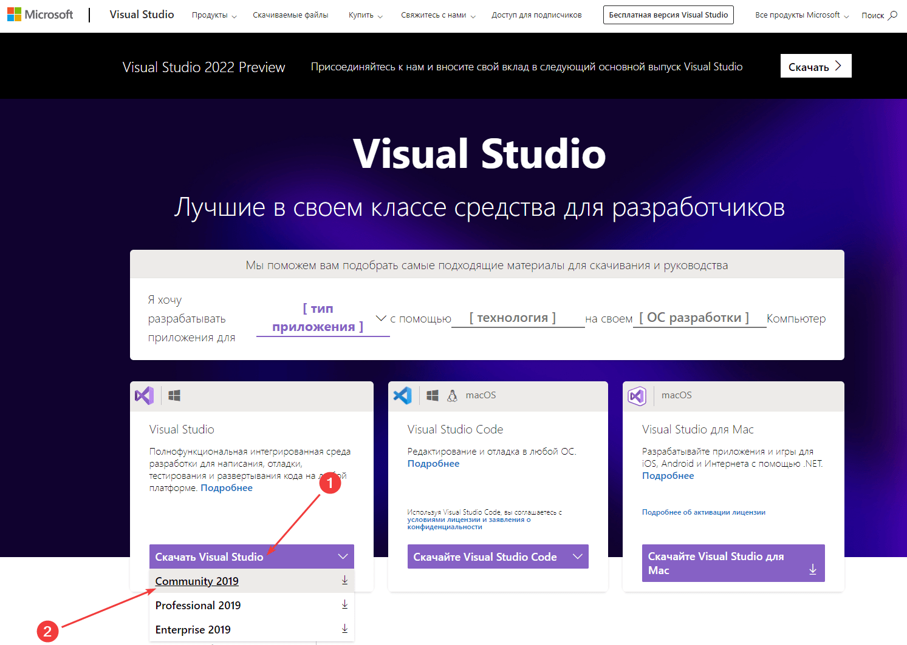

Запускаем скаченный файл:

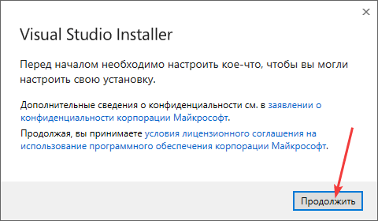

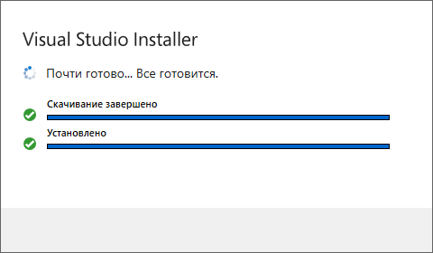

После этого откроется окно с большим количеством пакетов для скачивания и установки в `Visual Studio`. Там и средства для программирования для мобильных устройств и под Node.js и так далее. Причем каждый пункт имеет справа список загружаемых файлов.

Нас интересует программирование на C++ под обычный Windows.

Если вы хотите программировать так называемые универсальные приложения (это те, что с Metro стилем и могут распространяться с магазином), то выберите первый блок и такие подпункты справа (обратите внимание, что пакет `Windows 10 SDK` лучше выбирать последний версии, который будет показываться у вас):

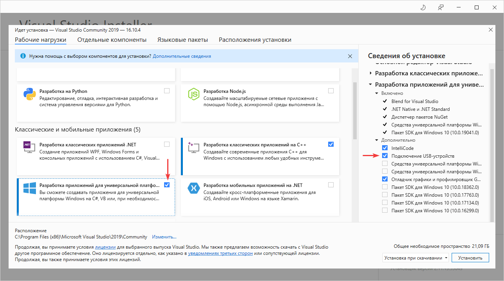

Для классических приложений выберите эти пакеты:

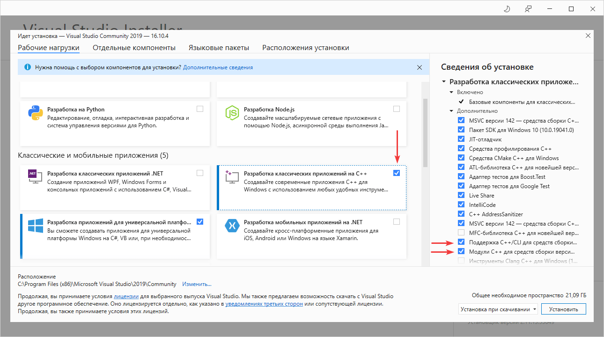

Для программирования на C# это выбираем:

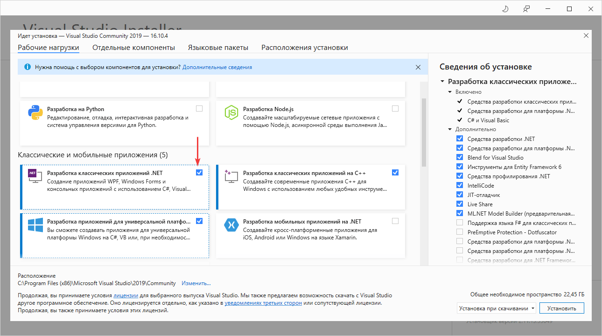

Лично я еще удаляю пакет русского языка и устанавливаю только английский язык. Но это исключительно на ваш выбор:

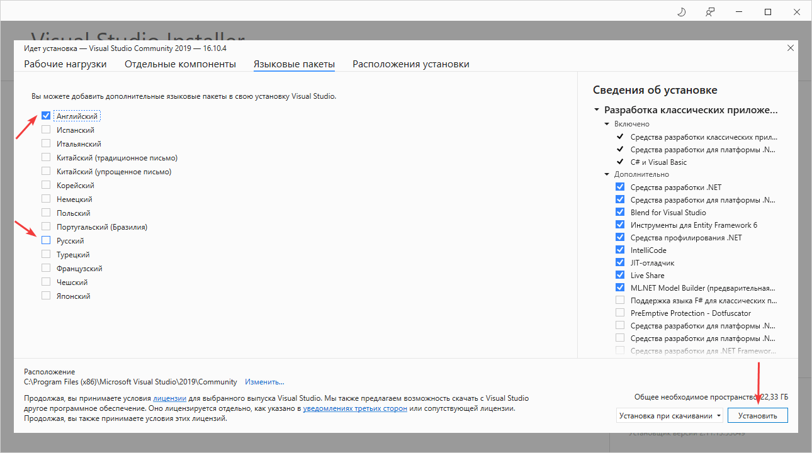

После выбора пакетов нужно запустить долгую-долгую установку:

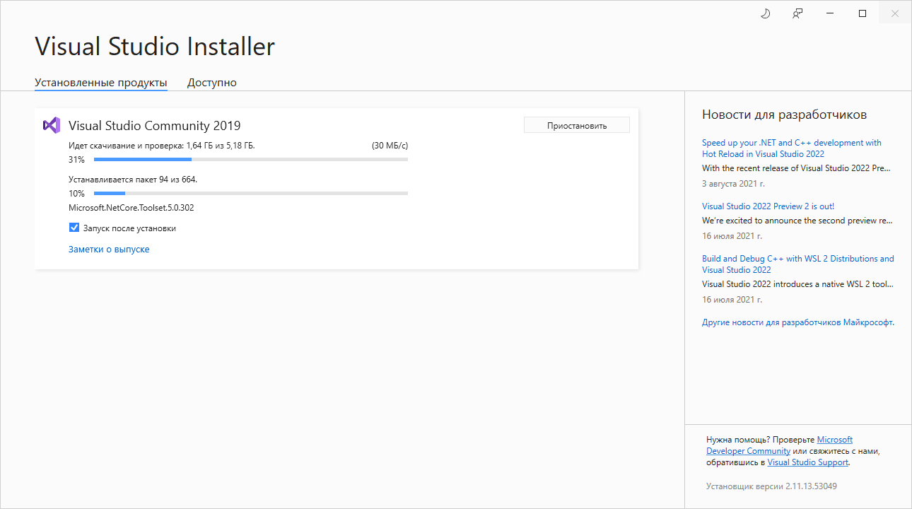

После установки всех пакетов запустите Visual Studio:

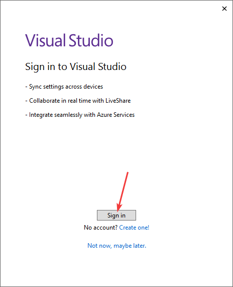

Настоятельно рекомендую войти под учетной записью Visual Studio, чтобы через месяц программа не перестала работать:

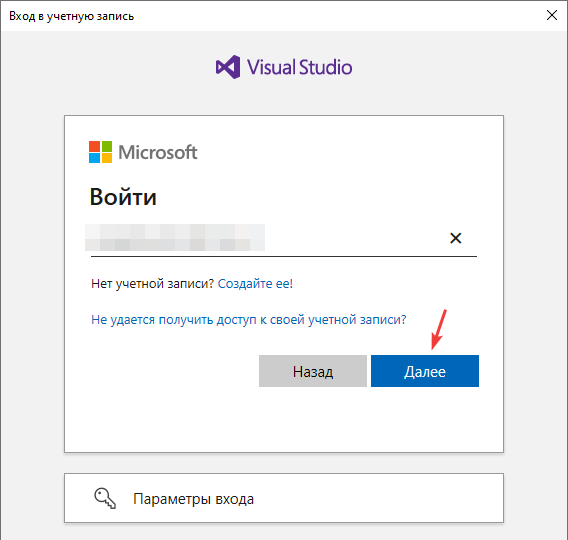

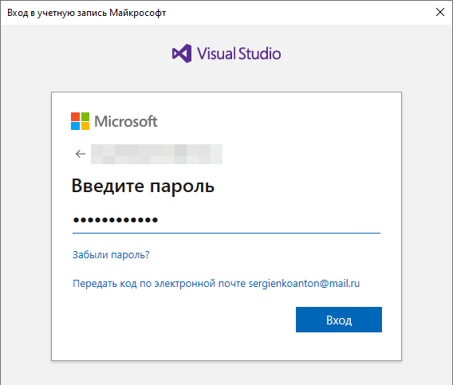

После этого откроется готовая к работе `Visual Studio 2019 Community`:

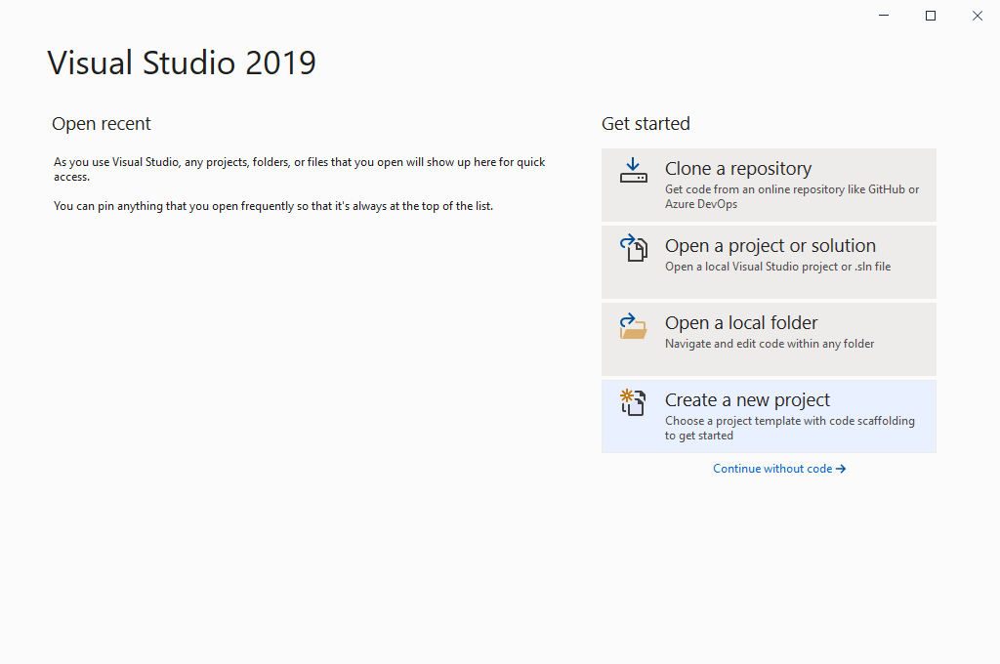

## Дополнительно

Если вы хотите разрабатывать универсальные UWP приложения, то не забудьте включить режим `Режим разработчика` в параметрах Windows 10:

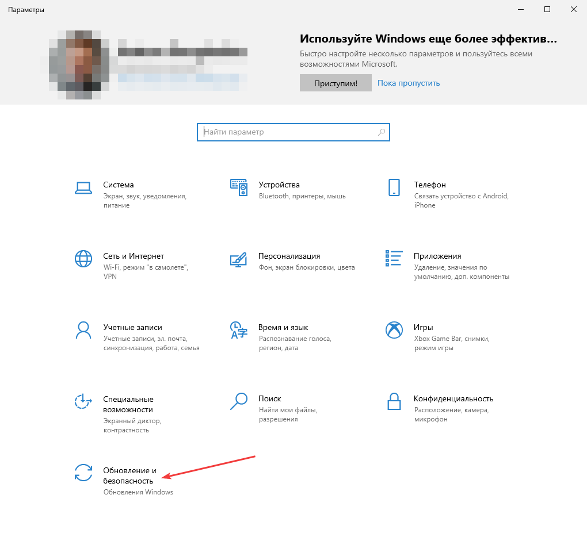

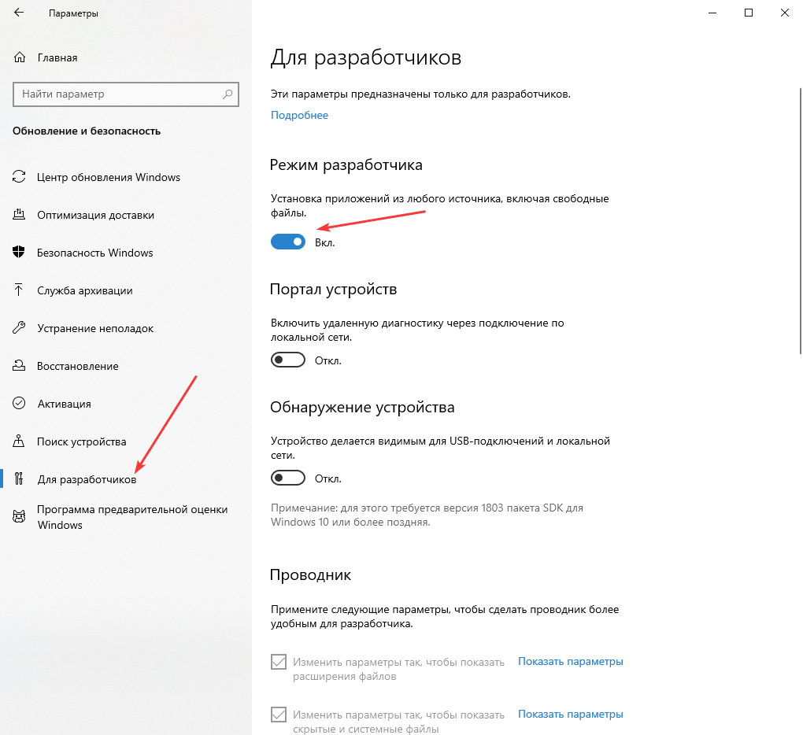