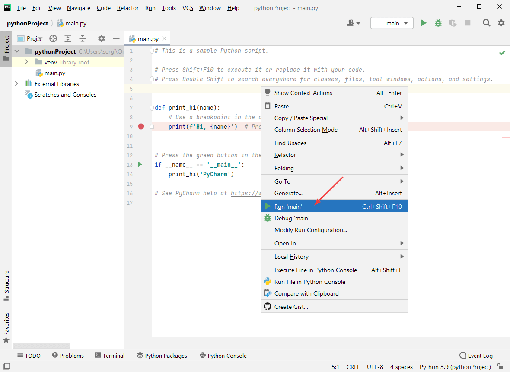

# Установка PyCharm

PyCharm является одним из самых популярных сред для программирования на Python.

Вначале нужно установить Python. В статье [Установка Python](/blog/2021/install-python/) об этом рассказывается.

## Скачивание

На сайте [jetbrains.com](https://www.jetbrains.com/ru-ru/pycharm/download/#section=windows) скачиваем установщик именно версии Community, которая бесплатная.

## Установка

Установка простая:

Обязательно ставим галочку у пункта `Add launchers dir to the PATH`:

Далее начнется установка, после которой в конце вас попросят перезагрузить компьютер, что и делаем:

При первом запуске программы вас попросят согласиться с условиями лицензии:

Далее спросят о том, можно ли отправлять статистику использования программы в JetBrains. Тут на ваше усмотрение:

После откроется PyCharm, где в разделе `Customize` можно выбрать тему оформления (вдруг кто-то любит темную тему), размер шрифта и др.:

## Создание тестового проекта

Проверим, как всё установилось. Для этого создадим и запустим тестовый проект:

Если у вас до этого был открыт проект в PyCharm, то предыдущее окно будет выглядеть так:

Тут можно оставить всё по умолчанию, но в дальнейшем вы тут сможете много чего полезного настроить. Можно выбрать путь расположения вашего проекта, версию Python, а также тип виртуального окружения. По умолчанию используется Virtualenv (venv). Я, например, предпочитаю [Pipenv](https://pipenv.pypa.io/en/latest/).

В общем, пока оставляем всё по умолчанию:

Запустим проект. Для этого правой кнопкой щелкнем по коду файла `main.py` и выберем пункт `` Run `main`  ``:

Внизу появится окно с консолью, где должен вывестись текст `Hi, PyCharm`.

Если всё вывелось, то у вас всё установилось нормально.

## Дополнительная настройка

По [правилам PEP8](https://www.python.org/dev/peps/pep-0008/#maximum-line-length) максимальная длина строки должна быть 79 символов. По умолчанию в PyCharm стоит комфортные 120 символов. Но, например, в Лицея Яндекс Академии система использует в качестве максимальной длины значение в 101 символ. Поэтому, чтобы строки нормально форматировались, например, по 101 символ при `Ctrl` + `Alt` + `L`, поменяйте соответствующий параметр `Hard wrap at` в настройках:

Также рекомендую включить увеличение шрифта через колесико мыши и нажатый `Ctrl`:

