# Сложение двух чисел в Code::Blocks

В статье рассказывается как создать консольное приложения сложения двух чисел в Code::Blocks.

## Установка программы

На сайте <https://www.codeblocks.org/downloads/binaries/> скачиваем установщик. Скачиваем версию с подписью **mingw-setup**, так как в основном установщике нет компилятора C++, и скорее всего у вас его нет на компьютере:


---

**Установка Code::Blocks** <!-- !details -->

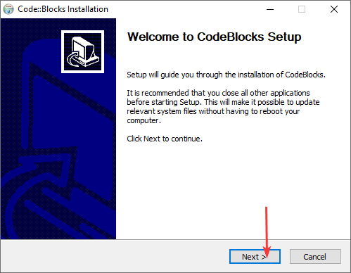

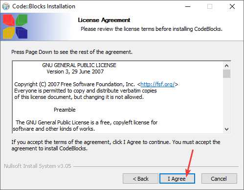

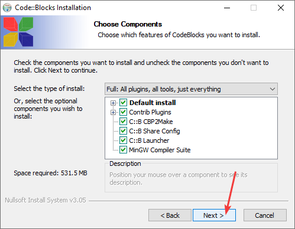

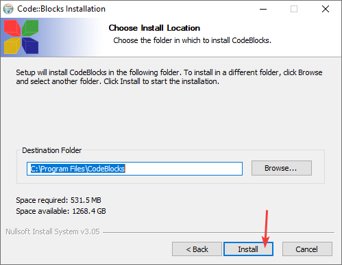

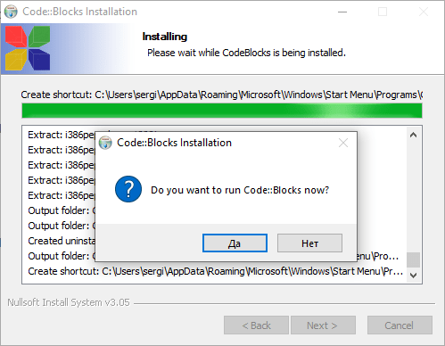

При запуске программы появится такое окно, где показывается найденный компилятор. Если он не определился, то что-то пошло не так, или вы скачали версию Code::Blocks без компилятора:

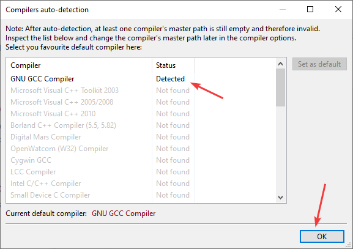

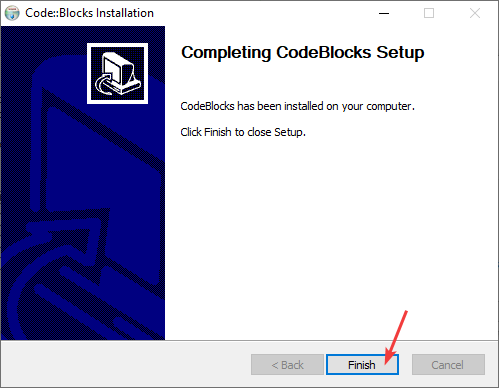

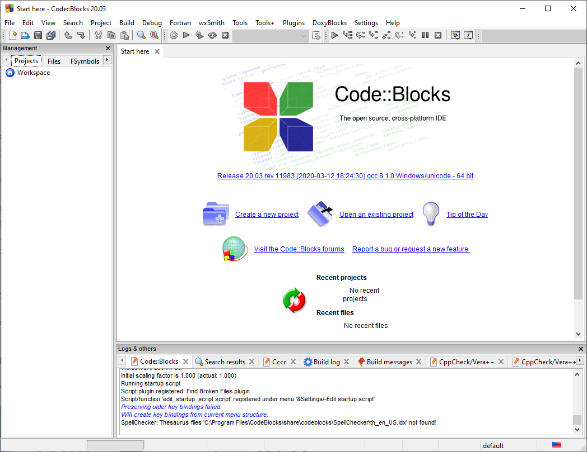

---

## Создание проекта

Если вы хотите создавать проект полноценный с множеством файлов и так далее, то проект нужно создавать нормально. Об этом под спойлером.

Открываем программу `Code::Blocks` и создаем пустой файл (можно создать сразу файл C++, но там путь сего создания дольше):

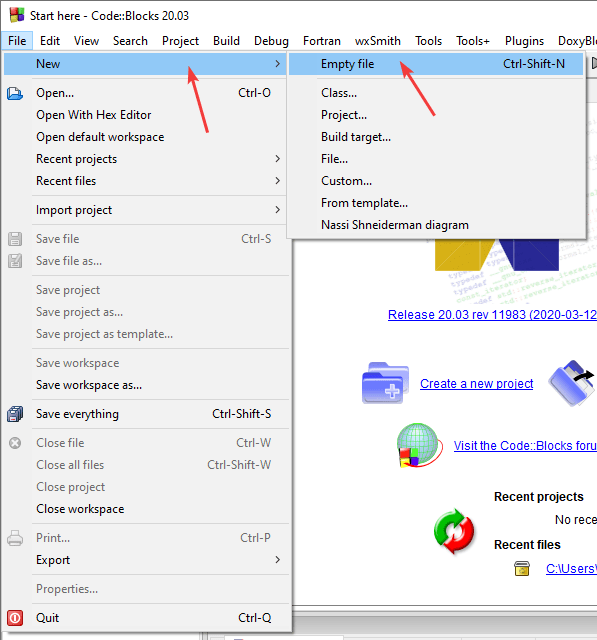

Сразу файл сохраняем, чтобы при написании кода была подсветка синтаксиса:

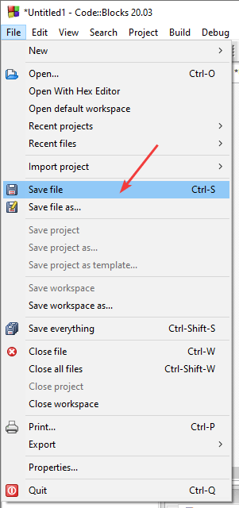

Выбираем название и папку сохранение нашего файла. **Обязательно** в расширении файла дописываем дву буквы **pp**, чтобы название файла, например, из `Untitled1.c` стало `Untitled1.cpp`. Это нужно, чтобы Code::Blocks понимал, что перед ним будет код на C++, а не языке C:

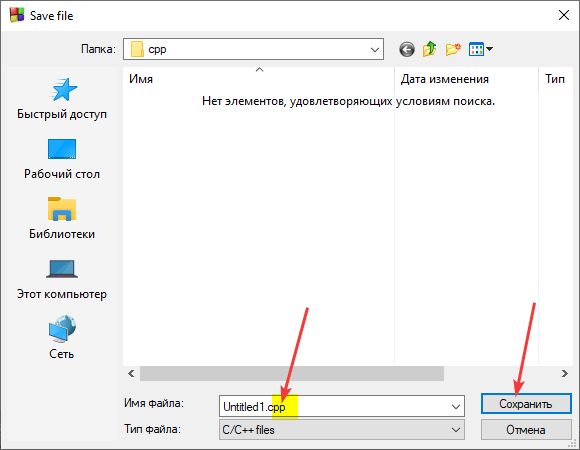

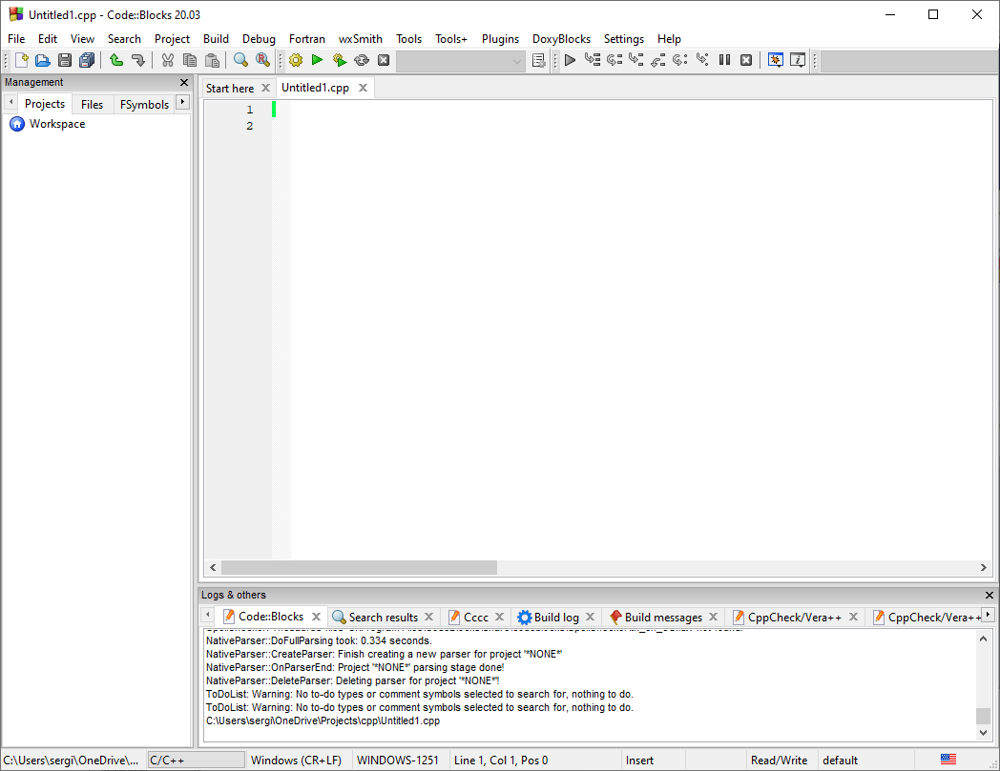

Напишите болванку приложения:

```cpp
#include <iostream>

using namespace std;

int main () {

  return 0;
}
```

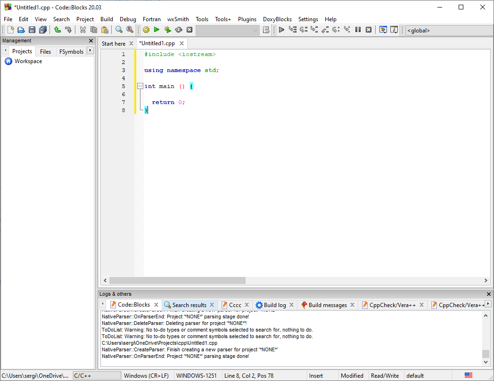

Скомпилируйте код и запустите его:

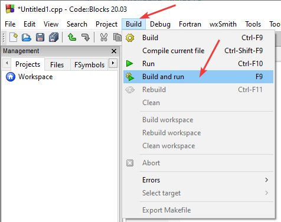

У вас должно запуститься пустое приложение, которое ничего не делает:

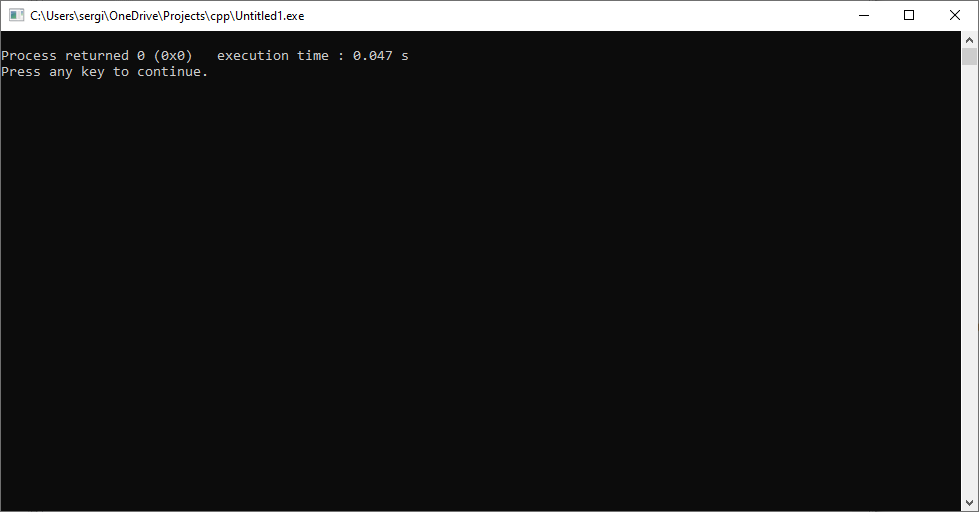

## Написание кода

Перейдем теперь к написанию программы сложения двух чисел.

В функции `main` добавьте код:

```cpp
int a, b, c;

cout << "Input first number" << endl;
cin >> a;

cout << "Input second number" << endl;
cin >> b;

c = a + b;

cout << "Sum " << c << endl;
```


Полный вид программы будет такой:

```cpp
#include <iostream>

using namespace std;

int main () {

  int a, b, c;

  cout << "Input first number" << endl;
  cin >> a;

  cout << "Input second number" << endl;
  cin >> b;

  c = a + b;

  cout << "Sum " << c << endl;

  return 0;
}
```

На всякий случай упрощенный вариант программы:

```cpp
#include <iostream>

using namespace std;

int main () {

  int a, b, c;

  cin >> a >> b;
  c = a + b;

  cout << c;

  return 0;
}
```

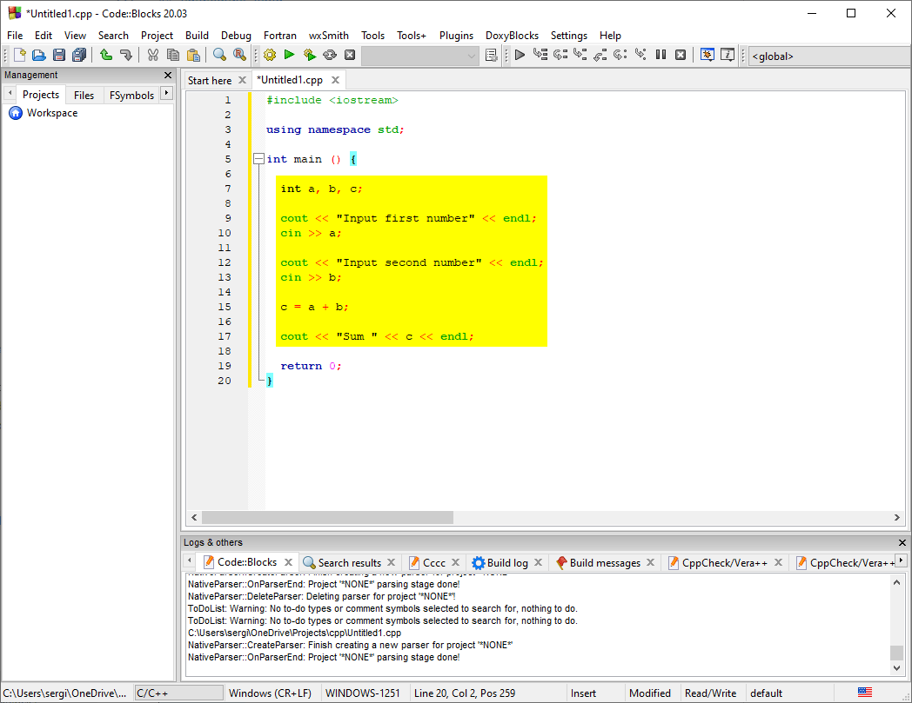

Сохраните файл:


## Запуск программы

Скомпилируйте код и запустите его:


После запустится программа, где мы можете ввести два числа и посмотреть на результат их суммирования:

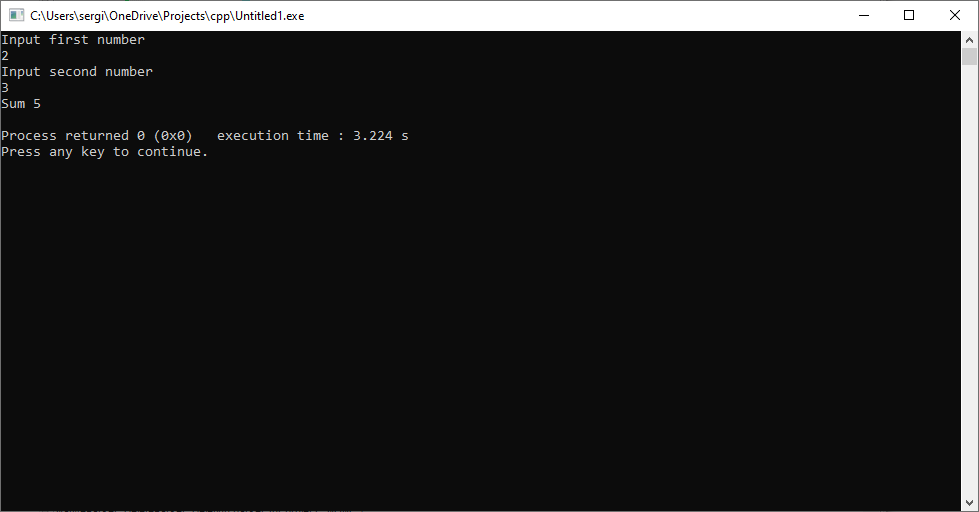
