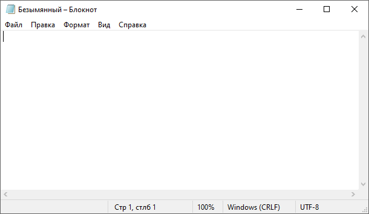
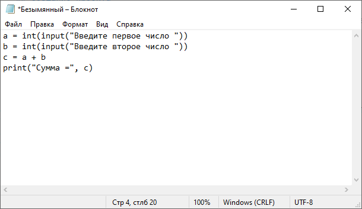
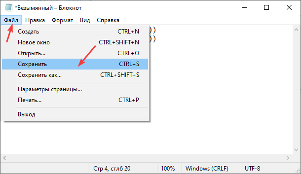
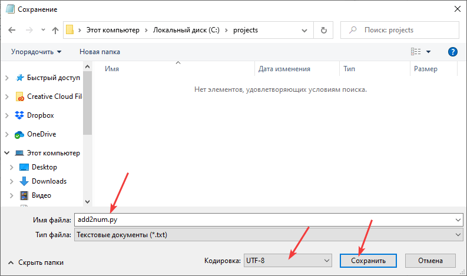
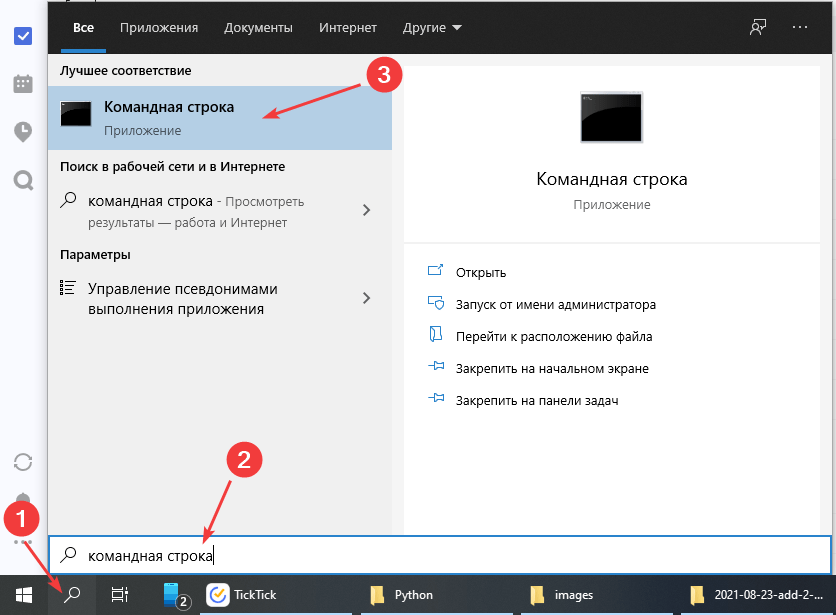
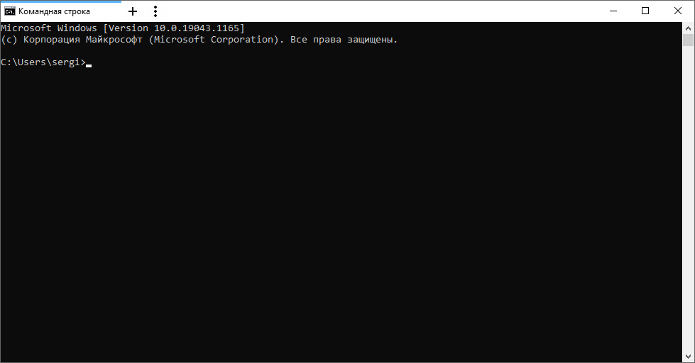
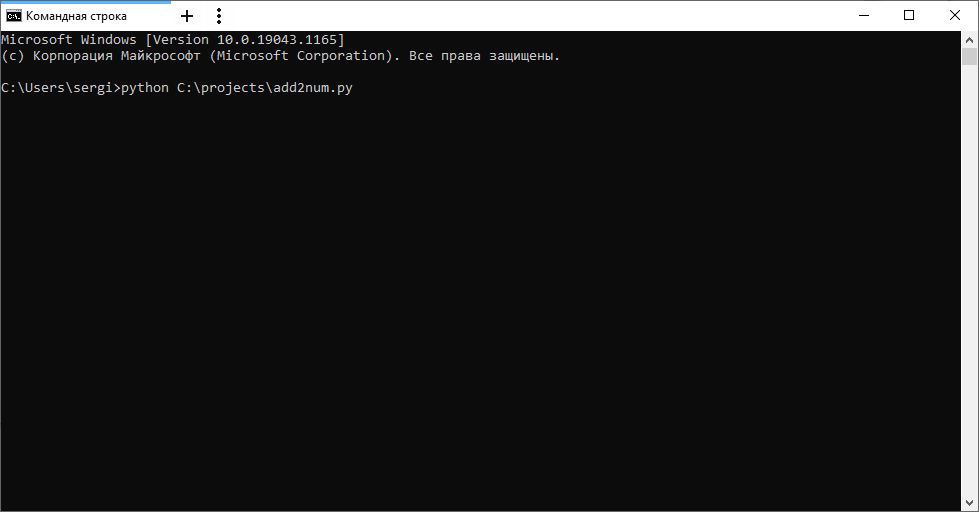
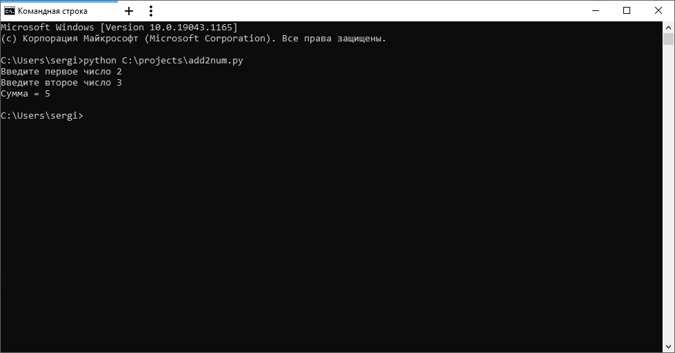

# Сложение двух чисел в Python через консоль и блокнот

Для работы с Python после его установки можно не устанавливать никаких других программ (PyCharm, VSCode, Wing и др.), а воспользоваться обычным блокнотом.

## Установка программы

Вначале надо установить Python себе на компьютер. Смотрите статью [Установка Python](https://github.com/Harrix/harrix.dev-blog-2021/blob/main/2021-08-03-install-python/2021-08-03-install-python.md).

## Создание проекта

Вместо навороченных сред программирования откроем обычный блокнот:



## Написание кода

Напишем программу сложения двух чисел:

```py
a = int(input("Введите первое число "))
b = int(input("Введите второе число "))
c = a + b
print("Сумма =", c)
```



Сохраним файл куда-нибудь. Я для примера сохранил под именем `add2num.py` в папке `C:\projects`:





То есть полный путь к файлу у меня такой `C:\projects\add2num.py`.

## Запуск программы

Нам нужна командная строка, терминал или что-нибудь в этом роде. Покажу, как открыть обычную командную строку через поиск в Windows:





Теперь просто пропишем такую команду и нажмем `Enter`:

```console
python C:\projects\add2num.py
```



Если у вас путь к сохраненному файлу с кодом другой, то поменяйте в примере вызова этот путь. Если вдруг не сработает, то попробуйте такой вариант:

```console
python3 C:\projects\add2num.py
```

После запустится программа, где мы можете ввести два числа и посмотреть на результат их суммирования:



