# Сложение двух чисел в Code::Blocks


В статье рассказывается как создать консольное приложения сложения двух чисел в Code::Blocks.

<details>
<summary>📖 Содержание ⬇️</summary>

## Содержание

- [Установка программы](#установка-программы)
- [Создание проекта](#создание-проекта)
- [Написание кода](#написание-кода)
- [Запуск программы](#запуск-программы)

</details>

## Установка программы

На сайте <https://www.codeblocks.org/downloads/binaries/> скачиваем установщик. Скачиваем версию с подписью **mingw-setup**, так как в основном установщике нет компилятора C++, и скорее всего у вас его нет на компьютере:

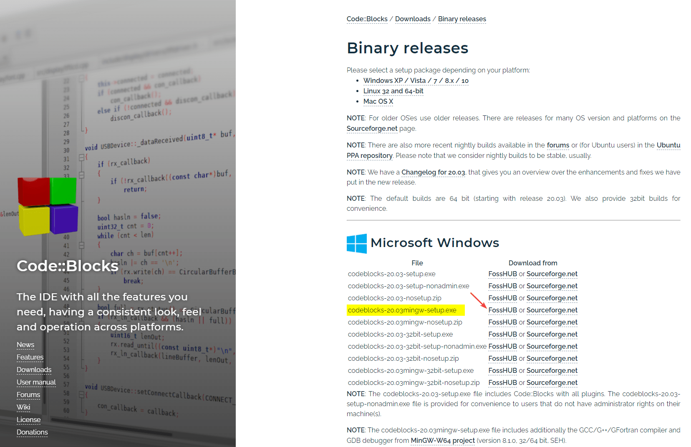

_Рисунок 1 — Скачивание установщика_

<details>
<summary>Установка Code::Blocks</summary>

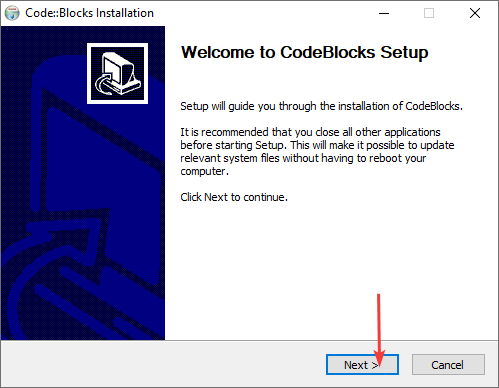

_Рисунок 2 — Первое окно установки_

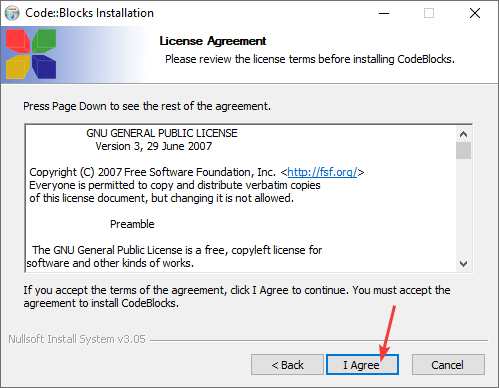

_Рисунок 3 — Соглашение с условиями_

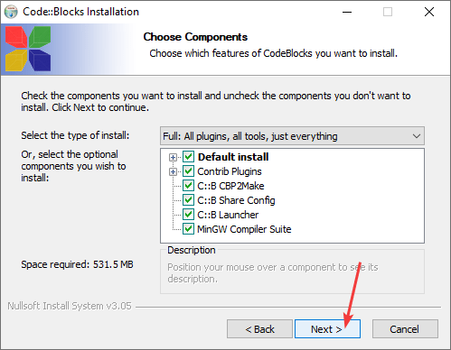

_Рисунок 4 — Выбор компонентов для установки_

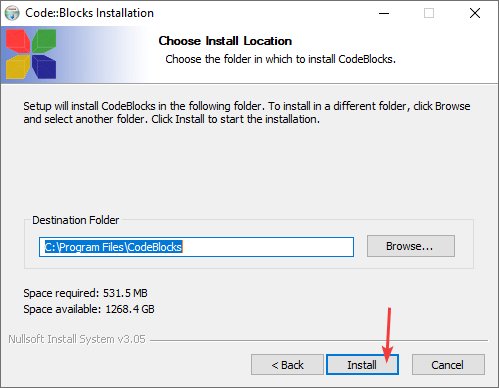

_Рисунок 5 — Выбор пути установки программы_

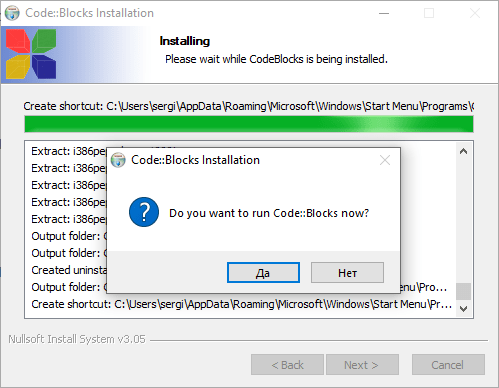

_Рисунок 6 — Процесс установки_

При запуске программы появится такое окно, где показывается найденный компилятор. Если он не определился, то что-то пошло не так, или вы скачали версию Code::Blocks без компилятора:

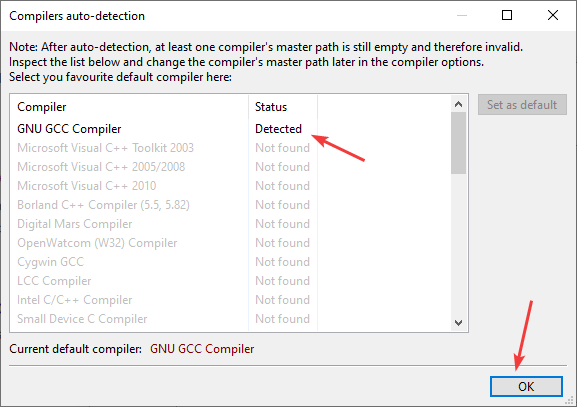

_Рисунок 7 — Окно выбора компилятора_

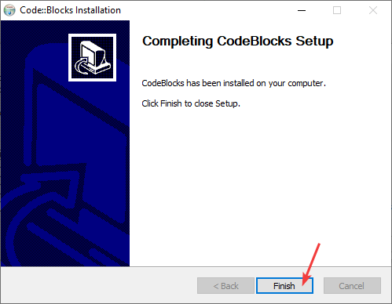

_Рисунок 8 — Окончание установки_

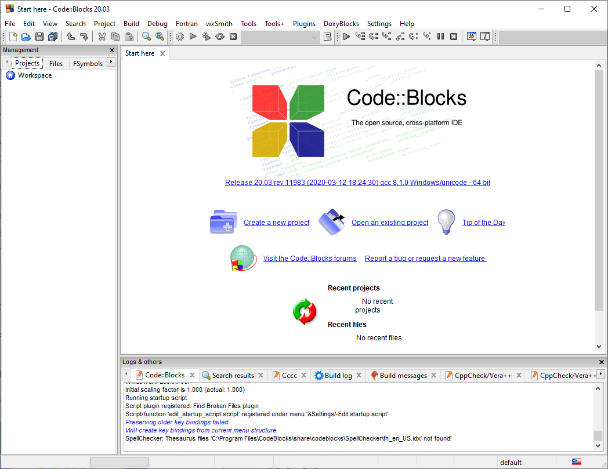

_Рисунок 9 — Открытая программа Code::Blocks_

</details>

## Создание проекта

Открываем программу `Code::Blocks` и создаем пустой файл (можно создать сразу файл C++, но там путь сего создания дольше):

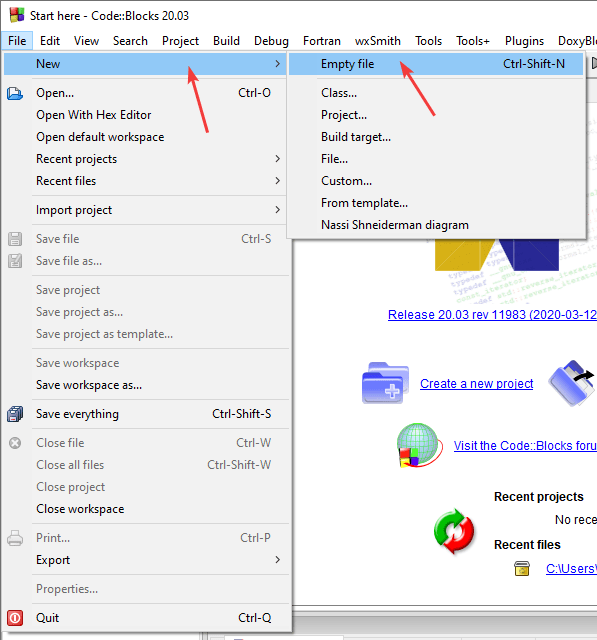

_Рисунок 10 — Создание пустого файла_

Сразу файл сохраняем, чтобы при написании кода была подсветка синтаксиса:

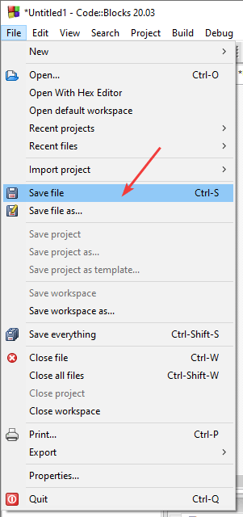

_Рисунок 11 — Пункт меню для сохранения файла_

Выбираем название и папку сохранение нашего файла. **Обязательно** в расширении файла дописываем дву буквы **pp**, чтобы название файла, например, из `Untitled1.c` стало `Untitled1.cpp`. Это нужно, чтобы Code::Blocks понимал, что перед ним будет код на C++, а не языке C:

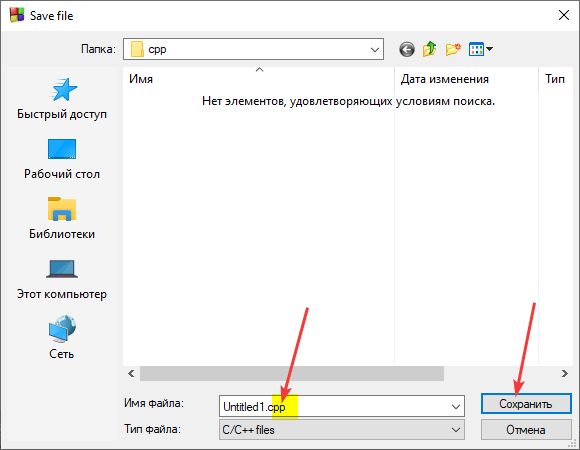

_Рисунок 12 — Сохранение файла кода_

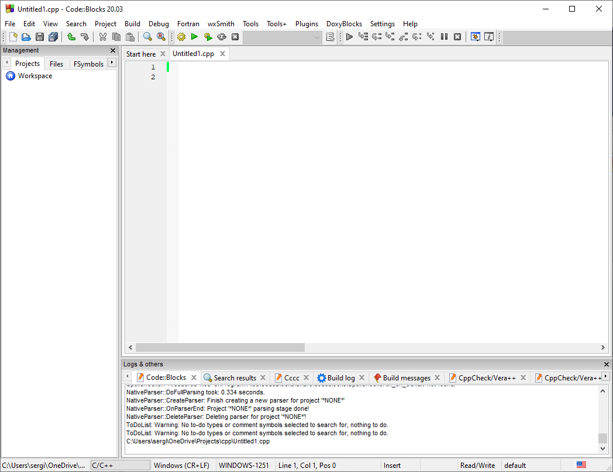

_Рисунок 13 — Программа Code::Blocks с пустым сохраненным файлом_

Напишите болванку приложения:

```cpp
#include <iostream>

using namespace std;

int main () {

  return 0;
}
```

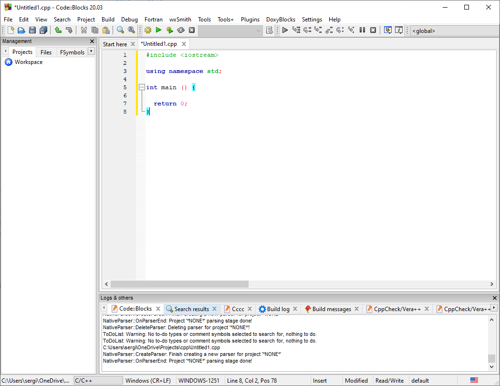

_Рисунок 14 — Болванка кода на C++_

Скомпилируйте код и запустите его:

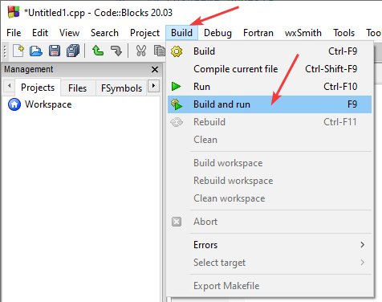

_Рисунок 15 — Компиляция и запуск программы_

У вас должно запуститься пустое приложение, которое ничего не делает:

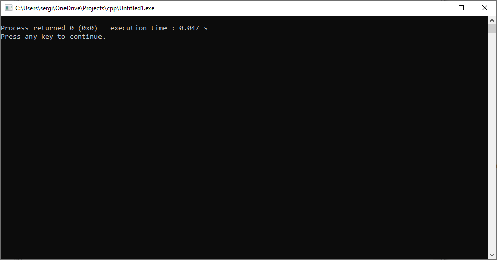

_Рисунок 16 — Запущенное приложение_

## Написание кода

Перейдем теперь к написанию программы сложения двух чисел.

В функции `main` добавьте код:

```cpp
int a, b, c;

cout << "Input first number" << endl;
cin >> a;

cout << "Input second number" << endl;
cin >> b;

c = a + b;

cout << "Sum " << c << endl;
```


_Рисунок 17 — Код программы сложения двух чисел_

Полный вид программы будет такой:

```cpp
#include <iostream>

using namespace std;

int main () {

  int a, b, c;

  cout << "Input first number" << endl;
  cin >> a;

  cout << "Input second number" << endl;
  cin >> b;

  c = a + b;

  cout << "Sum " << c << endl;

  return 0;
}
```

На всякий случай упрощенный вариант программы:

```cpp
#include <iostream>

using namespace std;

int main () {

  int a, b, c;

  cin >> a >> b;
  c = a + b;

  cout << c;

  return 0;
}
```

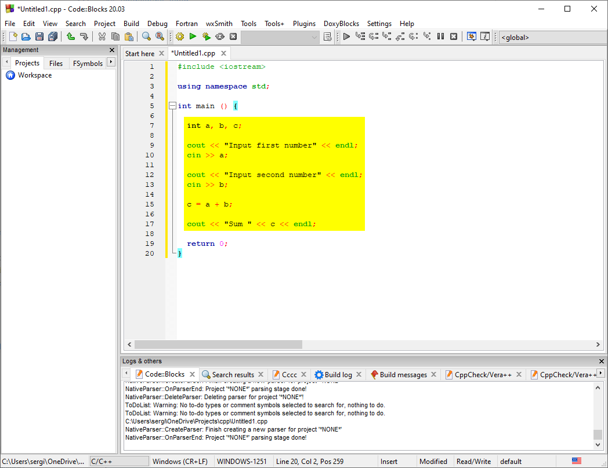

_Рисунок 18 — Код программы сложения двух чисел_

Сохраните файл:


_Рисунок 19 — Сохранение файла исходного кода_

## Запуск программы

Скомпилируйте код и запустите его:


_Рисунок 20 — Компиляция и запуск программы_

После запустится программа, где мы можете ввести два числа и посмотреть на результат их суммирования:

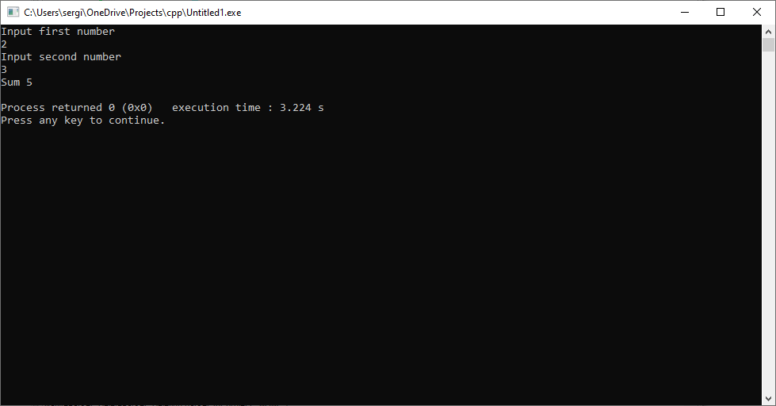

_Рисунок 21 — Компиляция и запуск программы_
