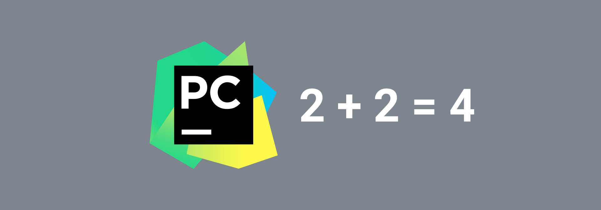
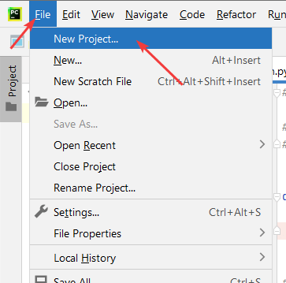
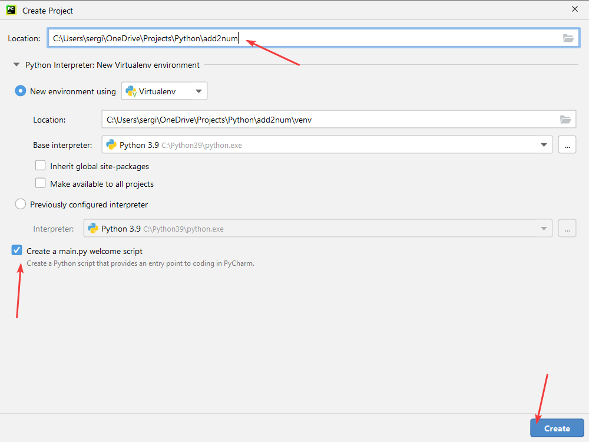
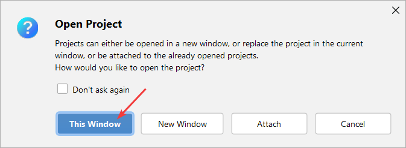
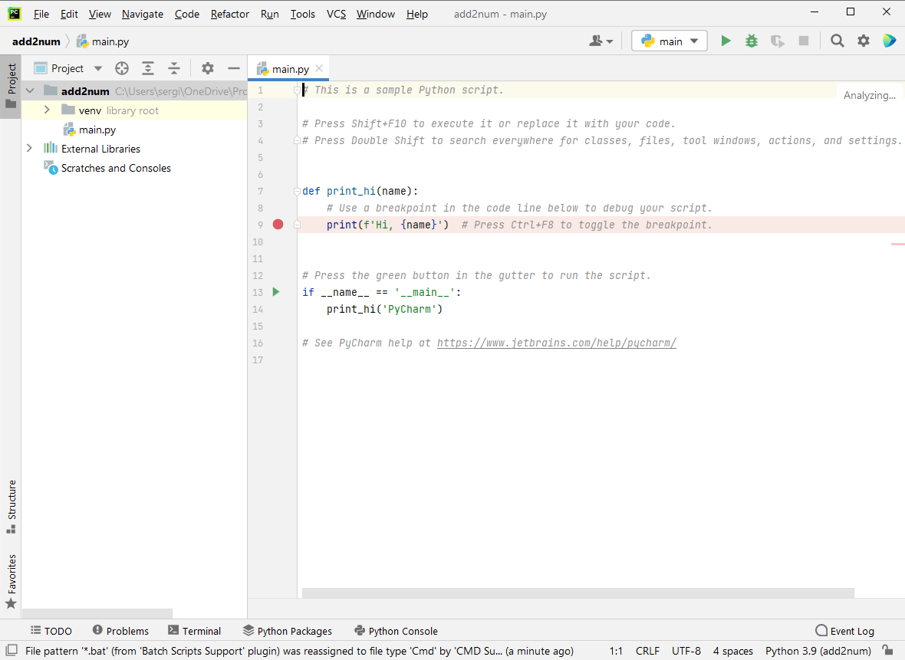
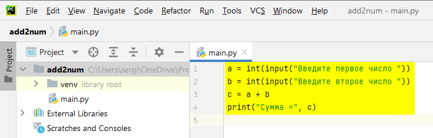
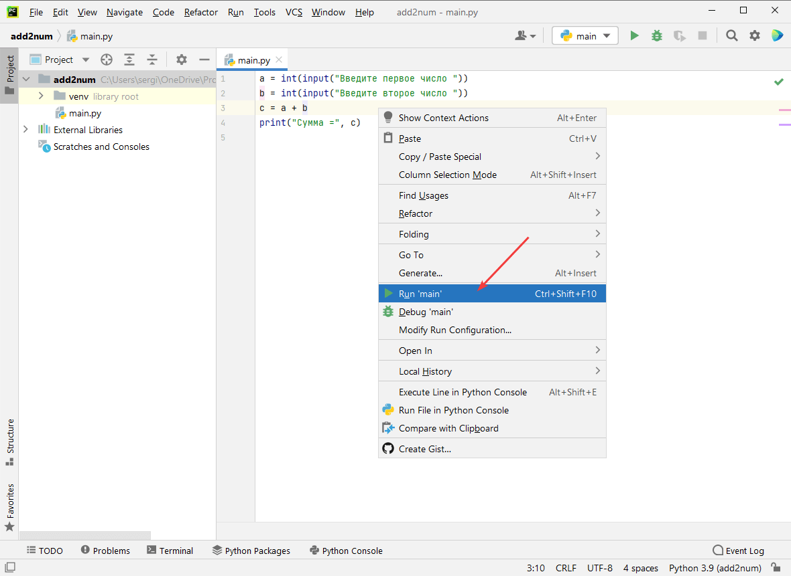
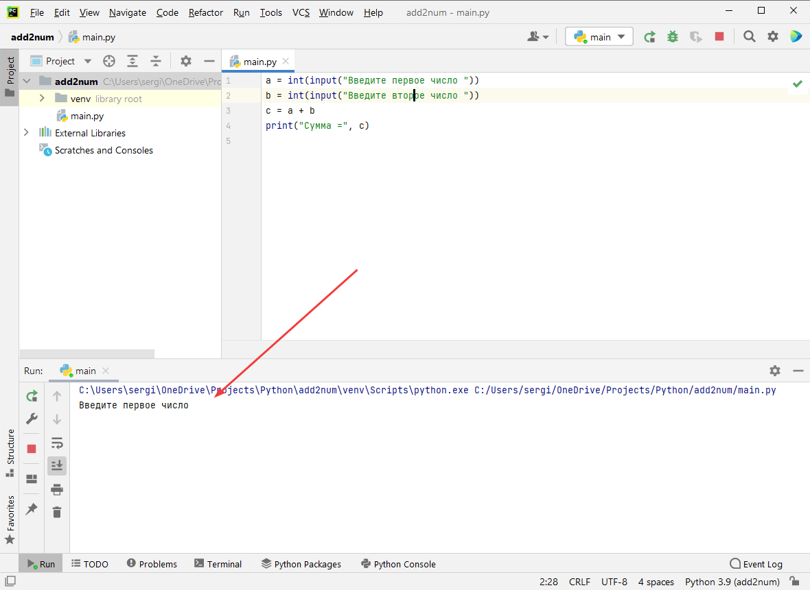
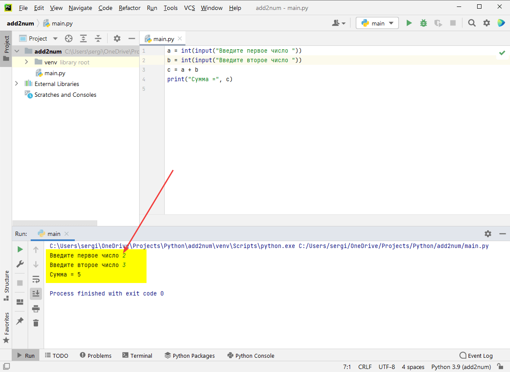

# Сложение двух чисел в PyCharm



В статье рассказывается как создать консольное приложения сложения двух чисел в PyCharm на Python.

<details>
<summary>📖 Содержание</summary>

## Содержание

- [Установка программы](#установка-программы)
- [Создание проекта](#создание-проекта)
- [Написание кода](#написание-кода)
- [Запуск программы](#запуск-программы)

</details>

## Установка программы

Вначале надо установить Python себе на компьютер. Смотрите статью [Установка Python](https://github.com/Harrix/harrix.dev-articles-2021/blob/main/install-python/install-python.md) | [🡥](https://harrix.dev/ru/articles/2021/install-python/).

Далее устанавливаем сам PyCharm по статье [Установка PyCharm](https://github.com/Harrix/harrix.dev-articles-2021/blob/main/install-pycharm/install-pycharm.md) | [🡥](https://harrix.dev/ru/articles/2021/install-pycharm/).

## Создание проекта

Открываем программу `PyCharm` и идем `File` → `New`:



_Рисунок 1 — Создание нового проекта_

О параметрах создаваемого проекта рассказано в статье [Установка PyCharm](https://github.com/Harrix/harrix.dev-articles-2021/blob/main/install-pycharm/install-pycharm.md) | [🡥](https://harrix.dev/ru/articles/2021/install-pycharm/). Так что тут просто скажу, что нужно указать месторасположение нового проекта и убедиться, что `Base interpreter` не горит красным и не пустой:



_Рисунок 2 — Настройка проекта_

Если у вас был открыт до этого другой проект в PyCharm, то программа спросит закрыть старый проект и открыть новый (`This Window`) или же оставить открытым старый и открыть еще один экземпляр PyCharm с новым проектом (`New Window`). Например, нам старый проект не нужен:



_Рисунок 3 — Закрытие старого проекта_



_Рисунок 4 — Созданный пустой проект_

## Написание кода

Напишем программу сложения двух чисел, удалив весь код из файла `main.py`:

```python
a = int(input("Введите первое число "))
b = int(input("Введите второе число "))
c = a + b
print("Сумма =", c)
```



_Рисунок 5 — Код программы_

## Запуск программы

Чтобы запустить код, щелкните правой кнопкой по коду и в появившемся меню выберите команду `Run 'main'`:



_Рисунок 6 — Компиляция и запуск программы_

После запустится программа, где мы можете ввести два числа и посмотреть на результат их суммирования:



_Рисунок 7 — Запущенное приложение_



_Рисунок 8 — Результат выполнения программы_
