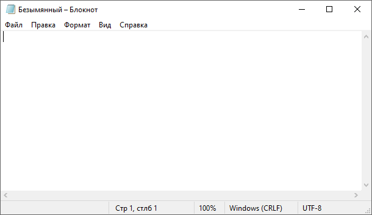
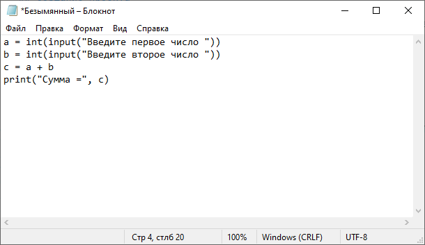
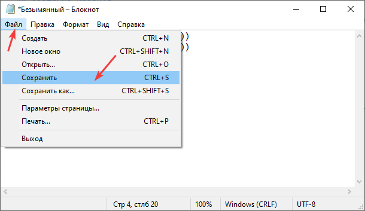
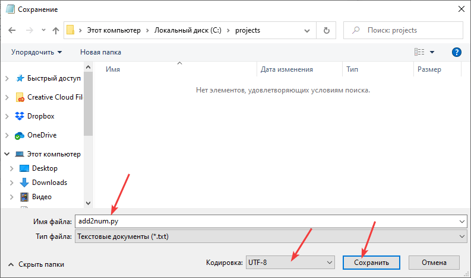
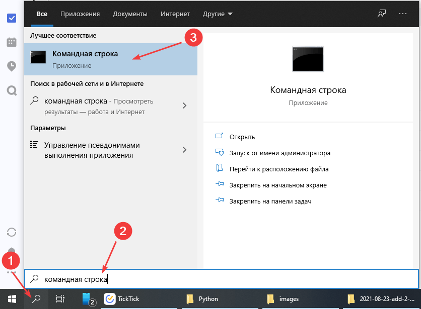
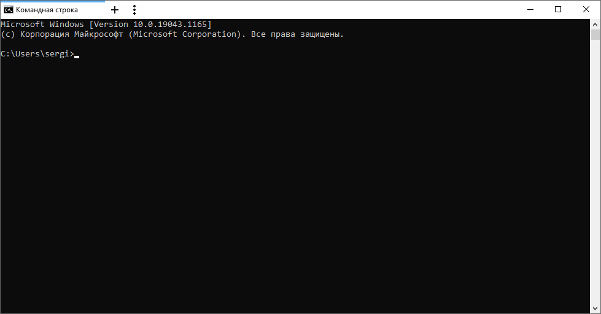
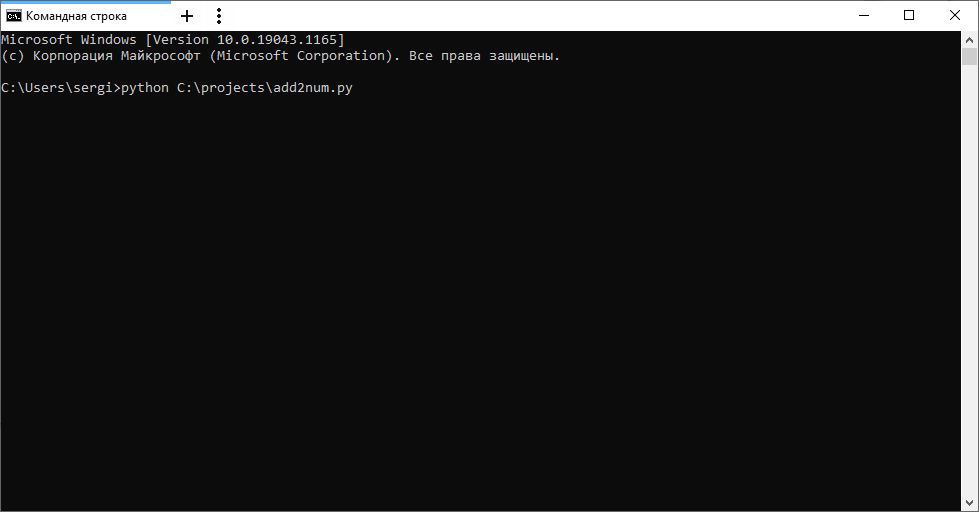
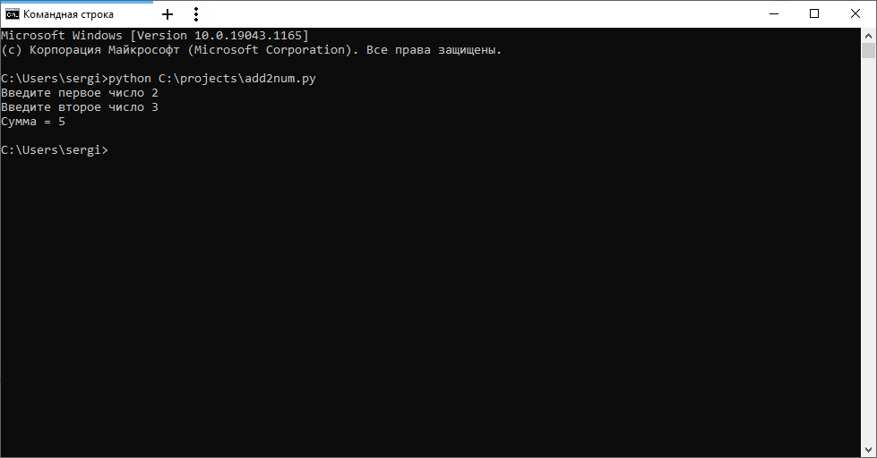

# Сложение двух чисел в Python через консоль и блокнот


Для работы с Python после его установки можно не устанавливать никаких других программ (PyCharm, VSCode, Wing и др.), а воспользоваться обычным блокнотом.

<details>
<summary>📖 Содержание</summary>

## Содержание

- [Установка программы](#установка-программы)
- [Создание проекта](#создание-проекта)
- [Написание кода](#написание-кода)
- [Запуск программы](#запуск-программы)

</details>

## Установка программы

Вначале надо установить Python себе на компьютер. Смотрите статью [Установка Python](https://github.com/Harrix/harrix.dev-articles-2021/blob/main/install-python/install-python.md) | [↗️](https://harrix.dev/ru/articles/2021/install-python/).

## Создание проекта

Вместо навороченных сред программирования откроем обычный блокнот:



_Рисунок 1 — Блокнот_

## Написание кода

Напишем программу сложения двух чисел:

```python
a = int(input("Введите первое число "))
b = int(input("Введите второе число "))
c = a + b
print("Сумма =", c)
```



_Рисунок 2 — Код программы_

Сохраним файл куда-нибудь. Я для примера сохранил под именем `add2num.py` в папке `C:\projects`:



_Рисунок 3 — Сохранение файла_



_Рисунок 4 — Выбор места хранения и названия файла_

То есть полный путь к файлу у меня такой `C:\projects\add2num.py`.

## Запуск программы

Нам нужна командная строка, терминал или что-нибудь в этом роде. Покажу, как открыть обычную командную строку через поиск в Windows:



_Рисунок 5 — Открытие командной строки через поиск_



_Рисунок 6 — Открытая командная строка_

Теперь просто пропишем такую команду и нажмем `Enter`:

```shell
python C:\projects\add2num.py
```



_Рисунок 7 — Запуск Python скрипта_

Если у вас путь к сохраненному файлу с кодом другой, то поменяйте в примере вызова этот путь. Если вдруг не сработает, то попробуйте такой вариант:

```shell
python3 C:\projects\add2num.py
```

После запустится программа, где мы можете ввести два числа и посмотреть на результат их суммирования:


_Рисунок 8 — Запущенное приложение_



_Рисунок 9 — Результат выполнения программы_
