# Сложение двух чисел в Python IDLE

Для работы с Python после его установки можно не устанавливать никаких других программ (PyCharm, VSCode, Wing и др.), а воспользоваться тем, что идет с Python.

## Установка программы

Вначале надо установить Python себе на компьютер. Смотрите статью [Установка Python](https://github.com/Harrix/harrix.dev-blog-2021/blob/main/install-python/install-python.md).

При установке Python через официальный установщик в систему устанавливается простая среда разработки IDLE, в которой можно полноценно работать. Ей можно найти через поиск:

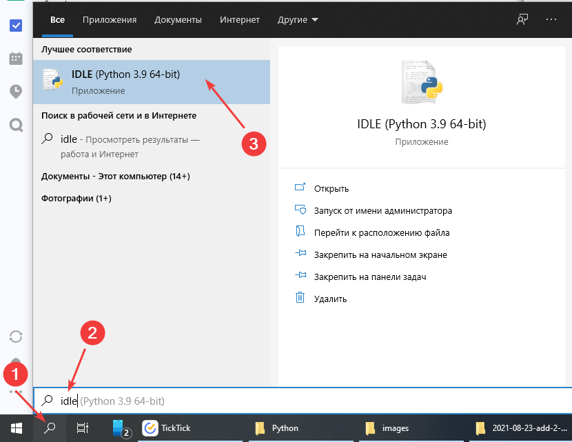

Либо, например, запустить программу `pythonw.exe` с параметром пути к файлу `idle.pyw`. У меня это так выглядит:

```console
C:\Python39\pythonw.exe "C:\Python39\Lib\idlelib\idle.pyw"
```

Но через поиск, конечно, куда проще.

Вот открытая среда IDLE:

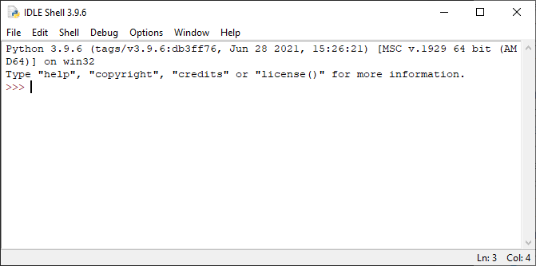

## Создание проекта

В программе сразу открывается Python интерпретатор, где можно сразу как производить вычисления примеров:

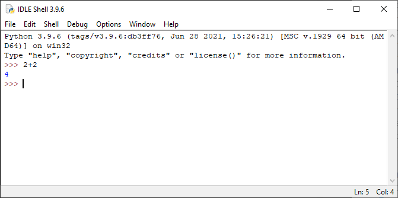

А можно записывать построчно нужный код:

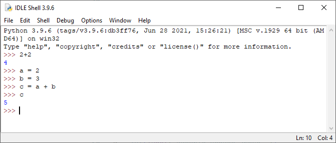

Но мы хотим писать код в отдельном файле, который и будем запускать. Поэтому идем `File` → `New File`:

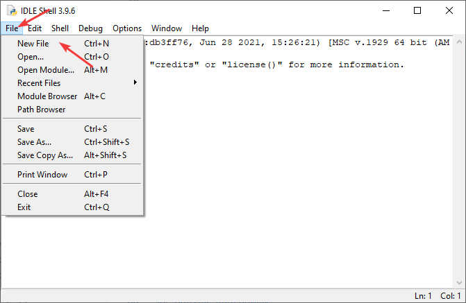

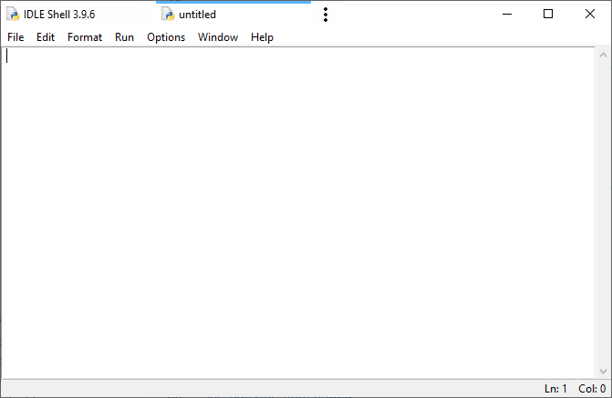

## Написание кода

Напишем программу сложения двух чисел:

```python
a = int(input("Введите первое число "))
b = int(input("Введите второе число "))
c = a + b
print("Сумма =", c)
```

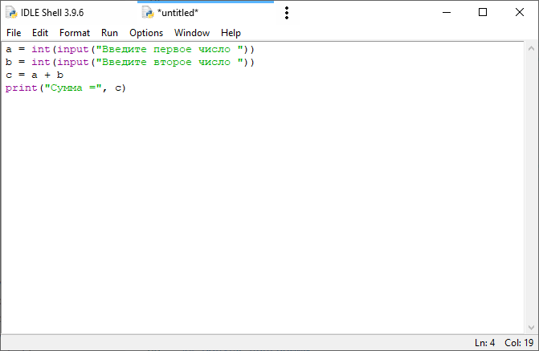

Сохраним файл куда-нибудь. Я для примера сохранил под именем `add2num.py`:

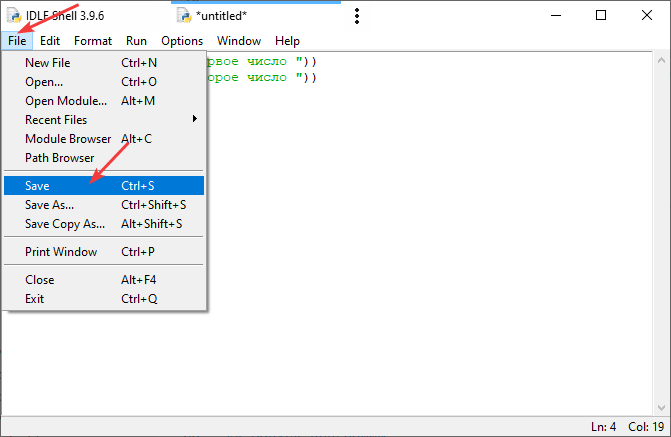

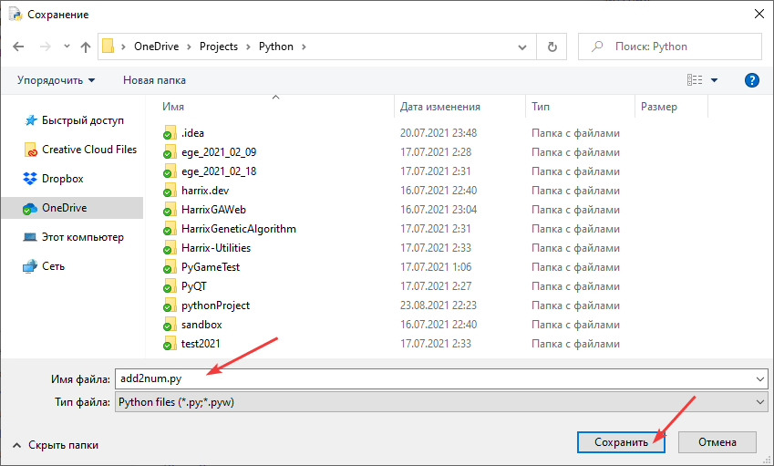

## Запуск программы

Чтобы запустить код идем `Run` → `Run Module`:

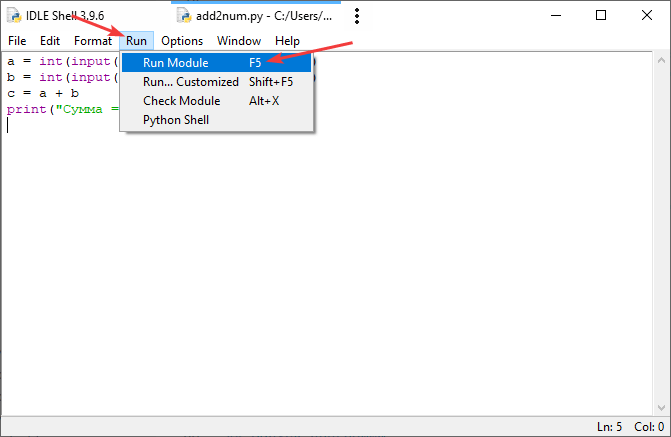

После запустится программа, где мы можете ввести два числа и посмотреть на результат их суммирования:

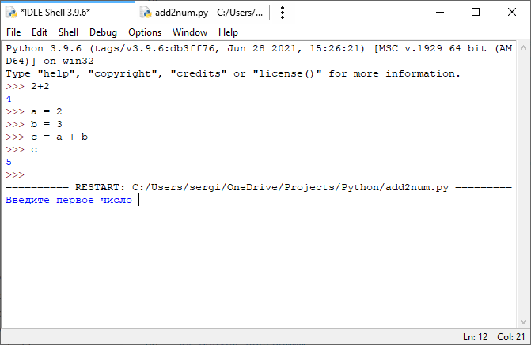

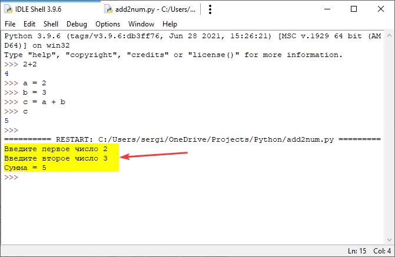
