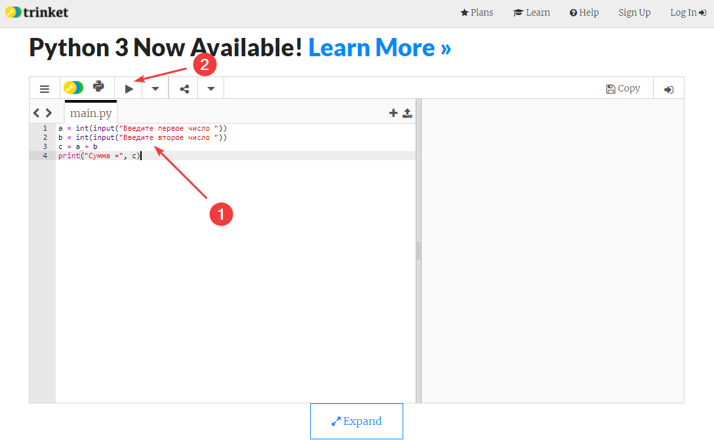
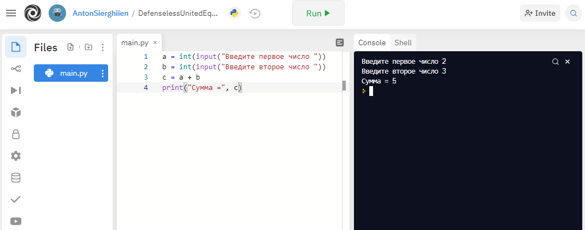

# Сложение двух чисел в Python на онлайн сервисах


В статье приведен список сайтов, где можно программировать на Python без установки какого-либо программного обеспечения.

- [Код](#код)
- [Trinket.io](#trinketio)
- [Onlinegdb.com](#onlinegdbcom)
- [Replit.com](#replitcom)
- [Online-python.com](#onlinepythoncom)
- [Programiz.com](#programizcom)

## Код

На всех сайтах будет тестироваться вот такой код сложения двух чисел:

```python
a = int(input("Введите первое число "))
b = int(input("Введите второе число "))
c = a + b
print("Сумма =", c)
```

## Trinket.io

<https://trinket.io/python3> — один из лучших сервисов с большим количеством предустановленных пакетов. Обратите внимание, что на главной странице <https://trinket.io> будет доступен Python 2, а не Python 3.

Вставляем код в главное текстовое поле, а затем запускаем код, нажимая на треугольник:



_Рисунок 1 — Код на trinket.io_

После этого справа запустится программа:


_Рисунок 2 — Запуск программы на trinket.io_

Введите число, нажмите `Enter`, введите второе число, нажмите `Enter` и получите сумму двух чисел:


_Рисунок 3 — Результат работы программы на trinket.io_

Кстати, еще щелкнуть по кнопке-гамбургеру, то появится меню с пунктом `Share`:


_Рисунок 4 — Меню на trinket.io_

Если нажать на эту кнопку `Share`, то сгенерируется ссылка на написанный вами код:


_Рисунок 5 — Ссылка на код_

Этой ссылкой можно поделиться с кем-нибудь, и человек, открыв её, увидит тот же код, что вы написали.

## Onlinegdb.com

<https://www.onlinegdb.com/online_python_compiler> — еще один популярный онлайн интерпретатор на Python без необходимости в регистрации.

Запуск осуществляется через кнопку `Run`:


_Рисунок 6 — Код на onlinegdb.com_

На сайте также есть кнопка `Share`, генерирует ссылку на ваш код:


_Рисунок 7 — Расшаривание вашего кода_

## Replit.com

<https://replit.com/new/python3> — известный сайт, где также без регистрации можно писать на Python.


_Рисунок 8 — Код на replit.com_

Но если вы зарегистрируйтесь на сайте и войдете под своей учеткой, то возможностей для программирования появится гораздо больше. И поменяется интерфейс. Например, при переходе по ссылке выше вначале вас попросят ввести данные вашего нового проекта:


_Рисунок 9 — Создание нового проекта_



_Рисунок 10 — Созданный проект и его запуск_

Расшаривание доступно для зарегистрированных пользователей:


_Рисунок 11 — Генерация ссылки для расшаривания_


_Рисунок 12 — Расшаренная ссылка_

Минус в том, что перейти по этой ссылке смогут опять-таки только зарегистрированные пользователи.

## Online-python.com

<https://www.online-python.com/> — простой онлайн сервис с Python.


_Рисунок 13 — Код в online-python.com_

Расшаривание кода также присутствует через кнопку `Share`.

## Programiz.com

<https://www.programiz.com/python-programming/online-compiler/> — простой онлайн сервис с Python.


_Рисунок 14 — Код в programiz.com_
