# Сложение двух чисел в Thonny на Python


В статье рассказывается как создать консольное приложения сложения двух чисел в Thonny на Python.

## Установка программы

Вначале надо установить Python себе на компьютер. Смотрите статью [Установка Python](https://github.com/Harrix/harrix.dev-blog-2021/blob/main/install-python/install-python.md) <!-- https://harrix.dev/ru/blog/2021/install-python/ -->.

После этого на сайте <https://thonny.org/> скачиваем установщик:

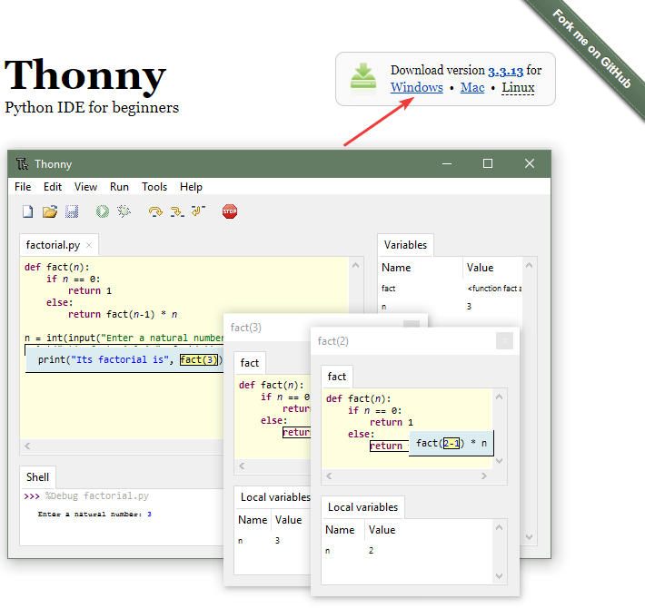

_Рисунок 1 — Скачивание установщика_

---

**Установка Thonny** <!-- !details -->

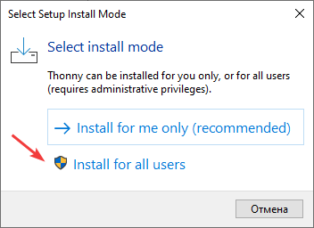

_Рисунок 2 — Выбор установки для всех пользователей_

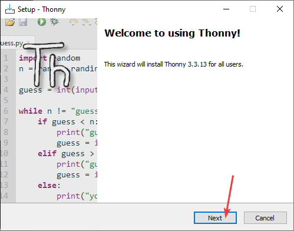

_Рисунок 3 — Начальное окно установки_

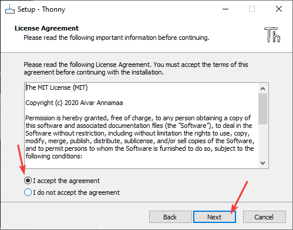

_Рисунок 4 — Соглашение с условиями_

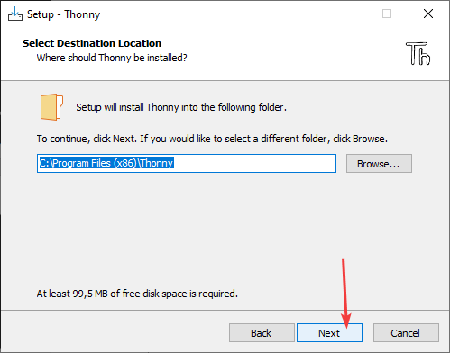

_Рисунок 5 — Выбор пути установки программы_

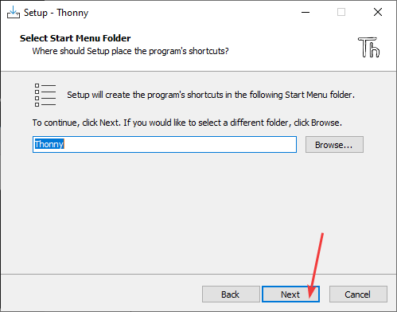

_Рисунок 6 — Выбор расположения в меню Пуск_

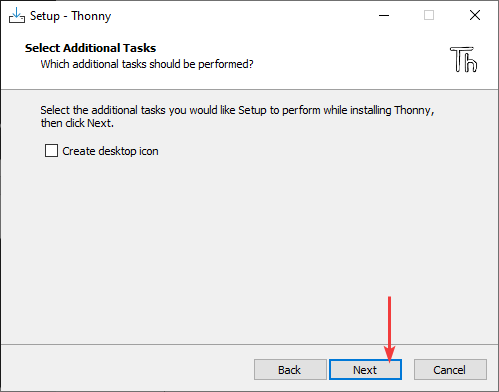

_Рисунок 7 — Создание ярлыка на рабочем столе_

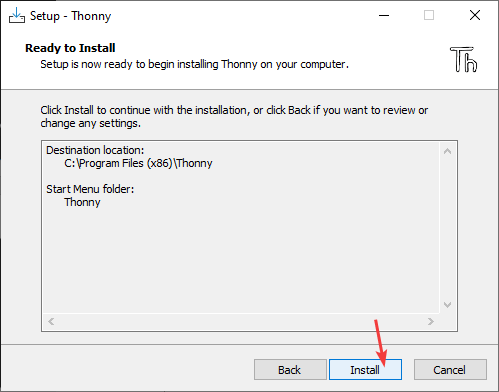

_Рисунок 8 — Окно перед процессом установки_

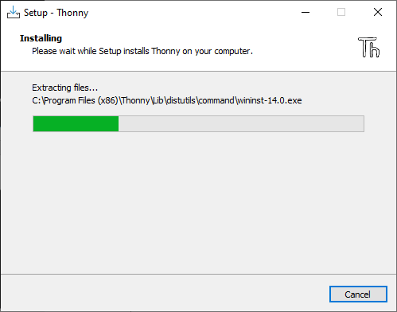

_Рисунок 9 — Процесс установки_

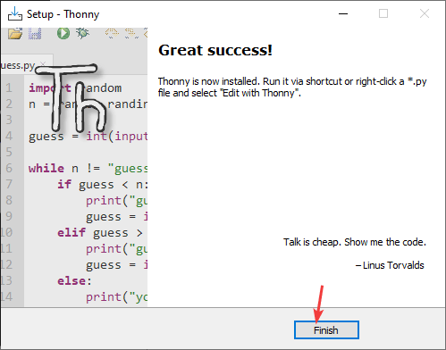

_Рисунок 10 — Окончание установки_

При запуске Thonny вас спросят про язык интерфейса (русский там есть тоже, но не советую его выбирать):

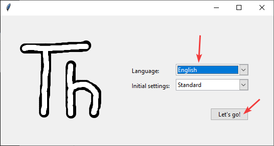

_Рисунок 11 — Настройка программы_

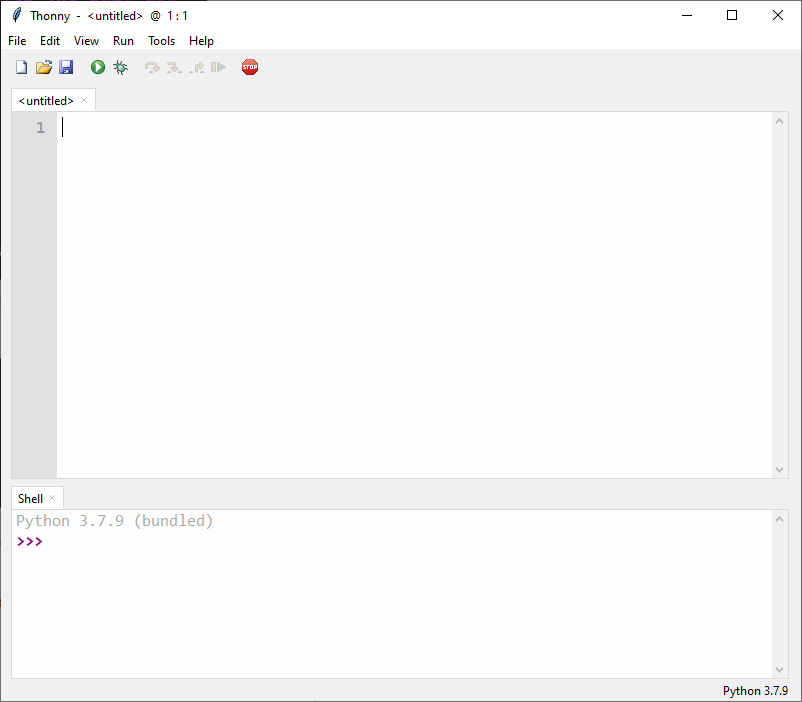

_Рисунок 12 — Открытая программа Thonny_

---

## Создание проекта

Открываем программу `Thonny`

Сразу уже есть пустой файл, в котором можно писать, но если нужно, то создать пустой файл можно через `File` → `New`:

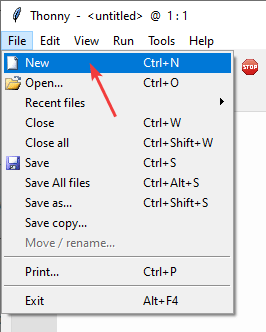

_Рисунок 13 — Создание пустого файла_

## Написание кода

Напишем программу сложения двух чисел:

```python
a = int(input("Введите первое число "))
b = int(input("Введите второе число "))
c = a + b
print("Сумма =", c)
```

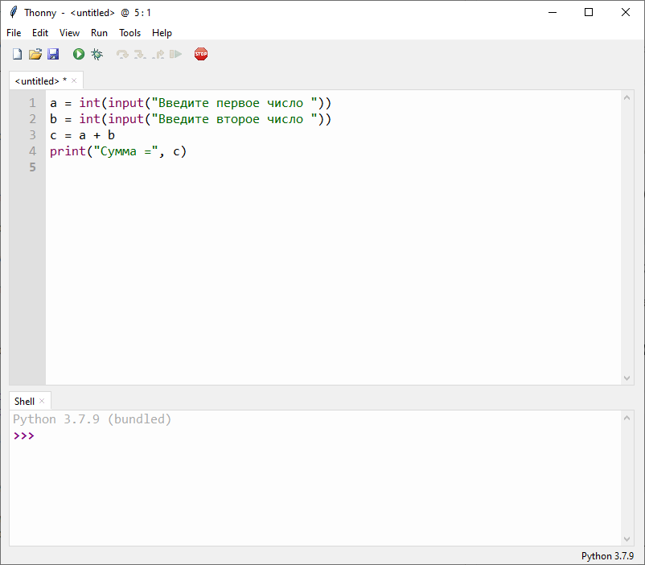

_Рисунок 14 — Код программы_

## Запуск программы

Так как мы еще не сохраняли наш файл, то сделаем это:

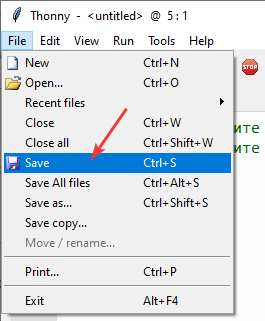

_Рисунок 15 — Сохранение файла_

Выберите папку и название вашего файла. Для данного примера я файл назвал `add2num.py`:

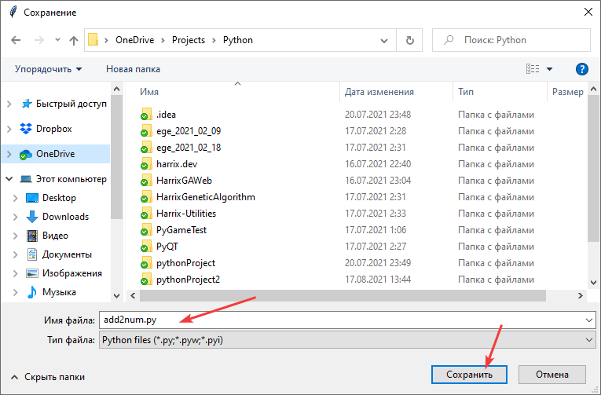

_Рисунок 16 — Выбор имени сохраняемого файла_

Скомпилируйте код и запустите его:

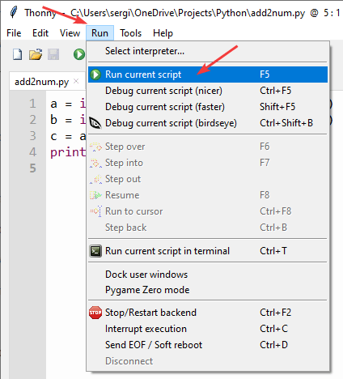

_Рисунок 17 — Компиляция и запуск программы_

После запустится программа, где мы можете ввести два числа и посмотреть на результат их суммирования:

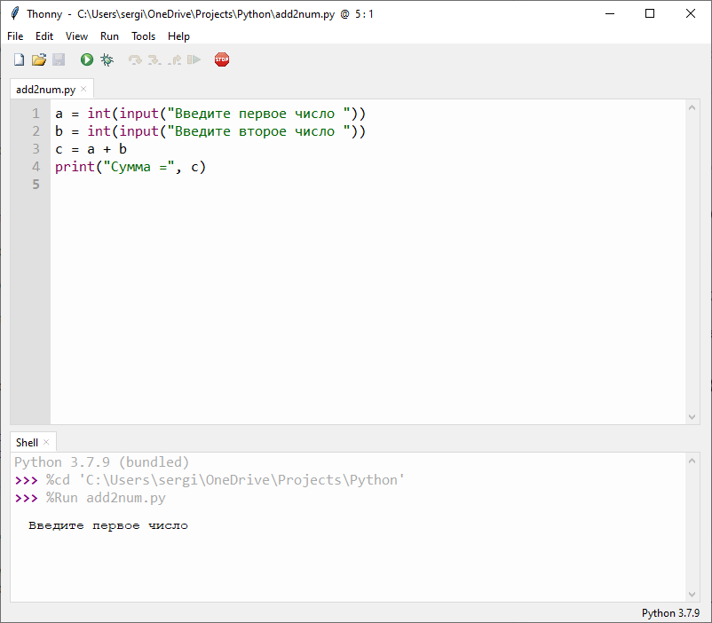

_Рисунок 18 — Запущенное приложение_

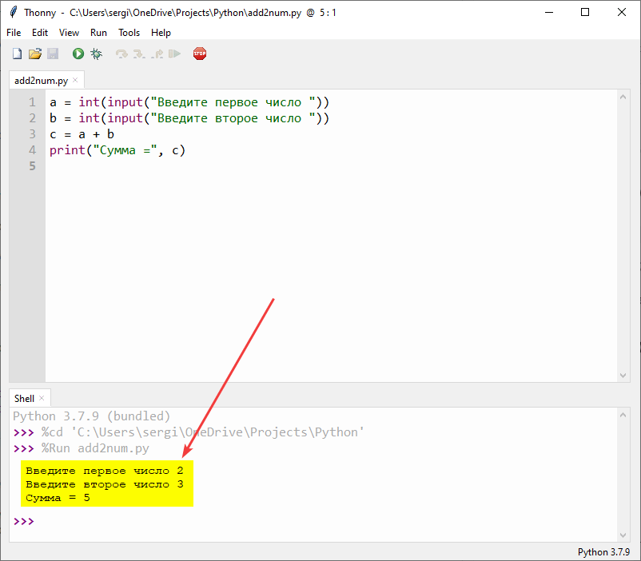

_Рисунок 19 — Результат выполнения программы_
