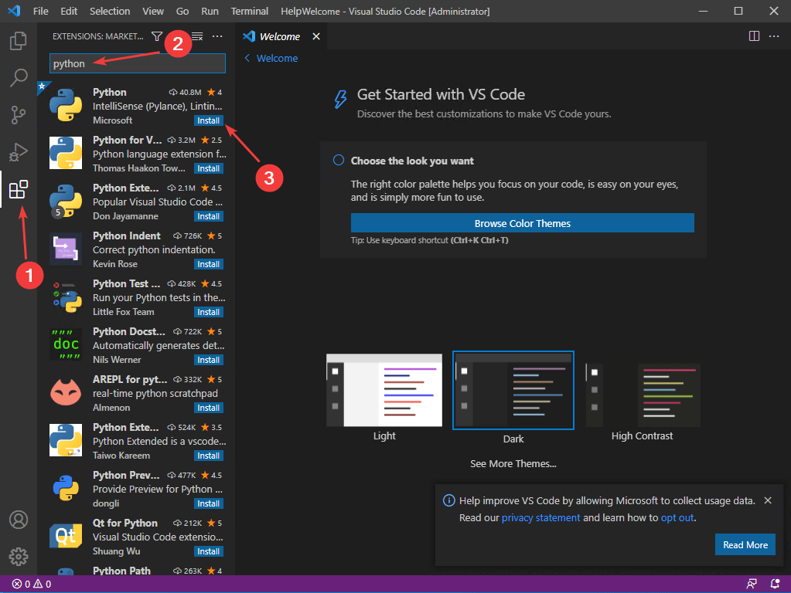
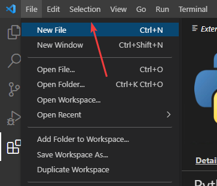
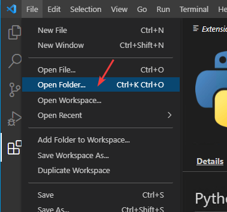
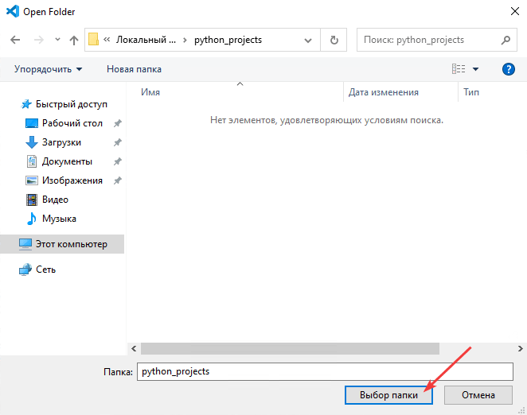
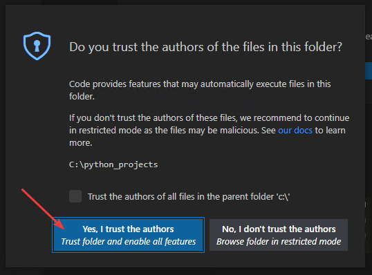
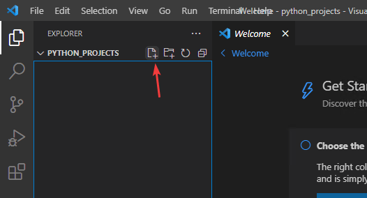
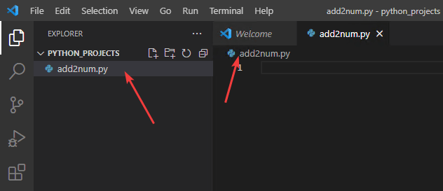
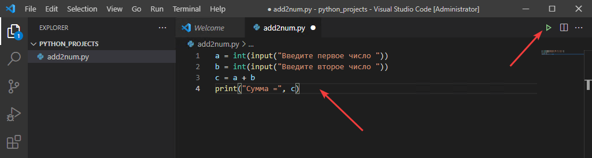
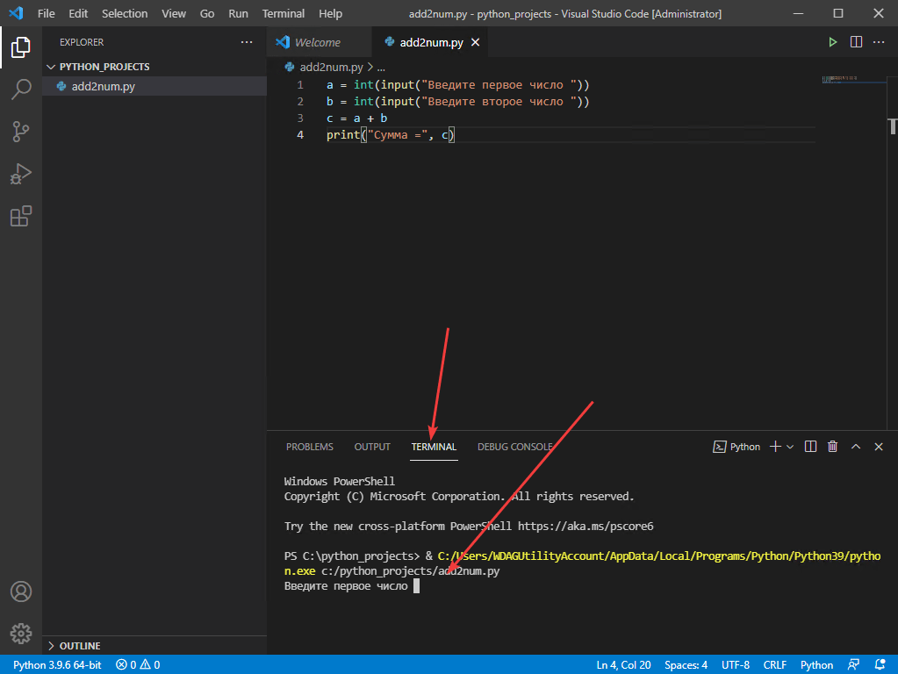
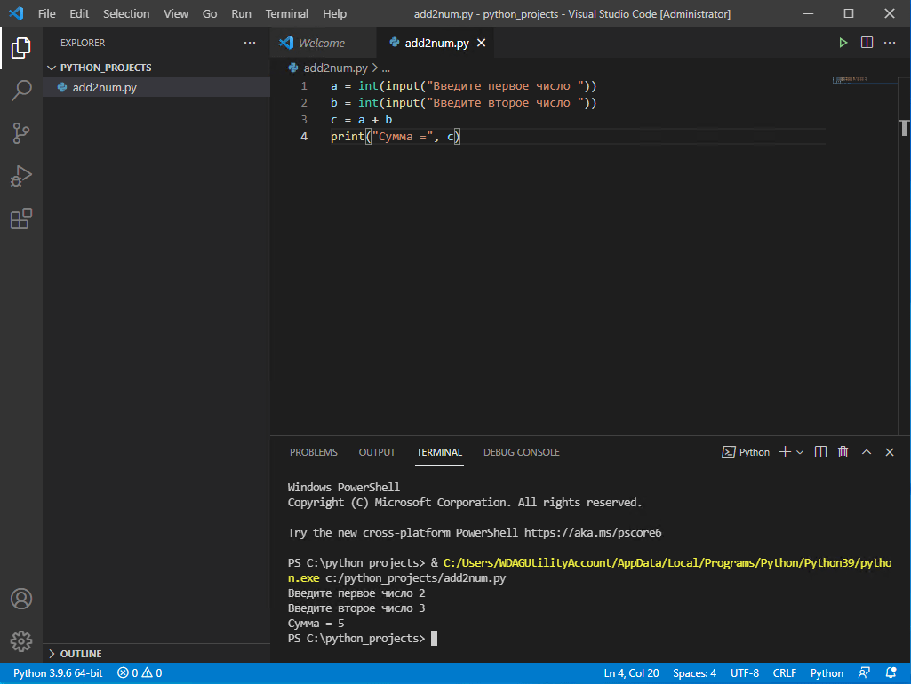

# Сложение двух чисел в VSCode на Python

Используем для программирования на Python самый популярный навороченный блокнот VSCode.

## Установка программы

Вначале надо установить Python себе на компьютер. Смотрите статью [Установка Python](https://github.com/Harrix/harrix.dev-blog-2021/blob/main/2021-08-03-install-python/2021-08-03-install-python.md).

Установите VSCode. Есть статья по его простой установке [Установка Visual Studio Code (простая)](https://github.com/Harrix/harrix.dev-blog-2021/blob/main/2021-08-01-install-vscode-simple/2021-08-01-install-vscode-simple.md). И есть статья с подробной и хардкорной настройкой [Установка Visual Studio Code](/blog/2022/install-vscode/).

После установите расширение Python в VScode:



## Создание файла

Создать новый файл можно стандартно через `File` → `New File`, а потом сохранить как скрипт Python:



Но можно пойти по другому пути, учитывая, что вы скорее всего будете создавать много Python файлов в рамках проекта или процесса обучения. В общем, откроем папку, где будем хранить все наши Python скрипты. Это позволит в VSCode сразу видеть все наши файла.

Создадим где-нибудь пустую папку, например, `C:\python_projects`, а потом откроем её в VSCode через `File` → `Open Folder…`:





VSCode стал подстраховываться и спрашивает доверяете ли вы авторам, которые создали папку (вдруг там вирусы). Но папку вы создали сами только что, так что доверяем авторам:



Откроется панель со всеми файлами папки. В нашем случае папка пуста, поэтому файла мы и не видим. Нажав на первую иконку, создадим новый файл:



Для примера файл назван `add2num.py`



## Написание кода

Напишем программу сложения двух чисел:

```py
a = int(input("Введите первое число "))
b = int(input("Введите второе число "))
c = a + b
print("Сумма =", c)
```



## Запуск программы

Через зеленую стрелку наверху справа, которая обозначена на скриншоте сверху, запускаем программу.

Запустится программа, где мы можете ввести два числа и посмотреть на результат их суммирования:




