# Сложение двух чисел в Wing Python IDE

В статье рассказывается как создать консольное приложения сложения двух чисел в Wing Python IDE.

## Установка программы

Вначале надо установить Python себе на компьютер. Смотрите статью [Установка Python](https://github.com/Harrix/harrix.dev-blog-2021/blob/main/2021-08-03-install-python/2021-08-03-install-python.md).

После этого на сайте <https://wingware.com/downloads/wing-personal> скачиваем установщик:

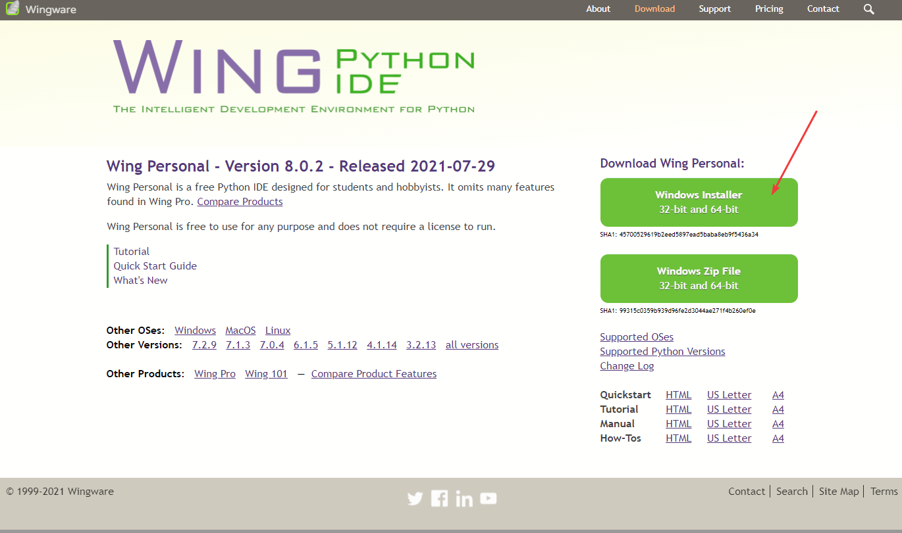

---

**Установка Wing Python IDE** <!-- !details -->

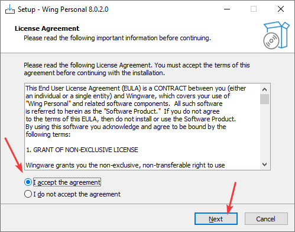


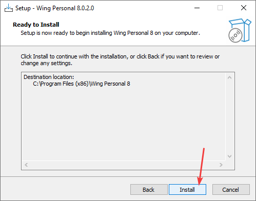

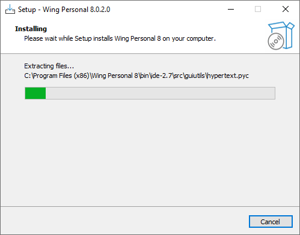

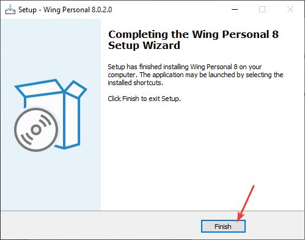

При запуске Wing Python IDE вас еще раз попросят согласиться с лицензией:

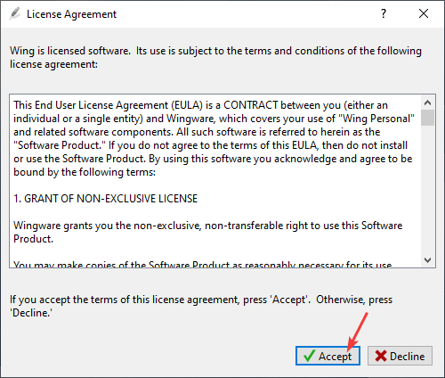

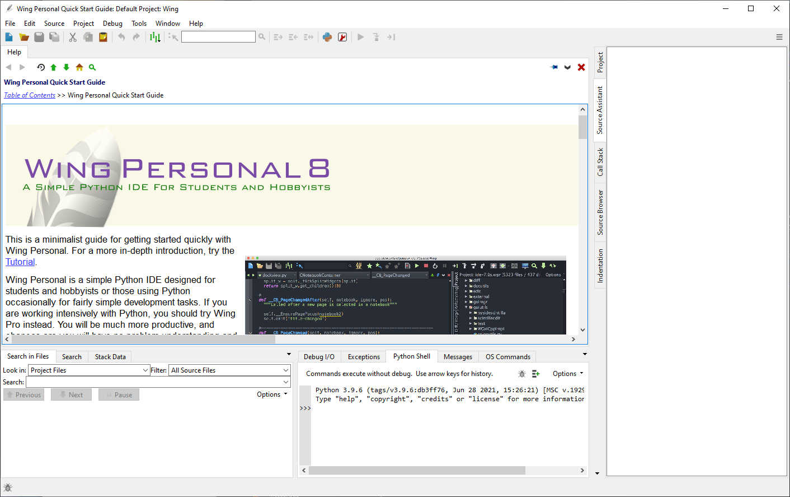

---

## Создание проекта

Открываем программу `Wing Python IDE` и создаем пустой файл `File` → `New`:

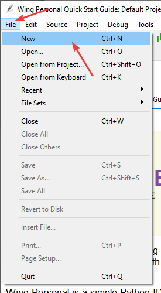

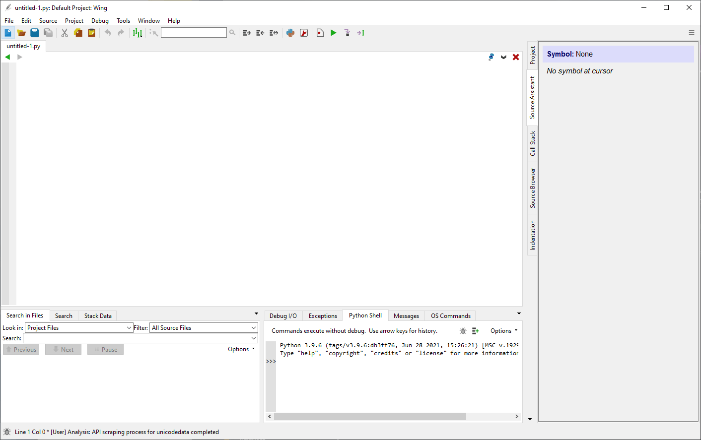

## Написание кода

Напишем программу сложения двух чисел:

```py
a = int(input("Введите первое число "))
b = int(input("Введите второе число "))
c = a + b
print("Сумма =", c)
```

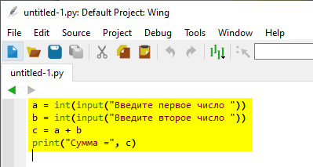

Обратите внимание на то, что при включенной русской раскладке клавиатуры горячие клавиши копирования `Ctrl` + `С`, вставки `Ctrl` + `V` работать не будут. Только на английской раскладке.

## Запуск программы

Скомпилируйте код и запустите его:

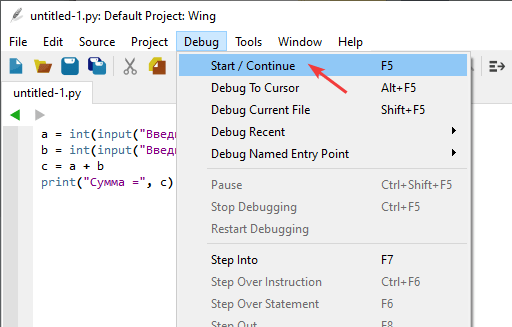

После этого вас попросят выбрать среду окружения, которую не меняем:

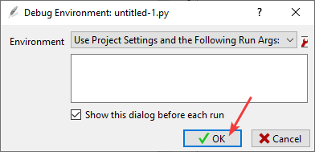

Так как мы еще не сохраняли наш файл, то сделаем это:

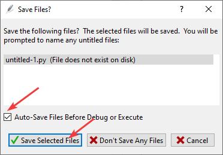

Выберите папку и название вашего файла. Для данного примера я файл назвал `add2num.py`:

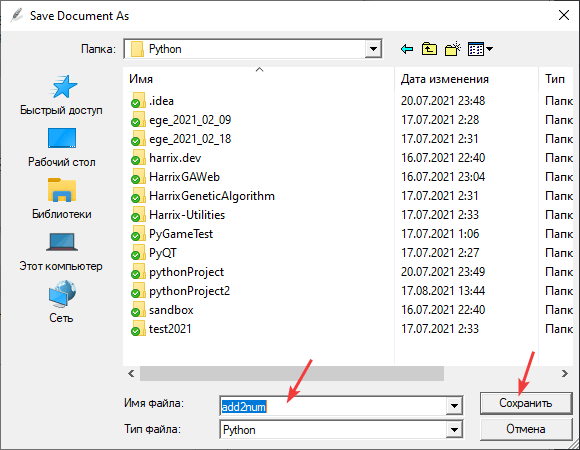

После запустится программа, где мы можете ввести два числа и посмотреть на результат их суммирования:

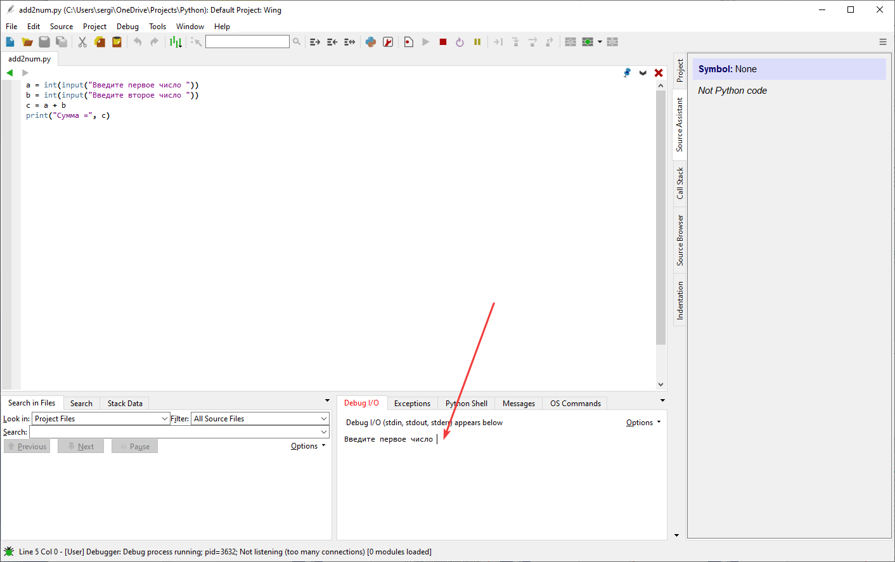

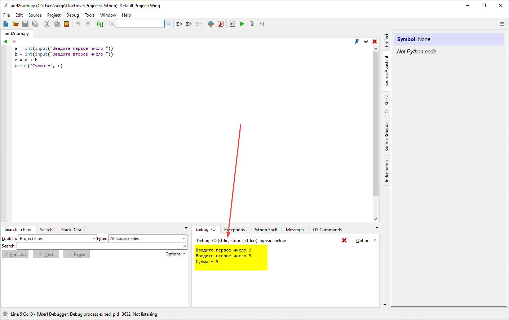
