# Создание пакетов в Python


Подробная инструкция по созданию собственного пакета Python на примере Windows 10.

<details>
<summary>📖 Содержание ⬇️</summary>

## Содержание

- [Подготовка](#подготовка)
- [Создание проекта](#создание-проекта)
- [Установка пакетов для создания пакетов](#установка-пакетов-для-создания-пакетов)
- [Создание пакета](#создание-пакета)
- [Тестирование пакета](#тестирование-пакета)
- [Создание requirements.txt](#создание-requirementstxt)
- [Сборка пакета и публикация на TestPyPi](#сборка-пакета-и-публикация-на-testpypi)
- [Использование пакета, опубликованного на TestPyPi](#использование-пакета-опубликованного-на-testpypi)
- [Сборка пакета и публикация на PyPi](#сборка-пакета-и-публикация-на-pypi)
- [Использование пакета, опубликованного на PyPi](#использование-пакета-опубликованного-на-pypi)
- [Публикация новой версии пакета](#публикация-новой-версии-пакета)
- [Развертывание разработки пакета на новой машине](#развертывание-разработки-пакета-на-новой-машине)
- [Установка локального пакета](#установка-локального-пакета)

</details>

Пакет, созданный для этой статьи:

- [https://github.com/Harrix/harrix-test-package](https://github.com/Harrix/harrix-test-package/tree/c4b5a51723920a9fdad966c29e769b44dc35384b)
- <https://pypi.org/project/harrix-test-package>
- <https://test.pypi.org/project/harrix-test-package>

Прочтите также официальную документацию по созданию пакетов: <https://packaging.python.org/tutorials/packaging-projects/>.

Пакет-шаблон, по мотивам которого, создавалась статья: <https://github.com/pypa/sampleproject>.

Все действия в командной строке, описанные в статье, можно выполнять в терминале, встроенного в другие программы (VSCode, PyCharm и др.).

Если возникают проблемы, например, с установкой пакетов, то иногда может помочь запуск командной строки или программы с терминалом под администратором.

## Подготовка

Проверьте доступность Python из командной строки:

```shell
python --version
```

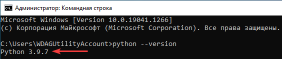

_Рисунок 1 — Версия_

Обновите **pip** и установите **virtualenv**, если пакет еще не установлен:

```shell
python -m pip install --upgrade pip
python -m pip install virtualenv
```

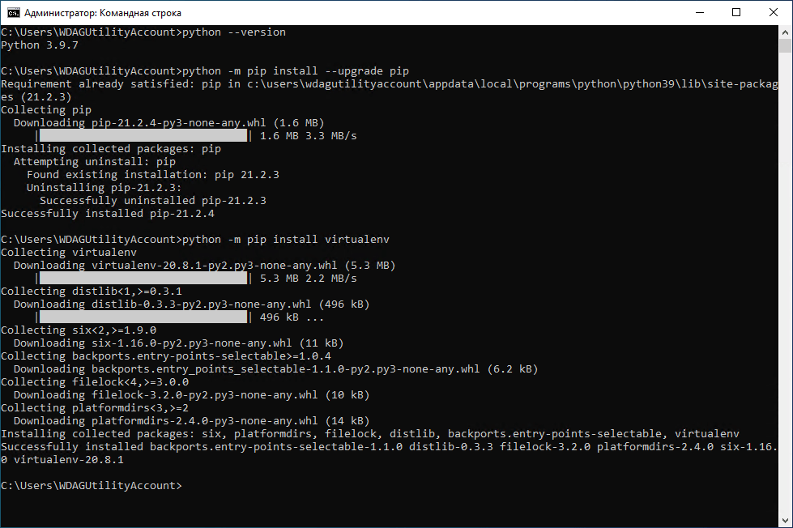

_Рисунок 2 — Установка virtualenv_

## Создание проекта

У меня проект будет называться `harrix-test-package` (но импортироваться будет как `harrixtestpackage`). Для своего проекта выберите своё название.

Создайте где-нибудь папку своего проекта. Например, я создал в папке `C:\projects` папку проекта `harrix-test-package`. Создавать можно как обычным путем через проводник, там и через консоль:

```shell
mkdir c:\projects\harrix-test-package
cd c:\projects\harrix-test-package
```

Если вы создаете папки и файлы не через командную строку, то не забудьте в ней перейти в созданную папку через команду `cd [путь к папке проекта]` (у меня`cd c:\projects\harrix-test-package`):

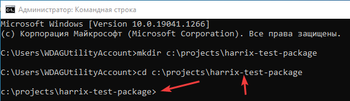

_Рисунок 3 — Переход в папку проекта_

Создайте под свой проект виртуальное окружение. У меня виртуальное окружение будет находиться в папке `.env`, находящейся в папке с проектом:

```python
python -m virtualenv .env
```

Затем активируйте его через команду `[Путь к виртуальному окружению]\Scripts\activate.bat`. В моем случае эта команда выглядит так:

```shell
c:\projects\harrix-test-package\.env\Scripts\activate.bat
```

В консоли в круглых скобках должно появиться название виртуального окружения:

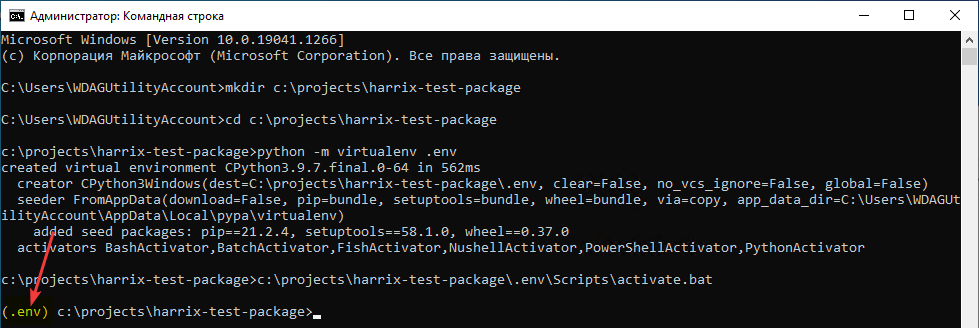

_Рисунок 4 — Активированное виртуальное окружение_

Помните, когда виртуальное окружение активировано, то все пакеты вы устанавливаете не глобально, а в конкретный проект. Если потребуется выйти из активированного виртуального окружения, то это сделать можно через команду `deactivate` или `[Путь к виртуальному окружению]\Scripts\deactivate.bat` (при этом название виртуального окружения в круглых скобках пропадет).

## Установка пакетов для создания пакетов

Установите пакеты [setuptools](https://pypi.org/project/setuptools/), [twine](https://pypi.org/project/twine/), [wheel](https://pypi.org/project/wheel/):

```shell
pip install setuptools
pip install twine
pip install wheel
```

## Создание пакета

У нас будет простой пакет с двумя функциями:

```python
def multiply_2(x):
    return x * 2

def multiply_10(x):
    return x * 10
```

В качестве хорошей заготовки под новый пакет может служить проект [sampleproject](https://github.com/pypa/sampleproject). Рекомендую подробно ознакомиться с файлом [setup.py](https://github.com/pypa/sampleproject/blob/main/setup.py), так как из проекта для этой статьи я взял не всё. Например, если в вашем пакете используются другие библиотеки, то в `setup.py` нужно добавить блок `install_requires`.

Папка `.env` уже была создана автоматически, и там располагается виртуальное окружение. Сами там ничего не трогаем.

В папке нашего проекта создадите такой набор файлов и папок (в проекте sampleproject файлов куда больше):

```text
├─ LICENSE
├─ README.md
├─ setup.cfg
├─ setup.py
├─ src
│  └─ harrixtestpackage
│     ├─ functions.py
│     └─ __init__.py
└─ tests
   ├─ test_functions.py
   └─ __init__.py
```

Основные файлы нашего пакета располагаем в папке `src` (об этом читайте [тут](https://hynek.me/articles/testing-packaging/)). Обратите внимание, что внутри папки `src` я располагаю название пакета в том виде, в котором я буду его импортировать в других проектах. И в этом названии дефисы использовать нельзя по правилам синтаксиса Python. Поэтому папка называется `harrixtestpackage` (без дефисов), а не `harrix-test-package`.

Файл `src\harrixtestpackage\__init__.py` импортирует всё то, что есть в нашем пакете для пользователей:

```python
from .functions import *
```

Файл `src\harrixtestpackage\functions.py`:

```python
def multiply_2(x):
    return x * 2

def multiply_10(x):
    return x * 10
```

Проверку нашего пакета будем делать через [unittest](https://docs.python.org/3/library/unittest.html). Для тестов создадим папку `tests` с файлами тестов.

Файл `tests\test_functions.py`:

```python
import unittest

import harrixtestpackage as h

class TestHarrixTestPackage(unittest.TestCase):

    def test_multiply_2(self):
        re = h.multiply_2(2)
        self.assertEqual(re, 4)

    def test_multiply_10(self):
        re = h.multiply_10(2)
        self.assertEqual(re, 20)


if __name__ == '__main__':
    unittest.main()
```

Файл `tests\__init__.py` пустой.

Теперь рассмотрим файлы настроек проекта.

Файл `setup.py`:

```python
from setuptools import find_packages, setup
import pathlib
here = pathlib.Path(__file__).parent.resolve()
long_description = (here / 'README.md').read_text(encoding='utf-8')

setup(
    name="harrix-test-package",
    version="0.1",
    description="Test package",
    long_description=long_description,
    long_description_content_type='text/markdown',
    url="https://github.com/Harrix/harrix-test-package",
    author="Anton Sergienko",
    author_email="anton.b.sergienko@gmail.com",
    packages=find_packages(where="src"),
    package_dir={"": "src"},
)
```

Параметры `name`, `version`, `description`, 'url', 'author', 'author_email' поменяйте под себя. Параметр `url` можно оставить пустым (`url="",`).

Файл `setup.cfg`:

```txt
[metadata]
license_files = LICENSE
```

В файле лицензии `LICENSE` располагается текст вашей лицензии. У меня это [MIT лицензия](https://en.wikipedia.org/wiki/MIT_License):

```markdown
MIT License

Copyright (c) [Year] [Your name]

Permission is hereby granted, free of charge, to any person obtaining a copy
of this software and associated documentation files (the "Software"), to deal
in the Software without restriction, including without limitation the rights
to use, copy, modify, merge, publish, distribute, sublicense, and/or sell
copies of the Software, and to permit persons to whom the Software is
furnished to do so, subject to the following conditions:

The above copyright notice and this permission notice shall be included in all
copies or substantial portions of the Software.

THE SOFTWARE IS PROVIDED "AS IS", WITHOUT WARRANTY OF ANY KIND, EXPRESS OR
IMPLIED, INCLUDING BUT NOT LIMITED TO THE WARRANTIES OF MERCHANTABILITY,
FITNESS FOR A PARTICULAR PURPOSE AND NONINFRINGEMENT. IN NO EVENT SHALL THE
AUTHORS OR COPYRIGHT HOLDERS BE LIABLE FOR ANY CLAIM, DAMAGES OR OTHER
LIABILITY, WHETHER IN AN ACTION OF CONTRACT, TORT OR OTHERWISE, ARISING FROM,
OUT OF OR IN CONNECTION WITH THE SOFTWARE OR THE USE OR OTHER DEALINGS IN THE
SOFTWARE.
```

Файл `README.md` содержит описание вашего пакета в формате [Markdown](https://ru.wikipedia.org/wiki/Markdown). Оно может быть любым. У меня оно такое:

````markdown
# harrix-test-package

Test package.

## Install

```shell
pip install harrix-test-package
```

```shell
pipenv install harrix-test-package
```

## Using

```python
import harrixtestpackage as h


print(h.multiply_2(2))
```
````

Если вы проект храните в git, то не забудьте про файл `.gitignore` под Python. Его можно найти [тут](https://github.com/github/gitignore) или сгенерировать [тут](https://www.toptal.com/developers/gitignore).

<details>
<summary>.gitignore</summary>

```python
### Python ###
# Byte-compiled / optimized / DLL files
__pycache__/
*.py[cod]
*$py.class

# C extensions
*.so

# Distribution / packaging
.Python
build/
develop-eggs/
dist/
downloads/
eggs/
.eggs/
lib/
lib64/
parts/
sdist/
var/
wheels/
share/python-wheels/
*.egg-info/
.installed.cfg
*.egg
MANIFEST

# PyInstaller
#  Usually these files are written by a python script from a template
#  before PyInstaller builds the exe, so as to inject date/other infos into it.
*.manifest
*.spec

# Installer logs
pip-log.txt
pip-delete-this-directory.txt

# Unit test / coverage reports
htmlcov/
.tox/
.nox/
.coverage
.coverage.*
.cache
nosetests.xml
coverage.xml
*.cover
*.py,cover
.hypothesis/
.pytest_cache/
cover/

# Translations
*.mo
*.pot

# Django stuff:
*.log
local_settings.py
db.sqlite3
db.sqlite3-journal

# Flask stuff:
instance/
.webassets-cache

# Scrapy stuff:
.scrapy

# Sphinx documentation
docs/_build/

# PyBuilder
.pybuilder/
target/

# Jupyter Notebook
.ipynb_checkpoints

# IPython
profile_default/
ipython_config.py

# pyenv
#   For a library or package, you might want to ignore these files since the code is
#   intended to run in multiple environments; otherwise, check them in:
# .python-version

# pipenv
#   According to pypa/pipenv#598, it is recommended to include Pipfile.lock in version control.
#   However, in case of collaboration, if having platform-specific dependencies or dependencies
#   having no cross-platform support, pipenv may install dependencies that don't work, or not
#   install all needed dependencies.
#Pipfile.lock

# PEP 582; used by e.g. github.com/David-OConnor/pyflow
__pypackages__/

# Celery stuff
celerybeat-schedule
celerybeat.pid

# SageMath parsed files
*.sage.py

# Environments
.env
.venv
env/
venv/
ENV/
env.bak/
venv.bak/

# Spyder project settings
.spyderproject
.spyproject

# Rope project settings
.ropeproject

# mkdocs documentation
/site

# mypy
.mypy_cache/
.dmypy.json
dmypy.json

# Pyre type checker
.pyre/

# pytype static type analyzer
.pytype/

# Cython debug symbols
cython_debug/

```

</details>

## Тестирование пакета

Как проверять работу функций пакета? Можно, например, в корне проекта создать нужный `.py` файл, который будет всё проверять. Но это считается неправильным подходом. Поэтому в нашем файле для тестирования создана папка `tests`, а все тесты реализованы через `unittest`.

Но если запустить файл `test_functions.py` с тестами или запустить тесты через команду `python -m unittest discover tests`, то Python не найдет наш пакет:

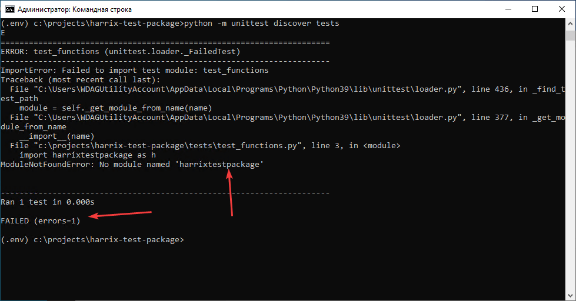

_Рисунок 5 — Ошибка при запуске пакетов_

```shell
python -m unittest discover tests
E
======================================================================
ERROR: test_functions (unittest.loader._FailedTest)
----------------------------------------------------------------------
ImportError: Failed to import test module: test_functions
Traceback (most recent call last):
  File "C:\Users\WDAGUtilityAccount\AppData\Local\Programs\Python\Python39\lib\unittest\loader.py", line 436, in _find_test_path
    module = self._get_module_from_name(name)
  File "C:\Users\WDAGUtilityAccount\AppData\Local\Programs\Python\Python39\lib\unittest\loader.py", line 377, in _get_module_from_name
    __import__(name)
  File "c:\projects\harrix-test-package\tests\test_functions.py", line 3, in <module>
    import harrixtestpackage as h
ModuleNotFoundError: No module named 'harrixtestpackage'
```

В теории его можно собрать, отправить на сервер [PyPi](https://pypi.org/) или [TestPyPi](https://test.pypi.org/), установить себе и запустить тесты. Но такой способ крайне плох, так как публиковать пакет ради теста самого пакета, — опасная затея.

Поэтому установим наш пакет в [режиме разработчика](https://packaging.python.org/guides/distributing-packages-using-setuptools/#working-in-development-mode), не публикуя его (не забудьте про точку в конце):

```shell
python -m pip install -e .
```

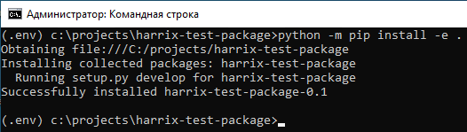

_Рисунок 6 — Установка пакета в режиме разработчика_

Теперь запуск юнит-тестов пройдет успешно:

```shell
python -m unittest discover tests
```

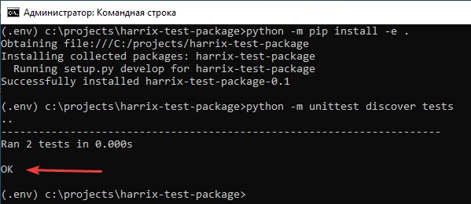

_Рисунок 7 — Тестирование пакета_

При этом вы можете вносить изменения в пакет и его тестировать без каких-либо дополнительных действий.

## Создание requirements.txt

Чтобы потом можно было развернуть проект на другой машине, то создайте файл со списком пакетов:

```shell
python -m pip freeze > requirements.txt
```

Удалите из файла эти строчки:

```text
# Editable install with no version control (harrix-test-package==0.1)
-e c:\projects\harrix-test-package\src
```

## Сборка пакета и публикация на TestPyPi

Перед публикацией пакета на основном сервере, лучше опубликовать пакет на тестовом сервере TestPyPi.

Зарегистрируйтесь на [TestPyPi](https://test.pypi.org/account/register/).

Соберите пакет для публикации:

```shell
python setup.py sdist bdist_wheel
```

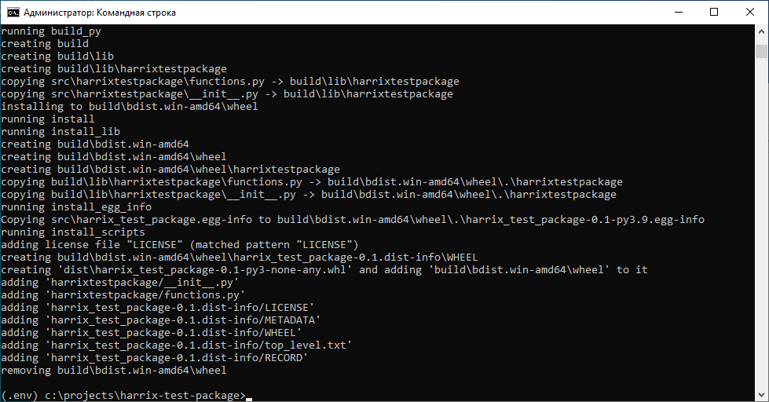

_Рисунок 8 — Успешная сборка пакета_

Отправьте пакет на тестовый сервер. При этом вам нужно будет ввести логин и пароль от своей учетки на TestPyPi. Обратите внимание на то, что когда вы будете вводить пароль, то пароль или звездочки не будут печататься. Но пароль будет вводиться в систему:

```python
twine upload --repository-url https://test.pypi.org/legacy/ dist/*
```

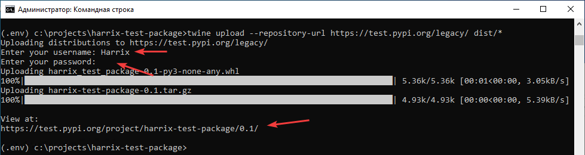

_Рисунок 9 — Успешная публикация пакета_

В случае успеха будет напечатана ссылка на опубликованный пакет. У меня это <https://test.pypi.org/project/harrix-test-package>.

## Использование пакета, опубликованного на TestPyPi

Для проверки опубликованного пакета я создам новый Python проект (например, с именем `test`) со своим виртуальным окружением, куда установлю опубликованный пакет.

```shell
deactivate
mkdir c:\projects\test
cd c:\projects\test
python -m virtualenv .env
c:\projects\test\.env\Scripts\activate.bat
```

Устанавливаем пакет. Команду для установки берем со страницы пакета <https://test.pypi.org/project/harrix-test-package>:

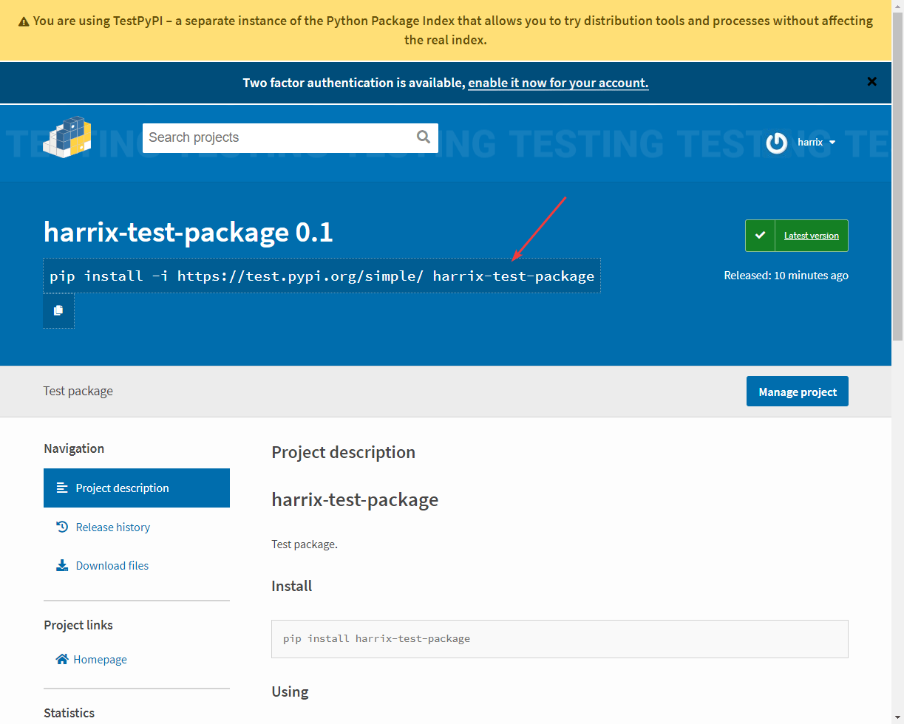

_Рисунок 10 — Установленный пакет_

```shell
python -m pip install -i https://test.pypi.org/simple/ harrix-test-package
```

В созданной папке `c:\projects\test\` создаем файл `main.py`:

```python
import harrixtestpackage as h


print(h.multiply_2(2))
```

После запустим данный файл:

```shell
python main.py
```

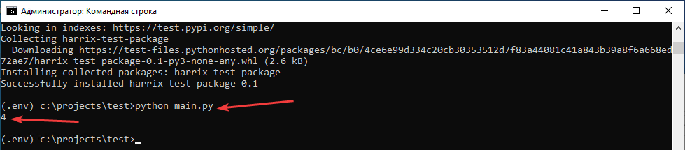

_Рисунок 11 — Запуск скрипта_

Мы видим вывод числа 4. Значит, всё работает хорошо.

## Сборка пакета и публикация на PyPi

Теперь опубликуем пакет на основном сервере. Для демонстрации я закрыл командную строку и открыл новую. В ней перехожу в папку пакета и активирую виртуальное окружение (используя неполный путь):

```shell
cd c:\projects\harrix-test-package
.env\Scripts\activate.bat
```

Зарегистрируйтесь на [PyPi](https://pypi.org/account/register/).

Соберите пакет для публикации:

```shell
python setup.py sdist bdist_wheel
```

Отправьте пакет на основной сервер. При этом вам нужно будет ввести логин и пароль от своей учетки на PyPi:

```python
twine upload dist/*
```

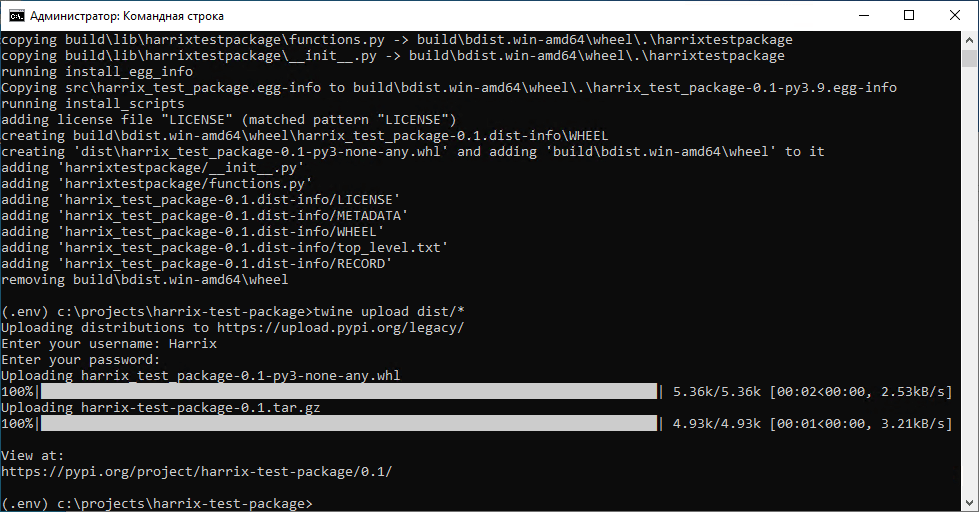

_Рисунок 12 — Успешная публикация пакета_

В случае успеха будет напечатана ссылка на опубликованный пакет. У меня это <https://pypi.org/project/harrix-test-package/0.1>. Отсюда получаем путь к нашему пакету <https://pypi.org/project/harrix-test-package/>:

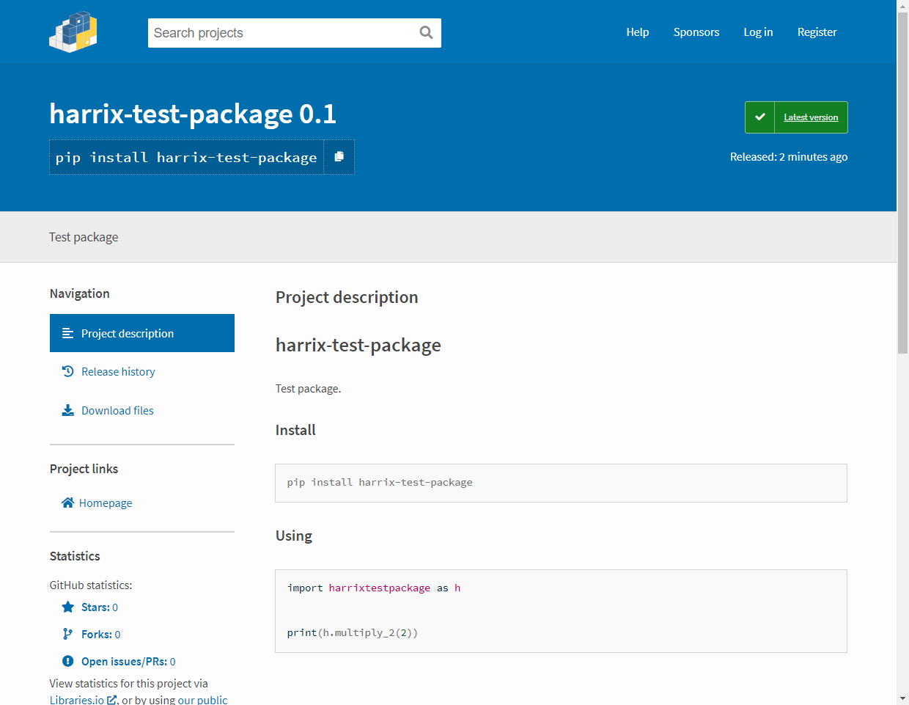

_Рисунок 13 — Пакет в библиотеке пакетов_

## Использование пакета, опубликованного на PyPi

Для проверки опубликованного пакета я создам новый Python проект (например, с именем `test2`) со своим виртуальным окружением, куда установлю опубликованный пакет.

```shell
deactivate
mkdir c:\projects\test2
cd c:\projects\test2
python -m virtualenv .env
.env\Scripts\activate.bat
```

Устанавливаем пакет. Команду для установки берем со страницы пакета <https://pypi.org/project/harrix-test-package>:


_Рисунок 14 — Установленный пакет_

```shell
python -m pip install harrix-test-package
```

В созданной папке `c:\projects\test2\` создаем файл `main.py`:

```python
import harrixtestpackage as h


print(h.multiply_2(2))
```

После запустим данный файл:

```shell
python main.py
```

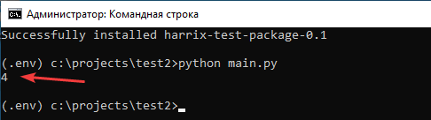

_Рисунок 15 — Запуск скрипта_

Мы видим вывод числа 4. Значит, всё работает хорошо.

## Публикация новой версии пакета

Попробуем добавить новую функцию в пакет и опубликовать новую версию. Итак, мега полезная функция:

```python
def multiply_20(x):
    return x * 20
```

После добавления файл `src\harrixtestpackage\functions.py` примет вид:

```python
def multiply_2(x):
    return x * 2

def multiply_10(x):
    return x * 10

def multiply_20(x):
    return x * 20
```

Также добавим новый тест в файл `tests\test_functions.py`:

```python
import unittest

import harrixtestpackage as h

class TestHarrixTestPackage(unittest.TestCase):

    def test_multiply_2(self):
        re = h.multiply_2(2)
        self.assertEqual(re, 4)

    def test_multiply_10(self):
        re = h.multiply_10(2)
        self.assertEqual(re, 20)

    def test_multiply_20(self):
        re = h.multiply_20(2)
        self.assertEqual(re, 40)


if __name__ == '__main__':
    unittest.main()
```

Теперь надо запустить юнит-тесты. Для примера я открыл новую командую строку (если вы были в чужом виртуальном окружении, то не забывайте выходить из него через `deactivate`):

```shell
cd c:\projects\harrix-test-package
.env\Scripts\activate.bat
python -m unittest discover tests
```

Тесты успешно пройдены:

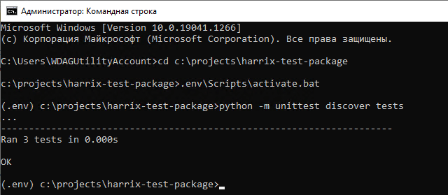

_Рисунок 16 — Тестирование пакета_

В файле `setup.py` поменяем номер версии пакета на `0.2`:

```python
from setuptools import find_packages, setup
import pathlib
here = pathlib.Path(__file__).parent.resolve()
long_description = (here / 'README.md').read_text(encoding='utf-8')

setup(
    name="harrix-test-package",
    version="0.2",
    description="Test package",
    long_description=long_description,
    long_description_content_type='text/markdown',
    url="https://github.com/Harrix/harrix-test-package",
    author="Anton Sergienko",
    author_email="anton.b.sergienko@gmail.com",
    packages=find_packages(where="src"),
    package_dir={"": "src"},
)
```

Собираем и публикуем пакет:

```shell
python setup.py sdist bdist_wheel
twine upload dist/*
```

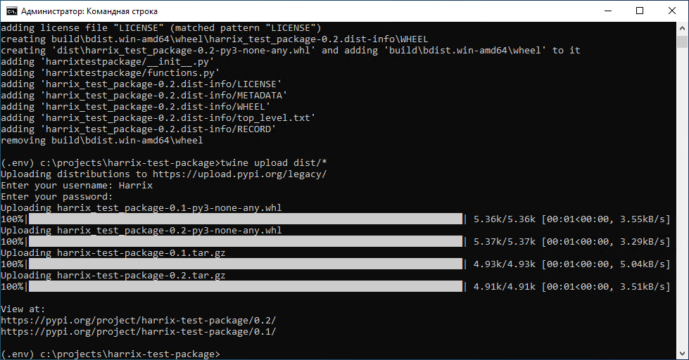

_Рисунок 17 — Публикация новой версии пакета_

В проектах, в котором использовался наш пакет обновляем его через команду:

```shell
pip install harrix-test-package --upgrade
```

## Развертывание разработки пакета на новой машине

У нас есть, например, на GitHub [исходники](https://github.com/Harrix/harrix-test-package) нашего пакета, которые мы хотим склонировать на другой компьютер, например, в папку `c:\python-projects` (для примера папку специально назвал по-другому, чтобы она отличалась от `c:\projects`).

Считаем, что [Python](https://github.com/Harrix/harrix.dev-articles-2021/blob/main/install-python/install-python.md) | [↗️](https://harrix.dev/ru/articles/2021/install-python/) и [Git](https://github.com/Harrix/harrix.dev-articles-2021/blob/main/install-git/install-git.md) | [↗️](https://harrix.dev/ru/articles/2021/install-git/) у вас установлены на новой машине. Cклонировать проект можно такой командой:

```shell
mkdir c:\python-projects
cd c:\python-projects
git clone https://github.com/Harrix/harrix-test-package
cd c:\python-projects\harrix-test-package
```

Или вы просто копируете как-нибудь свой проект на другую машину (да хоть через флешку).

На всякий случай обновляем pip и устанавливаем virtualenv:

```shell
python -m pip install --upgrade pip
python -m pip install virtualenv
```

Создаем виртуальное окружение и его активируем:

```shell
python -m virtualenv .env
.env\Scripts\activate.bat
```

Если в файле `requirements.txt` есть две подобные строчки, то удалите их:

```text
# Editable install with no version control (harrix-test-package==0.1)
-e c:\projects\harrix-test-package\src
```

Установите все пакеты из файла `requirements.txt`:

```shell
python -m pip install -r requirements.txt
```

Устанавливаем наш пакет в режиме разработчика:

```shell
python -m pip install -e .
```

Всё пакет готов для разработки. Теперь можно добавлять новые функции, тестировать, отправлять на сервер новые версии.

Например, в файл `src\harrixtestpackage\functions.py` добавляю функцию:

```python
def multiply_30(x):
    return x * 30
```

В файл `tests\test_functions.py` добавляю тест:

```python
def test_multiply_30(self):
    re = h.multiply_30(2)
    self.assertEqual(re, 60)
```

Запускаю юнит-тесты:

```shell
python -m unittest discover tests
```

В файле `setup.py` меняю номер версии пакета на `0.3`.

Собираю и публикую пакет:

```shell
python setup.py sdist bdist_wheel
twine upload dist/*
```

## Установка локального пакета

Если вы пока не хотите публиковать разрабатываемый пакет, но хотите использовать его в другом проекте, то его можно установить локально:

```shell
pip install -e c:/projects/harrix-test-package
```

В качестве `c:/projects/harrix-test-package` выступает путь, где находится `setup.py`.

Или просто скопировать папку пакета с кодом`C:\GitHub\harrix-test-package\src\harrixtestpackage` с кодом в папку `[папка виртуального окружения]\Lib\site-packages`.
