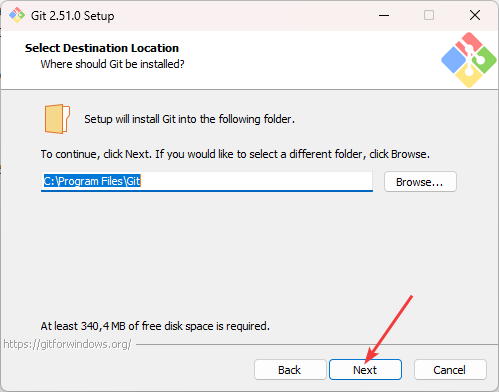
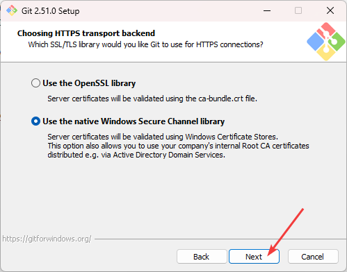
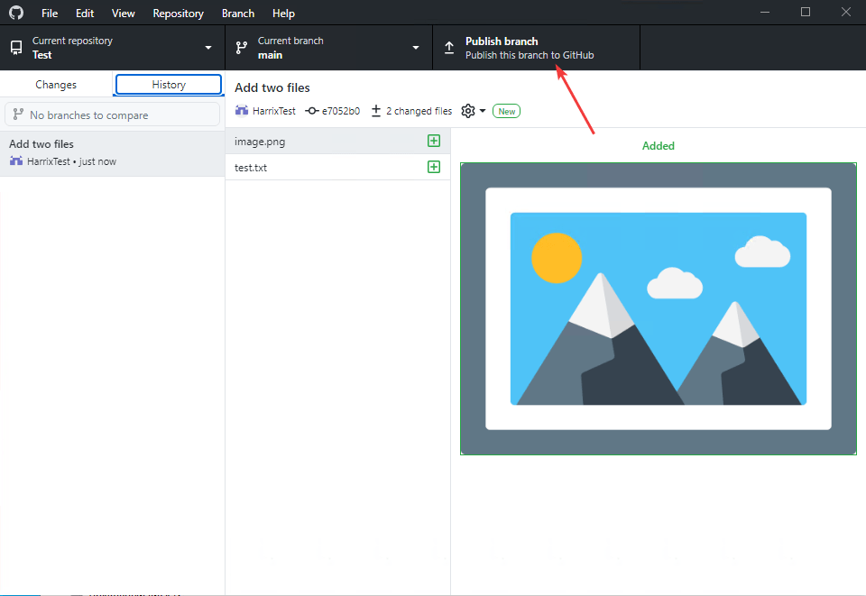

# Установка Git + GitHub Desktop и работа с ними


В статье рассказывается, как новичку установить Git и начать с ним работать через GitHub.

## Содержание

- [Установка Git](#установка-git)
- [Создание учетки в GitHub](#создание-учетки-в-github)
- [Создание нового репозитория](#создание-нового-репозитория)
- [Установка GitHub Desktop](#установка-github-desktop)
- [Клонирование Git репозитория](#клонирование-git-репозитория)
- [Работа с проектом](#работа-с-проектом)

В этой статье не рассказывается подробно о технологии Git и его возможностях. Для этого есть [официальный учебник](https://git-scm.com/book/ru/v2/) и множество других ресурсов.

## Установка Git

Скачиваем установщик на сайте <https://git-scm.com/>:


_Рисунок 1 — Скачивание установщика под Windows_

Не бойтесь непонятных пояснений, которые будут встречаться в процессе установки.

Запускаем установку:


_Рисунок 2 — Начальное окно установщика_



_Рисунок 3 — Выбор пути установки Git_

Лично я кроме включенных по умолчанию настроек выбираю ежедневную проверку новых обновлений Git и поддержку работы с Windows Terminal. Вы можете их не выбирать:


_Рисунок 4 — Выбор настроек установки_


_Рисунок 5 — Выбор расположения в меню Пуск_

Для работы с Git иногда требуется из-под консоли Git запускать текстовой редактор. И тут можно выбрать, какой текстовой редактор будет запускаться при этом. Если у вас ничего особенного нет, то выбирайте обычный блокнот `Use Notepad as Git's default editor`. У меня же стоит Visual Studio Code Insiders, поэтому я выбираю выделенный синим пункт:


_Рисунок 6 — Выбор текстового редактора для работы с Git_

На западе борьба за права некоторых групп населения проявилась и тут. Раньше начальная [ветка](https://git-scm.com/book/ru/v2/%D0%92%D0%B5%D1%82%D0%B2%D0%BB%D0%B5%D0%BD%D0%B8%D0%B5-%D0%B2-Git-%D0%9E-%D0%B2%D0%B5%D1%82%D0%B2%D0%BB%D0%B5%D0%BD%D0%B8%D0%B8-%D0%B2-%D0%B4%D0%B2%D1%83%D1%85-%D1%81%D0%BB%D0%BE%D0%B2%D0%B0%D1%85) в Git называлась `master`. Но теперь в GitHub она называется `main`, так как `master` по своему смыслу означает рабовладельцев в текущих реалиях политкорректности. Чтобы не иметь проблем с GitHub, то выбираем начальное название ветки, как `main`


_Рисунок 7 — Выбор названия начальной ветки_

Далее идет выбор того, как Git будет вызываться в командной строке. Оставляем по умолчанию, чтобы Git работал везде, но не переписывал стандартные команды консоли Windows:


_Рисунок 8 — Настройка PATH_

Если не разбирайтесь в SSH и не хотите что-то настраивать под себя, то выбираете по умолчанию:


_Рисунок 9 — Настройка SSH_

Опять таки стандартная настройка работы с SSL нас устроит:



_Рисунок 10 — Настройка SSL_

В Windows в текстовых документах строки оканчиваются на два символа `\r\n`, тогда как в Linux окачиваются строки только на `\n`. И из-за этого возникают проблемы при обработке одних и тех же текстовых документов в разных операционных системах. Так как мы устанавливаем под Windows, но в то же время хотим стандартную работу Git, то в Git строки будут попадать с `\n` на конце. В общем, оставляем всё по умолчанию:


_Рисунок 11 — Настройка окончания строк для коммитов_

GitBash будем запускать в родном эмуляторе MinTTY (так, например, удобно работать с OpenSSL для некоторых задач). То есть опять по умолчанию оставляем:


_Рисунок 12 — Настройка терминала для GitBash_

Поведение команды `git pull` (загрузка удаленного репозитория на локальную машину) оставляем без изменений:


_Рисунок 13 — Выбор поведения git pull_

Систему аутентификации пользователей Git также берем по умолчанию:


_Рисунок 14 — Выбор credential helper_

В дополнительных настройках опять таки оставляем всё по умолчанию:


_Рисунок 15 — Выбор дополнительных настроек_

Экспериментальные функции не выбираем:


_Рисунок 16 — Выбор экспериментальных возможностей_


_Рисунок 17 — Процесс установки_


_Рисунок 18 — Окончание установки_

Теперь Git установлен на вашем компьютере и через консоль вы можете полноценно работать с ним. Но мы же хотим работать со связкой с GitHub, поэтому перейдем к нему.

## Создание учетки в GitHub

GitHub и Git — это разные вещи. GitHub — это сайт, где вы можете размещать проекты с использованием Git + всякие плюшки самого GitHub.

Итак, переходим на сайт <https://github.com/> и переходим по ссылке `Sign up`:


_Рисунок 19 — Главная страница сайта GitHub_

На момент написания статьи процесс создания аккаунта какой-то мультяшный и сильно нагружает процессор, так что на момент чтения статьи он может быть изменен.

Вводим свой Email:


_Рисунок 20 — Ввод Email_

Придумываем пароль:


_Рисунок 21 — Выбор пароля_

Выбираем свободное имя для своего аккаунта. Этот шаг **важен**! Возможно, что в будущем ваши работодатели будут видеть его название:


_Рисунок 22 — Выбор имени пользователя_

Нам же не нужен спам? Поэтому пишем `n`:


_Рисунок 23 — Отказ от получения спама на почту_

Далее вам нужно будет подтвердить, что вы не робот:


_Рисунок 24 — Проверка на человека_

Если вы не робот, то вам разрешат создать свой аккаунт:


_Рисунок 25 — Создание аккаунта_

После этого на почту придет код в письме, который надо будет ввести.

После этого учетная запись будет создана, но GitHub еще кое-что вас спросит, чтобы можно было предложить платный тарифный план. Но это нам не нужно, поэтому просто пропускаем:


_Рисунок 26 — Пропуск персонализации аккаунта_

И вот ваш пустой аккаунт в GitHub создан:


_Рисунок 27 — Созданный аккаунт_

Не забывайте выходить из аккаунта на общих машинах:


_Рисунок 28 — Выход из учетной записи_

В входить нужно через `Sign in`:


_Рисунок 29 — Вход в уже существующую учетную запись_

## Создание нового репозитория

Репозиторий — это проект в терминологии Git. Создадим новый репозиторий через знак плюса:


_Рисунок 30 — Создание нового репозитория_

Обязательно нужно указать только название проекта (английские буквы). В примере я его назвал `Test`. Остальное опционально:


_Рисунок 31 — Настройка проекта_

Хоть остальное опционально, но расскажу про каждый пункт под спойлером:

<details>
<summary>Описание параметров репозитория</summary>

**Description** — необязательное описание вашего проекта. Помогает в поиске проектов.

Например, я в GitHub в поиске ввел `plot` и в результатах поиска сразу могу прочитать краткое описание каждого проекта:


_Рисунок 32 — Настройка проекта_

**Public, Private** — если проект в режиме `Private`, то его только вы сможете увидеть; проекты в режиме `Public` общедоступны. Раньше приватные проекты были платными, сейчас бесплатны.

**Add a README file** — добавит в ваш проект файл `README.md` в формате [Markdown](https://ru.wikipedia.org/wiki/Markdown), в котором вы можете подробно описать свой проект. Более подробно [тут](https://docs.github.com/en/github/creating-cloning-and-archiving-repositories/creating-a-repository-on-github/about-readmes). Именно эти файлы вы видите в проекте, когда его открываете:


_Рисунок 33 — Пример файла README.md_

**Add .gitignore** — добавит в ваш проект файл `.gitignore`. Когда вы работает над проектом в какой-нибудь среде (Pycharm, Visual Studio и так далее), то в процессе работы образуются файлы, которые сохранять в Git не нужно: они временный мусор. Например, в Qt образуется файл с расширением `.pro.user`: он на каждом компьютере создается автоматически. А в Node.js проектах в GitHub не нужно тащить папку пакетов `node_modules`, так как она создается автоматически после команды `npm i` через файл `package.json`. И чтобы не тащить весь этот мусор, в файле `.gitignore` прописываются шаблоны мусора, который в Git не попадет. При выборе галочки появится список языков, которые подберут для вас нужное содержимое файла `.gitignore`:


_Рисунок 34 — Пример выбора файла .gitignore_

А в репозитории <https://github.com/github/gitignore> или на сайте <https://www.toptal.com/developers/gitignore> представлено гораздо больше шаблонов `.gitignore` файлов.

**Choose a license** — добавит в ваш проект файл лицензии. Есть много лицензий для распространения программ. Например, [MIT](https://ru.wikipedia.org/wiki/%D0%9B%D0%B8%D1%86%D0%B5%D0%BD%D0%B7%D0%B8%D1%8F_MIT) позволяет делать с кодом почти всё, но снимает с автора кода любую ответственность. А лицензия [GNU GPL](https://ru.wikipedia.org/wiki/GNU_General_Public_License) заставляет тех, кто использует ваш код, свои проекты также делать под GNU GPL лицензией: открыто и свободно. Можно написать и свою лицензию. В общем, лицензия — это просто текстовой файл с описанием того, что может человек делать с вашим проектом, а что не может.

Кстати, все эти три файла можно будет добавлять в проект потом вручную как обычные файлы, так что не обязательно их сейчас тут выбирать.

</details>

Итак, вы нажали на кнопку `Create repository`, и у вас создаться репозиторий:


_Рисунок 35 — Новый репозиторий_

Обратите внимание, что у репозитория появится ссылка вида:

```text
https://github.com/[Ваш-логин]/[Название-проекта]
```

Пока в репозитории пусто (если вы не отметили галочки `Add a README file` и др.). По идеи файлы можно создавать и тут на сайте Github (на скриншоте выше есть синяя ссылка `creating new file`), но так лучше поступать только в крайних случаях. Мы будем создавать все файлы у себя на компьютере, куда мы установили Git.

## Установка GitHub Desktop

Опять таки после установки Git и создания репозитория в GitHub вы можете с репозиторием работать уже сейчас, используя командную строку, что часто вам и придется делать. Но рутинную работу с Git лучше делать через нормальный интерфейс. Для этого есть [много разных программ](https://git-scm.com/downloads/guis), но мы будем использовать официальный GitHub Desktop.

Переходим на сайт <https://desktop.github.com/> и скачиваем установщик:


_Рисунок 36 — Скачивание установщика_

Установка быстрая, но отличается от стандартных установщиков. На первом окне вас попросят авторизоваться в GitHub:


_Рисунок 37 — Авторизация в GitHub_

После вас перебросит в браузер. Если вы выходили из аккаунта GitHub, то придется ввести свои логин и пароль:


_Рисунок 38 — Ввод логи н и пароля GitHub_

После этого вам предложат связать Github аккаунт с GitHub Desktop:


_Рисунок 39 — Авторизация GitHub Desktop_

После успешной авторизации выбираете правильную почту и нажмите кнопку `Finish`:


_Рисунок 40 — Окончание установки_


_Рисунок 41 — Открытый GitHub Desktop_

## Клонирование Git репозитория

Теперь клонируем наш репозиторий с сайта GitHub на ваш компьютер. Для этого перейдите `File` → `Clone repository…`:


_Рисунок 42 — Пункт меню с клонированием проекта_

После этого выбираем наш репозиторий, выбираем папку, куда будет скопирован наш репозиторий, и нажимаем `Clone`:


_Рисунок 43 — Выбор репозитория для клонирования_

Всё. Наш проект скопирован


_Рисунок 44 — Репозиторий в GitHub Desktop_

Кстати, тут можно переключаться между разными репозиториями:


_Рисунок 45 — Переключение между репозиториями_

И там, если кликнуть по проекту правой кнопкой и выбрать `Show in Explorer`, то вы перейдете в папку вашего репозитория:


_Рисунок 46 — Переключение между репозиториями_

В папке будет скрытая папка `.git`, которую вы никогда не трогайте самостоятельно:


_Рисунок 47 — Переключение между репозиториями_

## Работа с проектом

Теперь в папке вашего репозитория вы можете делать всё что угодно (кроме действий с папкой `.git`): можно тут сохранять свой проект, создавать файлы и папки, удалять их, редактировать в любой программе и так далее.

Для примера я создам текстовой файл `test.txt` с содержимым:

```txt
Первая строка
Вторая строка

```

И добавлю картинку `image.png`:


_Рисунок 48 — Тестовая картинка_


_Рисунок 49 — Файлы в папке с проектом_

Перейдем в GitHub Desktop. И во вкладке `Changes` вы увидите изменения в проекте: добавилось два новых файла:


_Рисунок 50 — Изменения в проекте_

В играх вы сталкивайтесь с точками сохранения. Тут за такие точки сохранения отвечают так называемые **коммиты**. В коммите должно быть название и описание (опционально).

Коммиты лучше называть по-английски, начиная с глагола в начальной форме. К конце названия не должно быть точки. Например, для нашего случая коммит можно назвать `Add first files`.

Но все эти правила названия необязательны, и можно назвать хоть `Я добавил два первых файла`, хоть `Подушка не может скрыться`.

В общем название должно объяснять те изменения, которые вы произвели. Введем название и нажмем кнопку `Commit to main`:


_Рисунок 51 — Создание коммита_

Коммит (точка сохранения) создаться, которая отобразится во вкладке `History`:


_Рисунок 52 — История коммитов с первым коммитом_

Но на GitHub в репозитории изменения не появились, так как коммит был создан только локально. Отправим его на сервер, нажав на кнопку `Publish branch`:



_Рисунок 53 — Отправка коммита на сервер_

Данная кнопка так называется только сейчас, так как это наш первый коммит. Потом она будет называться по-другому.

Теперь на сайте GitHub в нашем репозитории появились изменения:


_Рисунок 54 — Репозиторий на сайте с первым коммитом_

Внесем еще изменения в папке проекте. Для примера создам третий текстовой файл `test2.txt` с содержимым:

```txt
1 + 1 = 2

```

А содержимое файла `test.txt` поменяю на следующее:

```txt
Первейшая строка.
Вторая строка
Третья строка

```

То есть я добавил еще один файл, в другом файле в одном месте что-то поменял, а в другом что-то добавил. Перейдем в GitHub Desktop. Увидим изменения. Причем в файле `test.txt` видим список изменений, что изменения произошли в двух строках. Зеленым обозначены новые строки, а красным — удаленные строки:


_Рисунок 55 — Новые изменения_

По аналогии создадим новым коммит, например, с названием `Create second test commit`.

И в разделе `History` отобразится новый коммит. Отправим его на сервер, нажав на кнопку `Push origin` (теперь почти всегда эта кнопка будет так называться):


_Рисунок 56 — Отправка коммита на сервер_

На сайте с наим репозиторием появятся наши изменения:


_Рисунок 57 — Изменения в репозитории на GitHub_

Вот так дальше и работаем. В проекте вносим какие-то изменения, создаем коммит, как-то его обзывая, отправляем на сервер.

Конечно, работа с Git не ограничивается этими действиями, но это база.
