# Установка Node.js

С помощью Node.js можно программировать на JavaScript как на обычном языке программирования, а не только в браузере на сайтах в клиентской их части.

## Скачивание

Переходим на сайт <https://nodejs.org/en/> и скачиваем версию под Windows. Можно скачать как стабильную, так и последнюю (как на скриншоте):

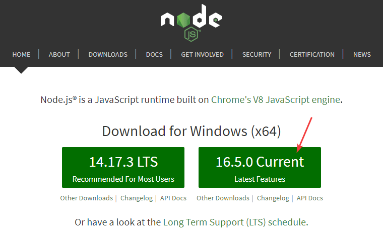

## Установка

Установка стандартная:

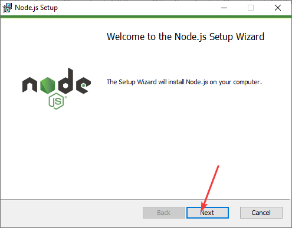

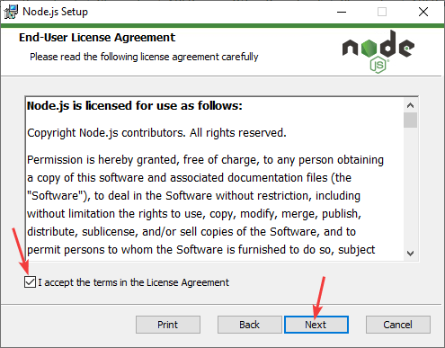

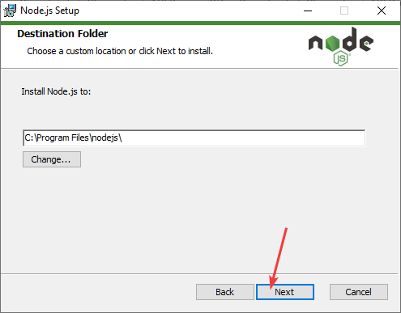

Выбираем все параметры установки. Обязательно следим, чтобы пункт `Add to PATH` был включен:

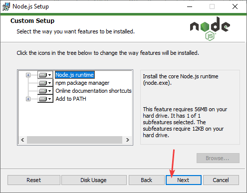

Не обязательно устанавливать Chocolatey, но есть плагины, которые нормально не установятся без него. Это некий аналог магазина пакетов для Windows, как npm:


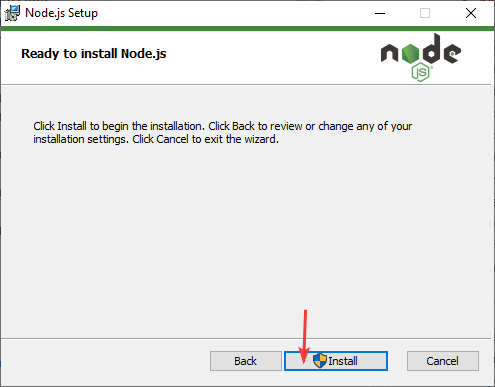

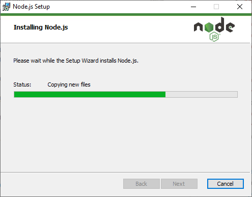

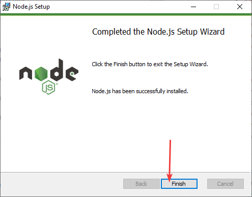

Потом Node.js немного похимичит, показывая вам консольные окна, где надо будет нажать любую клавишу

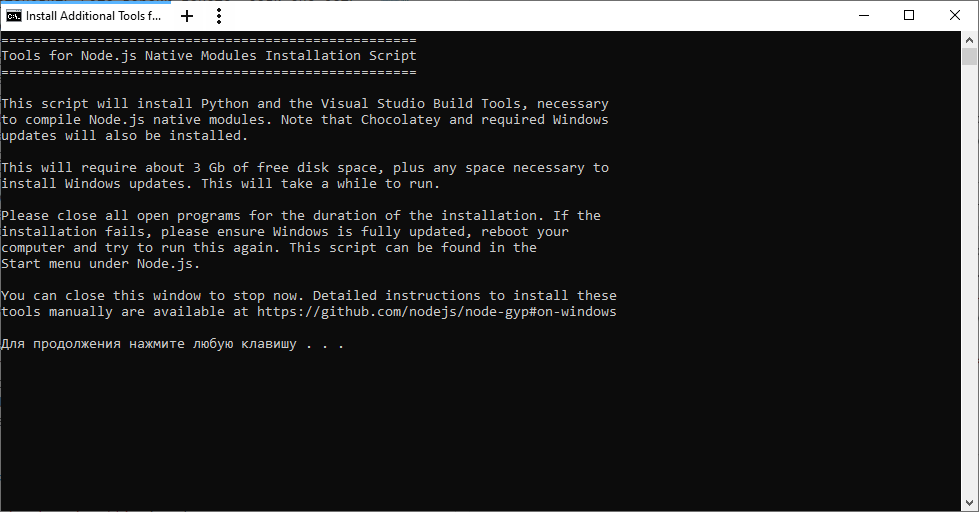

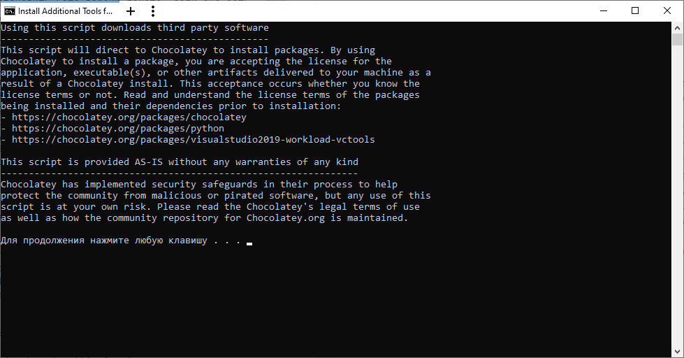

Если вы согласились с установкой Chocolatey, то следом пойдет установка Chocolatey. В первом окне нужно просто нажать любую клавишу:

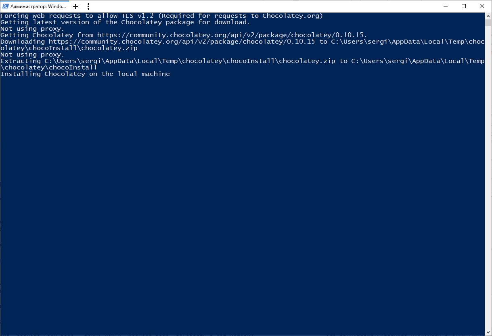

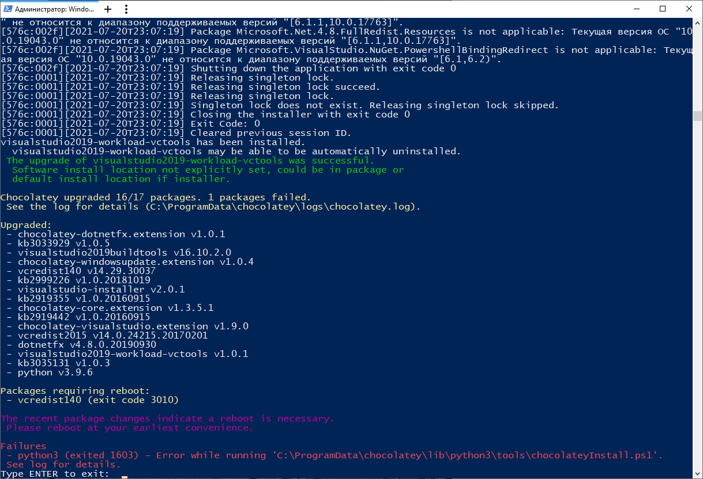

## Установка пакетов

Откройте командную строку или терминал.

Через команду ниже можно обновить все глобальные пакеты, которые у вас установлены:

```console
npm update -g
```

А через следующую команду можно обновить менеджер пакетов npm:

```console
npm update npm -g
```

Большинство пакетов, которые вы будете устанавливать, будут локальными для каждого Node.js проекта. Но некоторые пакеты можно установить глобально. На данный момент у меня таких два пакета.

### npm-check-updates

[npm-check-updates](https://www.npmjs.com/package/npm-check-updates) — принудительно обновляет пакеты вашего проекта в файле `package.json`. Стандартное обновление пакетов через `npm update` не всегда обновит пакеты из-за жесткого указания версии в `package.json`, из-за недавних минорных обновлений пакетов с проблемами совместимости и др. И это хорошо, но иногда хочется обновить принудительно все пакет. Для работы с пакетом нужно вызвать три команды.

Команда `ncu` просто проверит наличие новых пакетов.

Команда `ncu -u` обновит записи в `package.json` на новые версии пакетов.

Команда `npm i` установит новые версии пакетов.

Сам пакет устанавливается через команду:

```console
npm i -g npm-check-updates
```

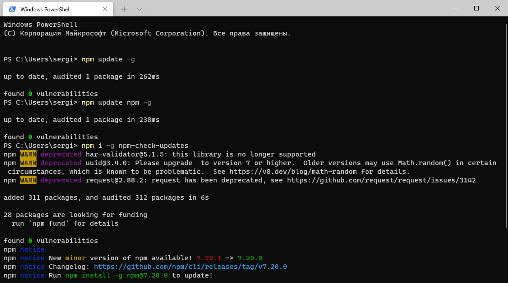

### prettier

[prettier](https://www.npmjs.com/package/prettier) позволяет форматировать код следующих языков JavaScript, TypeScript, Flow, JSX, JSON, CSS, SCSS,Less, HTML, Vue, Angular, GraphQL, Markdown, YAML.

С его помощью можно через консоль отформатировать файлы целой директории. Например:

- `prettier --parser markdown --print-width 120 --write **/*.md` — форматирование markdown файлов в директории, включая поддиректории. Он будет сам игнорировать папку `node-modules`.
- `prettier --print-width 120 --parser html --write **/*.html` — форматирование HTML файлов.

Сам пакет устанавливается через команду:

```console
npm i -g prettier
```

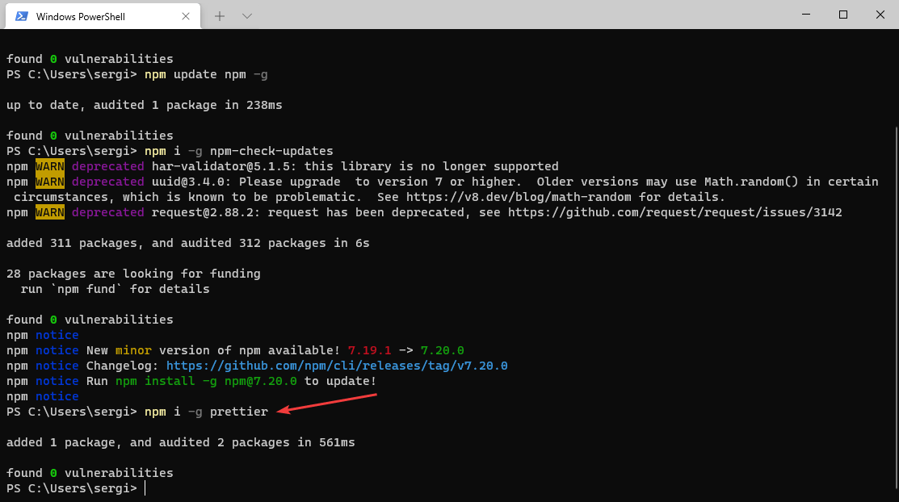
