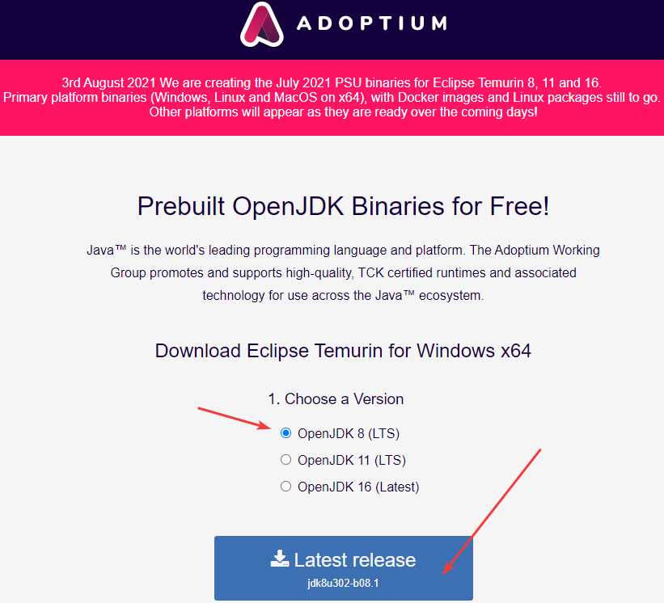
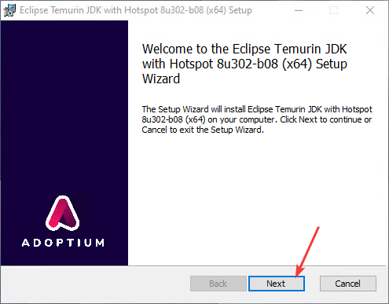
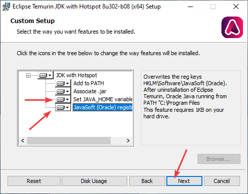
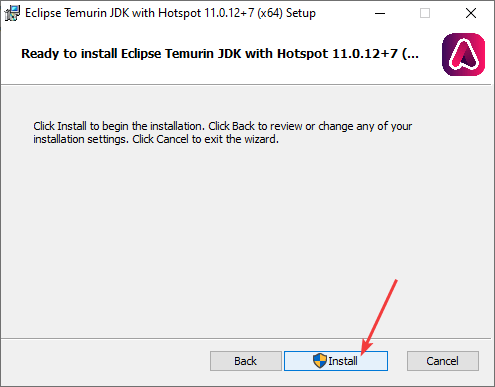
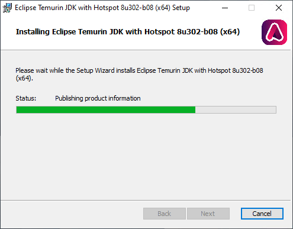
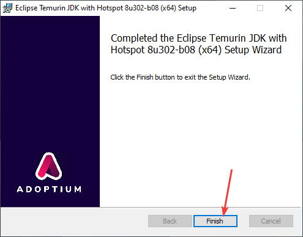

# Установка Open JDK в Windows

Для программирования под Java и, в частности, при создании приложений под Android на компе требуется установка JDK (Java Development Kit). В статье рассказывается как установить версию Open JDK.

Вместо [установки стандартного JDK](https://github.com/Harrix/harrix.dev-blog-2019/blob/main/install-jdk-on-windows/install-jdk-on-windows.md) можно установить [OpenJDK](https://ru.wikipedia.org/wiki/OpenJDK). Найти его можно на сайте <https://openjdk.java.net/>, но там не предоставляются установщики под Windows: «Мы вам сделали версию под GNU GPL? А собирать сами будете». Благо есть много организаций, которые сами собирают OpenJDK и его распространяют. Один из вариантов — это сайт <https://adoptium.net/>, который с 2021 года находится под крылом Eclipse, так что их сборкам можно доверять.

Например, мне нужен OpenJDK для работы Qt под Android. И там на 2021-08 до сих пор нужна версия JDK 8. Поэтому на сайте <https://adoptium.net/> скачиваем именно JDK 8:

Установка простая:

Рекомендую два параметра последних тоже включить, как на скриншоте:

Всё. JDK устанавливается в папку вида `C:\Program Files\Eclipse Foundation\jdk-8.0.302.8-hotspot`.
