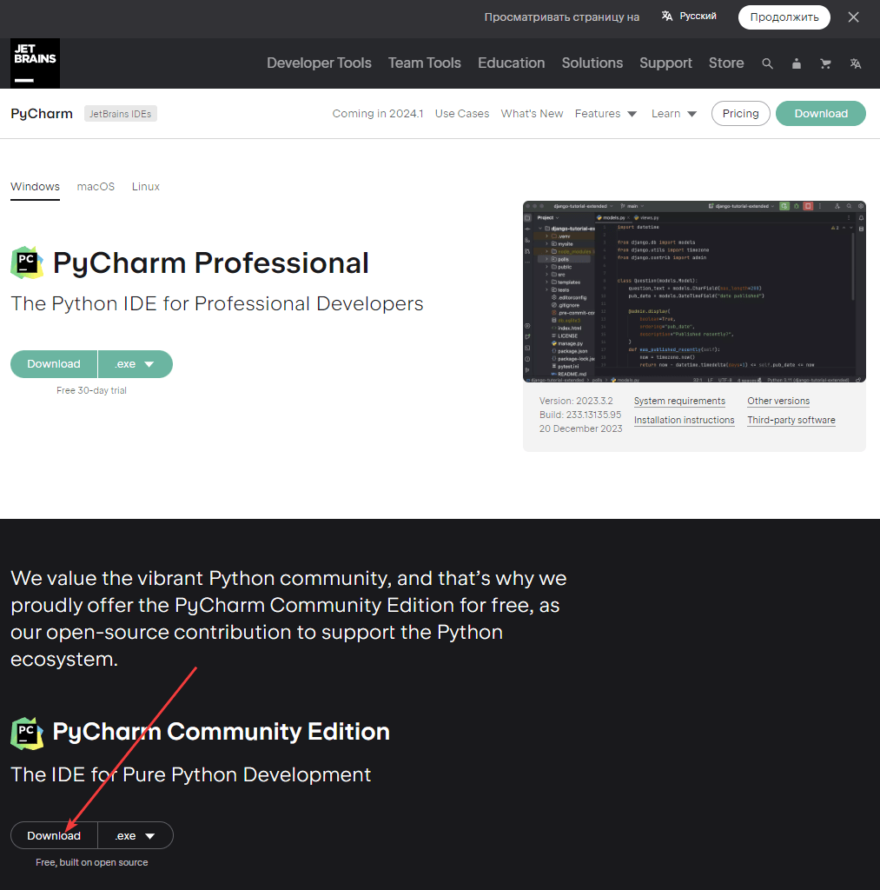
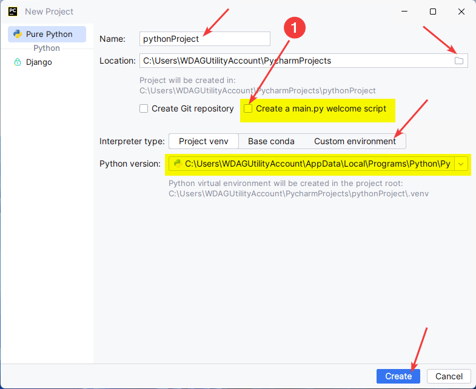

# Установка PyCharm

PyCharm является одним из самых популярных сред для программирования на Python.

Вначале нужно установить Python. В статье [Установка Python](https://github.com/Harrix/harrix.dev-blog-2021/blob/main/install-python/install-python.md) <!-- https://harrix.dev/ru/blog/2021/install-python/ --> об этом рассказывается.

## Скачивание

На сайте [jetbrains.com](https://www.jetbrains.com/ru-ru/pycharm/download/#section=windows) скачиваем установщик именно версии Community, которая бесплатная.

_Рисунок 1 — Скачивание установщика_

## Установка

Установка простая:

_Рисунок 2 — Начальное окно установки_

_Рисунок 3 — Выбор пути установки_

Обязательно ставим галочку у пункта `Add launchers dir to the PATH`:

_Рисунок 4 — Настройка установки_

_Рисунок 5 — Выбор расположения в меню Пуск_

Далее начнется установка, после которой в конце вас попросят перезагрузить компьютер, что и делаем:

_Рисунок 6 — Окончание установки_

При первом запуске программы вас попросят согласиться с условиями лицензии:

_Рисунок 7 — Соглашение с лицензией_

Далее спросят о том, можно ли отправлять статистику использования программы в JetBrains. Тут на ваше усмотрение:

_Рисунок 8 — Запрос на отправку данных в JetBrains_

После откроется PyCharm, где в разделе `Customize` можно выбрать тему оформления (вдруг кто-то любит темную тему), размер шрифта и др.:

_Рисунок 9 — Настройка PyCharm_

## Создание тестового проекта

Проверим, как всё установилось. Для этого создадим и запустим тестовый проект:

_Рисунок 10 — Создание нового проекта_

Если у вас до этого был открыт проект в PyCharm, то предыдущее окно будет выглядеть так:

_Рисунок 11 — Создание нового проекта при открытом другом проекте_

Тут можно оставить всё по умолчанию, но в дальнейшем вы тут сможете много чего полезного настроить. Можно выбрать путь расположения вашего проекта, версию Python, а также тип виртуального окружения. По умолчанию используется Virtualenv (venv). Я, например, предпочитаю [Pipenv](https://pipenv.pypa.io/en/latest/).

В общем, пока оставляем всё по умолчанию:

_Рисунок 12 — Настройка проекта_

_Рисунок 13 — Созданный проект_

Запустим проект. Для этого правой кнопкой щелкнем по коду файла `main.py` и выберем пункт `` Run `main`  ``:

_Рисунок 14 — Запуск python скрипта_

Внизу появится окно с консолью, где должен вывестись текст `Hi, PyCharm`.

_Рисунок 15 — Запущенный скрипт_

Если всё вывелось, то у вас всё установилось нормально.

## Дополнительная настройка

По [правилам PEP8](https://www.python.org/dev/peps/pep-0008/#maximum-line-length) максимальная длина строки должна быть 79 символов. По умолчанию в PyCharm стоит комфортные 120 символов. Но, например, в Лицея Яндекс Академии система использует в качестве максимальной длины значение в 101 символ. Поэтому, чтобы строки нормально форматировались, например, по 101 символ при `Ctrl` + `Alt` + `L`, поменяйте соответствующий параметр `Hard wrap at` в настройках:

_Рисунок 16 — Настройка Hard wrap at_

Также рекомендую включить увеличение шрифта через колесико мыши и нажатый `Ctrl`:

_Рисунок 17 — Изменение размера шрифта_
