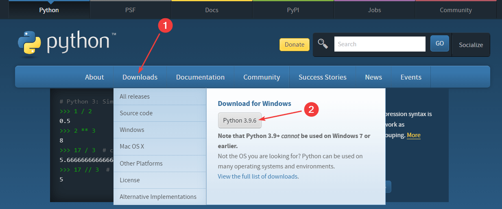
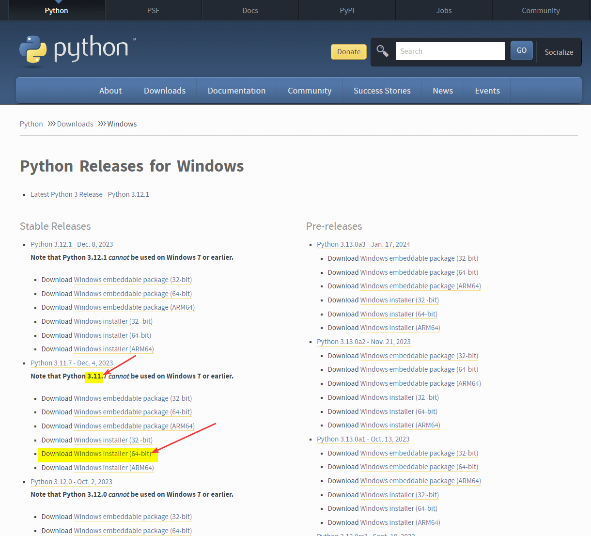
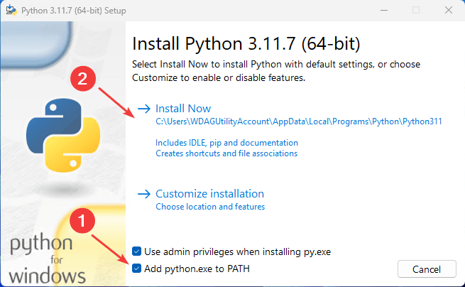
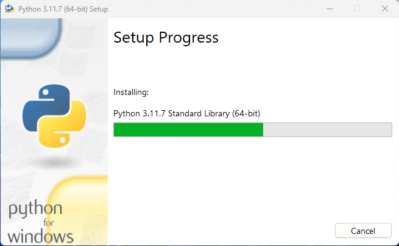
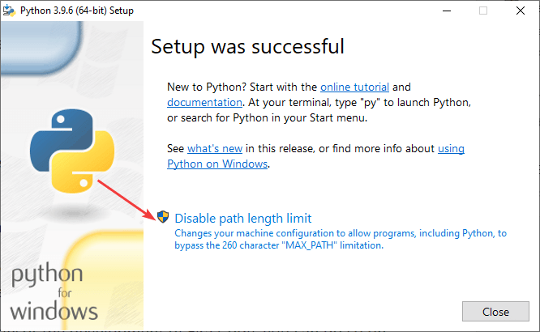
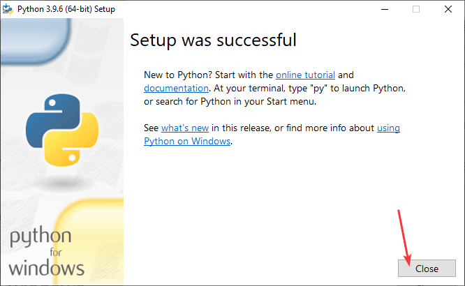
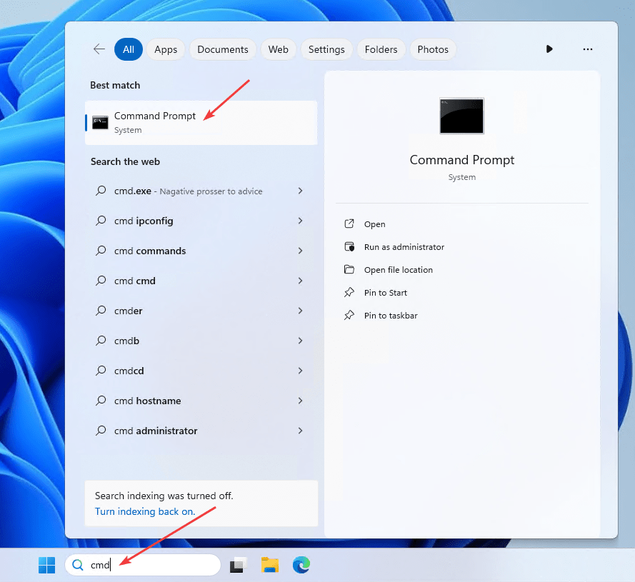
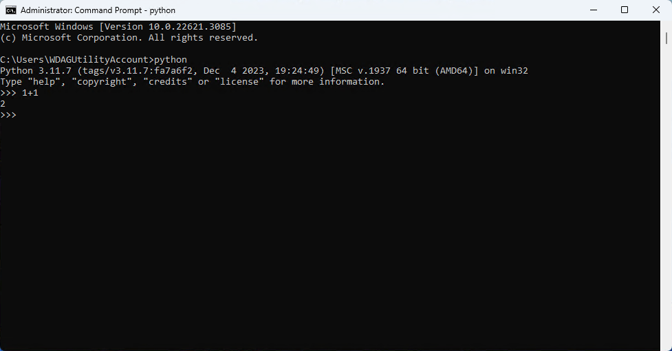

# Установка Python

Рассказываем, как установить Python на Windows.

## Скачивание

Переходим на сайт <https://www.python.org/> и скачиваем версию под Windows:



---

**Замечание про Python 3.8 для знающих** <!-- !details -->

На момент написания статьи всё еще есть известные и нужные библиотеки, которые под Python 3.9 не адаптированы. Поэтому есть смысл установить Python 3.8. Для этого на странице <https://www.python.org/downloads/windows/> находим такой последний релиз Python 3.8, в котором присутствует строка `Download Windows installer (64-bit)` и скачиваем этот файл:



Например, на скрине выше для Python 3.8.11 еще нет выложенных собранных установщиков, а под 3.8.10 есть. Конечно, если вы умеете, то установщик вам не нужен, но в таком случае вы бы на эту статью не попали. Дальнейшие действия я буду показывать на Python 3.9.

---

## Установка

На первом шаге **обязательно** поставьте галочку у пункта `Add Python to PATH`:





На последнем шаге уберите ограничение на длину пути к файлу в Windows:





## Проверка Python

Эта часть необязательная, но желательно проверить, как вы установили Python.

Запустите командную строку `cmd` или любой другой терминал (например, `Windows Terminal`). Это можно сделать многими способами. Можно, например, через поиск:



Введите команду `python` и нажмите `Enter`, чтобы запустить интерпретатор Python:


Введите какой-нибудь код, например, `1+1` и нажмите `Enter`. Если выведется 2, то всё отлично и у вас Python установился правильно:



После этого командную строку можно закрывать.

Кстати, если вы хотите выйти из интерпретатора Python, чтобы продолжать работать в командной строке, но нажмите `Ctrl` + `Z`, а затем `Enter`.

Иногда у вас могут возникать проблемы из-за не обновленного `pip`, который можно обновить в консоли через:

```console
python -m pip install --upgrade pip
```
