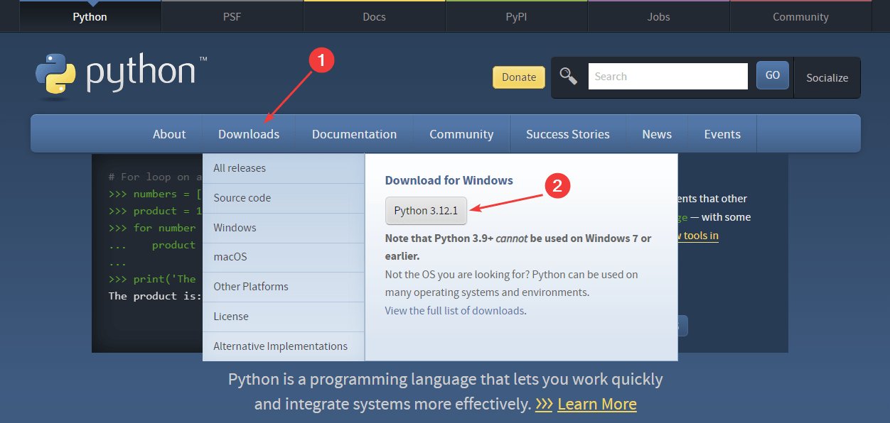
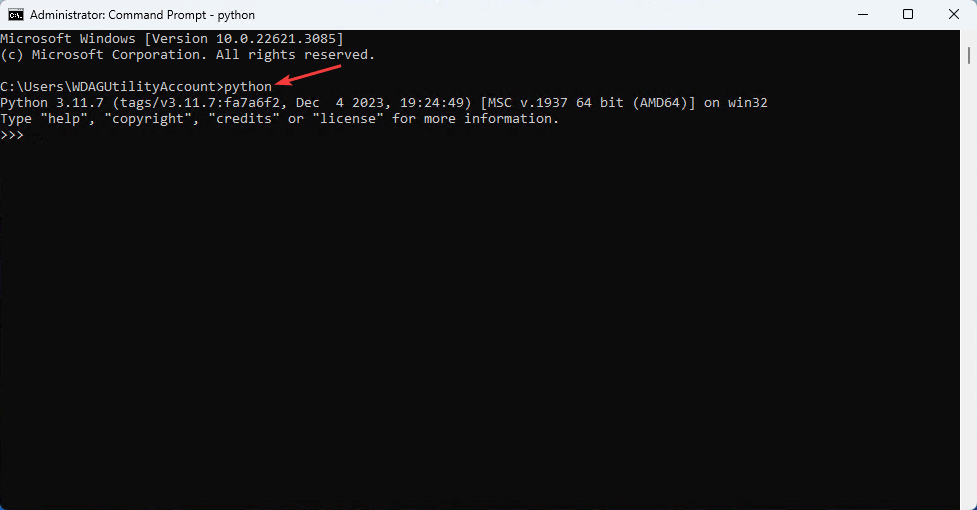

# Установка Python


Рассказываем, как установить Python на Windows.

## Скачивание

Переходим на сайт <https://www.python.org/> и скачиваем версию под Windows:



_Рисунок 1 — Выбор последней версии Python под Windows_

Но обычно с момента выхода новой версии Python проходит несколько месяцев или год, когда известные и нужные библиотеки адаптируются под новую версию. Поэтому есть смысл установить предыдущую версию Python. То есть, например, на скрине выше последняя версия — 12 (у вас может быть уже другая). Значит стоит выбрать Python 11. Для этого на странице <https://www.python.org/downloads/windows/> находим такой последний релиз Python, в котором присутствует строка `Download Windows installer (64-bit)` и скачиваем этот файл:


_Рисунок 2 — Выбор предыдущей версии Python под Windows_

---

## Установка

На первом шаге **обязательно** поставьте галочку у пункта `Add Python to PATH`:


_Рисунок 3 — Выбор установки по умолчанию_


_Рисунок 4 — Выбор установки по умолчанию_

Также возможен пункт на удаление ограничение на длину пути к файлу в Windows:


_Рисунок 5 — Снятие ограничение на длину пути_


_Рисунок 6 — Конец установки_

## Проверка Python

Эта часть необязательная, но желательно проверить, как вы установили Python.

Запустите командную строку `cmd` или любой другой терминал (например, `Windows Terminal`). Это можно сделать многими способами. Можно, например, через поиск:


_Рисунок 7 — Запуск командной строки в Windows 10_


_Рисунок 7 — Запуск командной строки в Windows 11_

Введите команду `python` и нажмите `Enter`, чтобы запустить интерпретатор Python:



_Рисунок 8 — Запуск интерпретатора Python_

Введите какой-нибудь код, например, `1+1` и нажмите `Enter`. Если выведется 2, то всё отлично и у вас Python установился правильно:


_Рисунок 9 — Пример арифметического действия_

После этого командную строку можно закрывать.

Кстати, если вы хотите выйти из интерпретатора Python, чтобы продолжать работать в командной строке, но нажмите `Ctrl` + `Z`, а затем `Enter`.

Иногда у вас могут возникать проблемы из-за не обновленного `pip`, который можно обновить в консоли через:

```powershell
python -m pip install --upgrade pip
```
