# Установка Virtual Box


В Windows можно открывать другие операционные системы, например, Linux в виде отдельных программ через их визуализацию.

<details>
<summary>📖 Содержание ⬇️</summary>

## Содержание

- [Установка](#установка)
- [Изменение языка приложения](#изменение-языка-приложения)
- [Установка VM VirtualBox Extension Pack](#установка-vm-virtualbox-extension-pack)
- [Создание новой виртуальной машины Alpine Linux](#создание-новой-виртуальной-машины-alpine-linux)
- [Создание виртуальной машины Ubuntu](#создание-виртуальной-машины-ubuntu)
- [Открытие виртуальных машин](#открытие-виртуальных-машин)

</details>

## Установка

В статье рассказывается об установке Virtual Box с расширением VM VirtualBox Extension Pack.

Перейдите на сайт <https://www.virtualbox.org/wiki/Downloads>.

Скачайте установщик и расширение VM VirtualBox Extension Pack:


_Рисунок 1 — Скачивание_

Запускаем установщик:

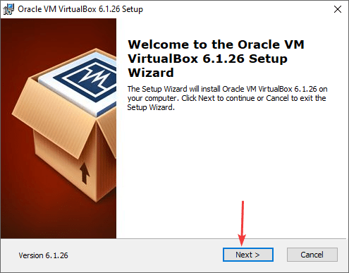

_Рисунок 2 — Стартовое окно установки_

Выбираем все компоненты для установки:

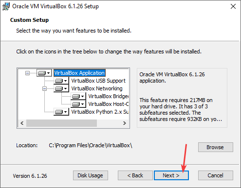

_Рисунок 3 — Выбор компонентов для установки_

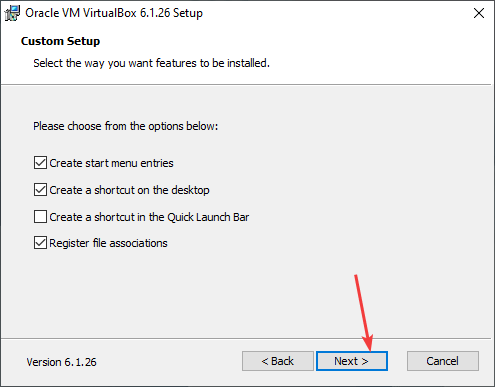

_Рисунок 4 — Настройка установки_

Нас предупреждают, что будут установлены виртуальные подключения к сети:

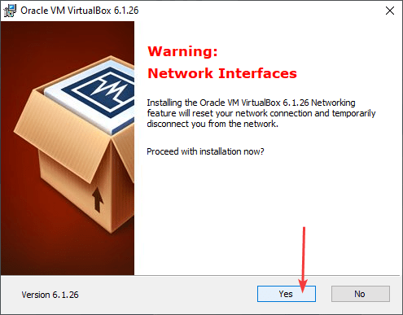

_Рисунок 5 — Предупреждение Network Interfaces_

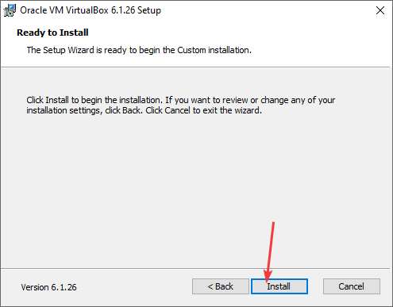

_Рисунок 6 — Окно перед началом установки_

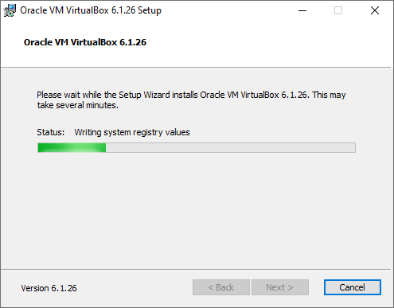

_Рисунок 7 — Процесс установки_

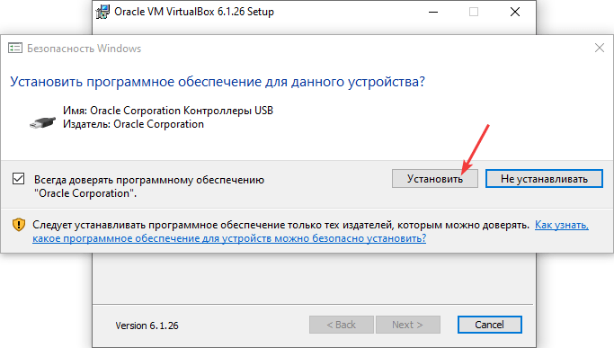

_Рисунок 8 — Установки драйверов_

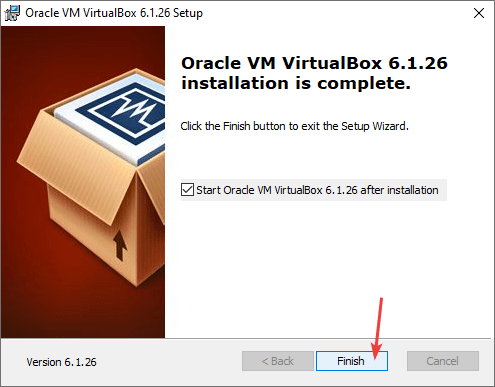

_Рисунок 9 — Окончание установки_

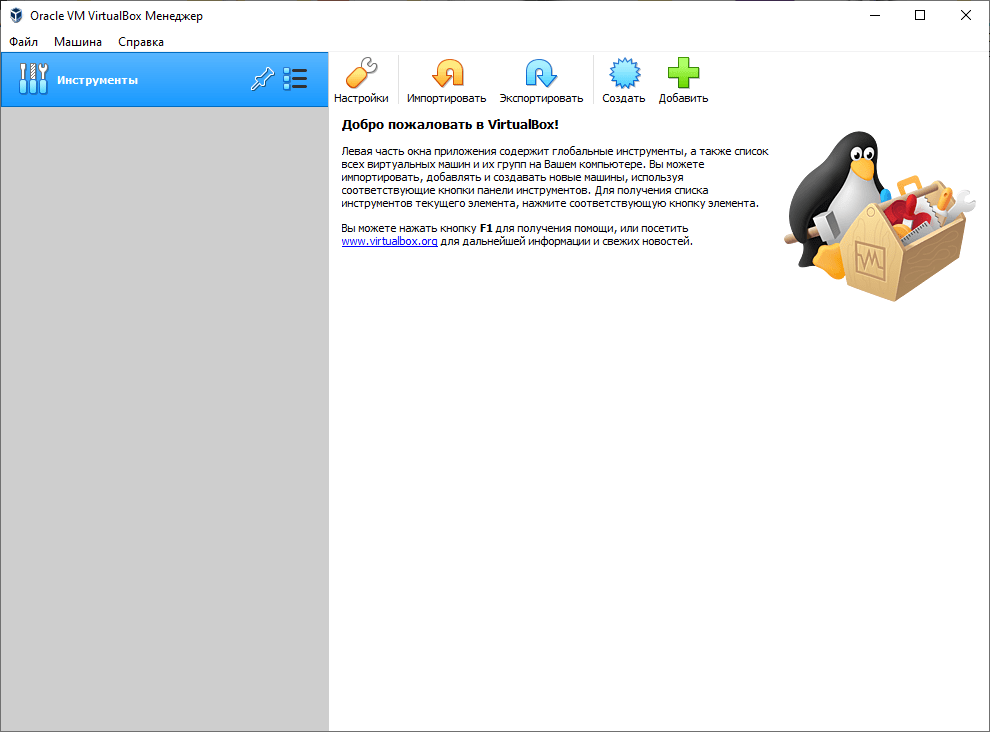

_Рисунок 10 — Запущенное приложение_

## Изменение языка приложения

Рекомендую сразу менять язык приложения:

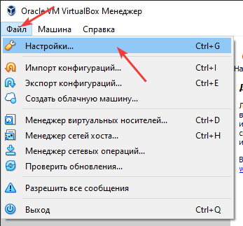

_Рисунок 11 — Настройки приложения_

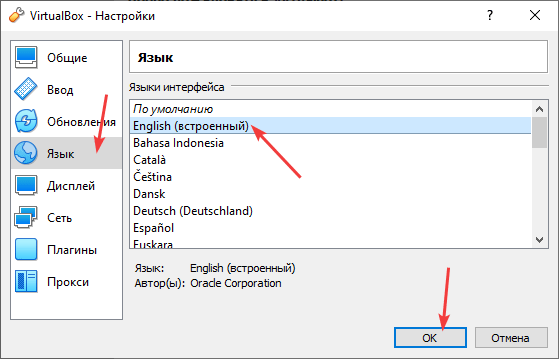

_Рисунок 12 — Изменение языка приложения_

## Установка VM VirtualBox Extension Pack

Для запуска некоторых виртуальных машин требуется расширение VM VirtualBox Extension Pack, которое мы уже скачали в начале статьи. Теперь его установим. Перейдем в настройки приложения:

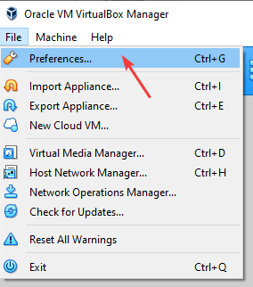

_Рисунок 13 — Настройки приложения_

В разделе расширений добавляем файл нашего расширения вида `Oracle_VM_VirtualBox_Extension_Pack-6.1.26.vbox-extpack`:

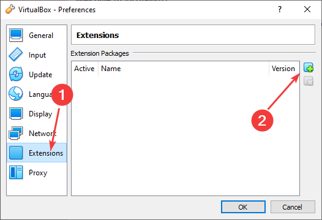

_Рисунок 14 — Добавляем файл расширения_

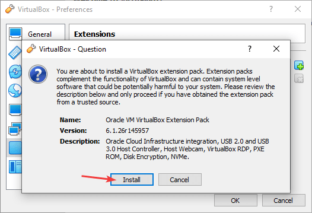

_Рисунок 15 — Соглашение с установкой расширения_

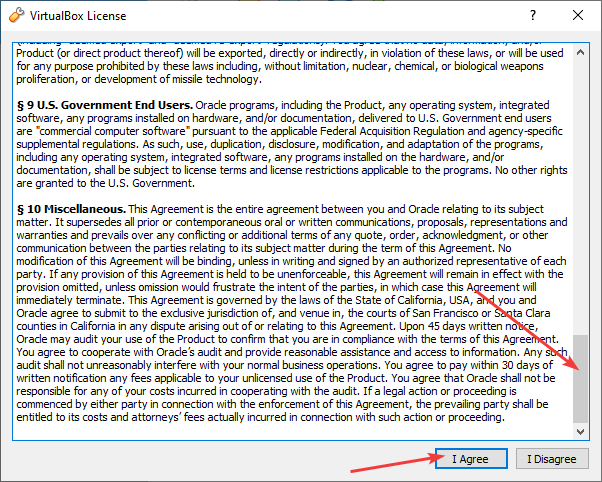

_Рисунок 16 — Согласие с лицензией_

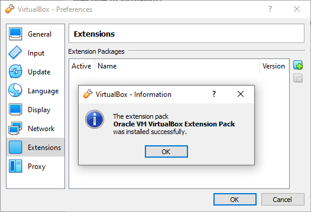

_Рисунок 17 — Сообщение об удачной установке_

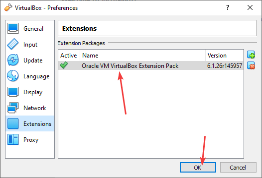

_Рисунок 18 — Установленное расширение_

## Создание новой виртуальной машины Alpine Linux

Создадим какую-нибудь виртуальную машину. Например, поставим Alpine Linux, который часто используется на соревнованиях по криптографии.

Перейдем на сайт <https://www.alpinelinux.org/downloads/>, где спустимся в самый низ:

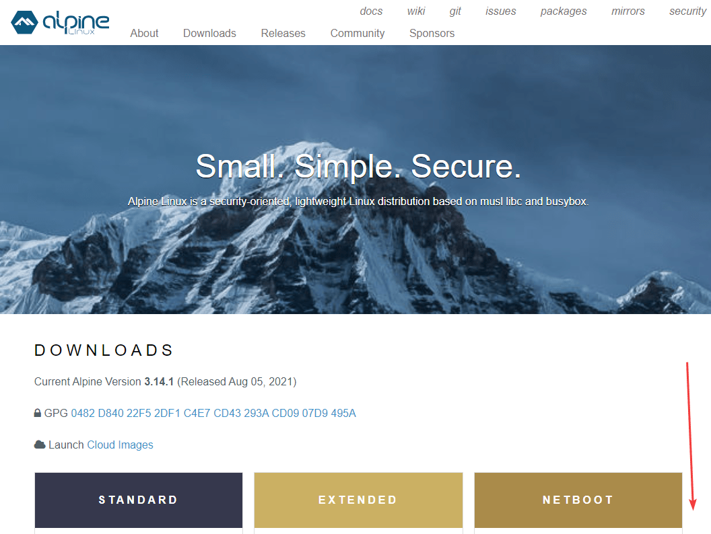

_Рисунок 19 — Страница с образами ОС_

Внизу выбираем, например, 32-битный образ Alpine Linux под виртуальные машины. Этот образ отличается очень маленьким размером: весь образ весит 40 Мб (`alpine-virt-3.14.1-x86.iso`):

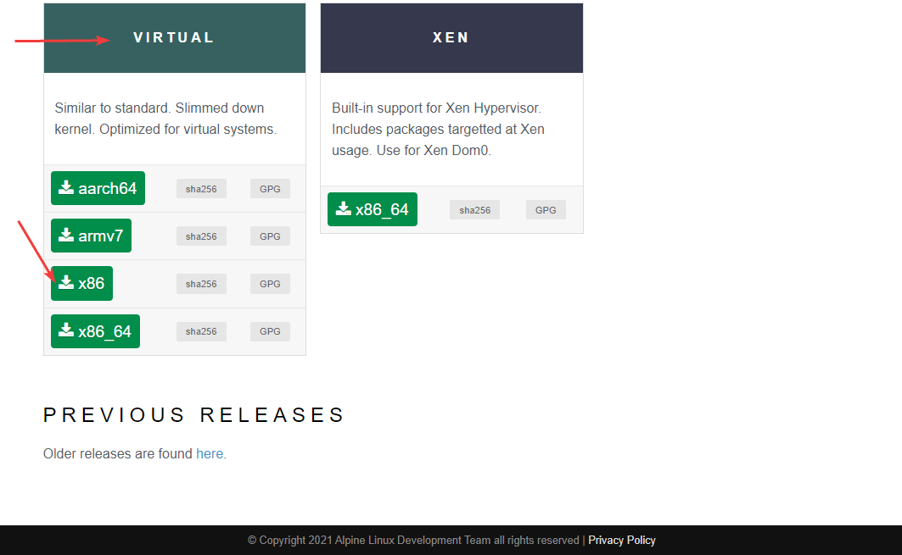

_Рисунок 20 — Скачивание образа_

Создайте какую-нибудь папку, куда вы будете складывать ISO образы, куда скопируйте скаченный файл. У меня это папка `C:\Users\sergi\OneDrive\ISO`.

В VirtualBox через главное меню создайте новую виртуальную машину:

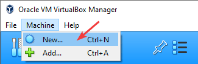

_Рисунок 21 — Создание новой виртуальной машины_

Выберите имя машины, а также тип виртуальной машины. У нас это Linux 32-bit:

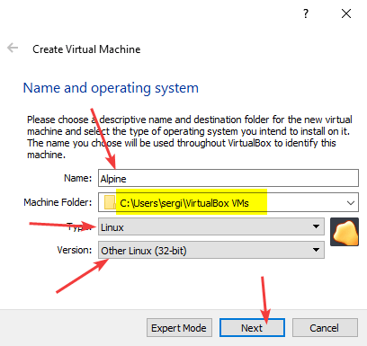

_Рисунок 22 — Настройки виртуальной машины_

Запомните, что по умолчанию виртуальные машины и виртуальные жесткие диски создаются по адресу `%userprofile%\VirtualBox VMs`.

Для Alpine Linux подойдут почти все настройки по умолчанию. Например, оперативки хватит 256Мб:

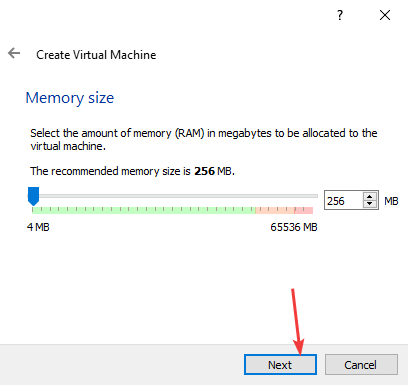

_Рисунок 23 — Выбор размера оперативной памяти_

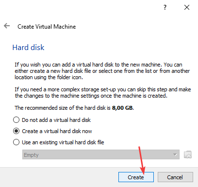

_Рисунок 24 — Создание нового виртуального жесткого диска_

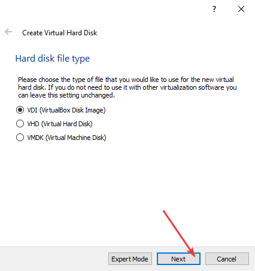

_Рисунок 25 — Выбор типа виртуального жесткого диска_

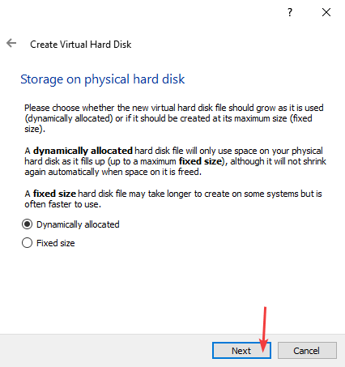

_Рисунок 26 — Настройки виртуального жесткого диска_

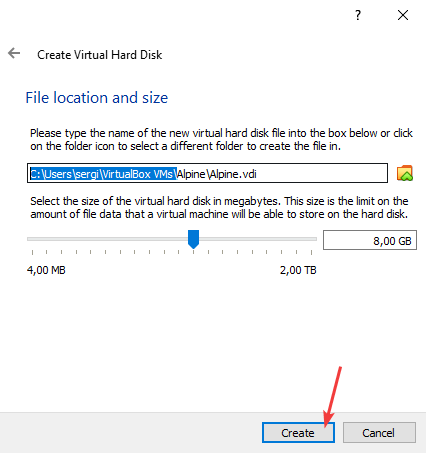

_Рисунок 27 — Размер жесткого диска_

Размер жесткого диска можно указать и поменьше. Нам пока и 2Гб хватит (на саму ОС нужно 125 Мб):

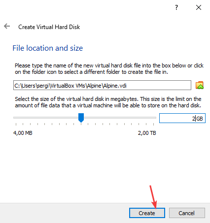

_Рисунок 28 — Выбор размера жесткого диска_

После создания виртуальной машины можно её запустить:

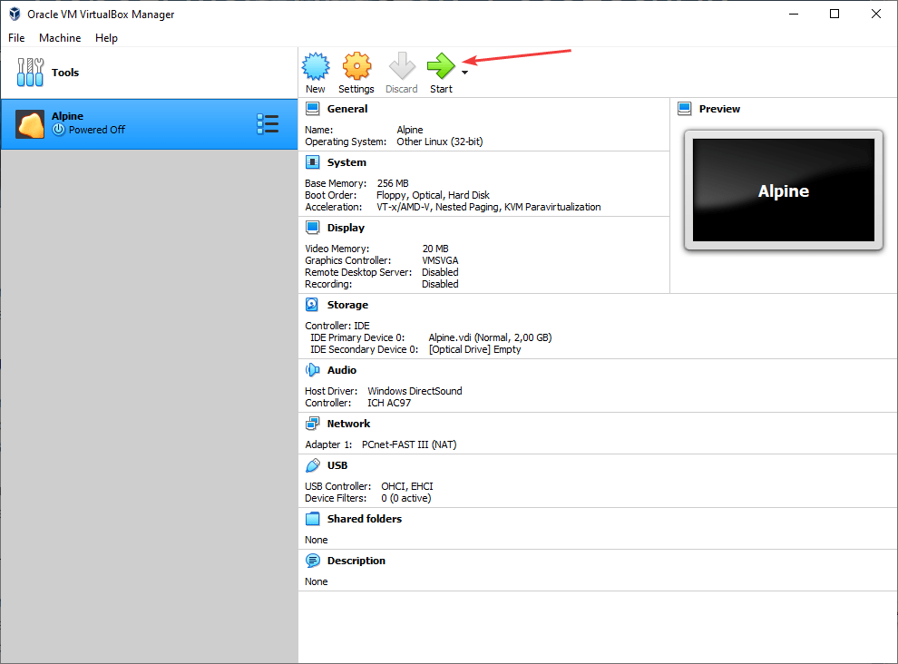

_Рисунок 29 — Запуск виртуальной машинны_

Вы же обратили внимание на то, что мы скаченный образ еще не использовали? Вот при первом запуске этот образ и укажем:

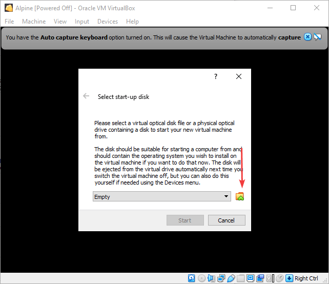

_Рисунок 30 — Добавление образа ОС_

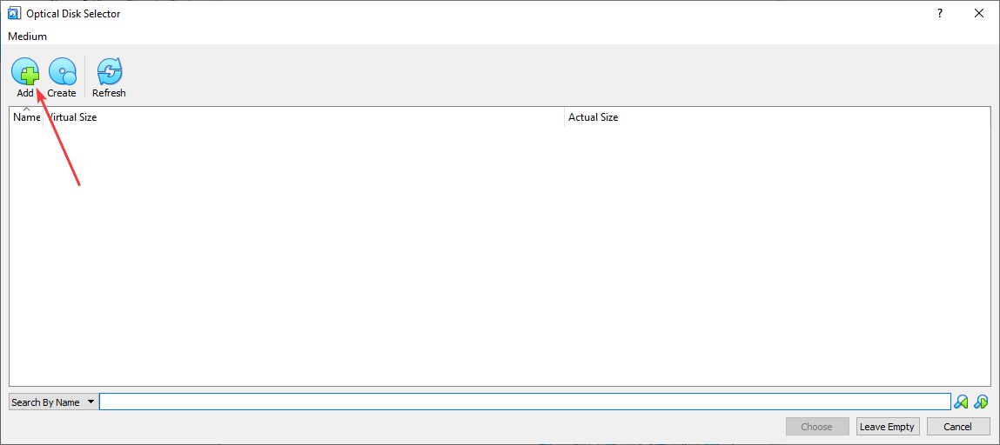

_Рисунок 31 — Добавление файла образа ОС_

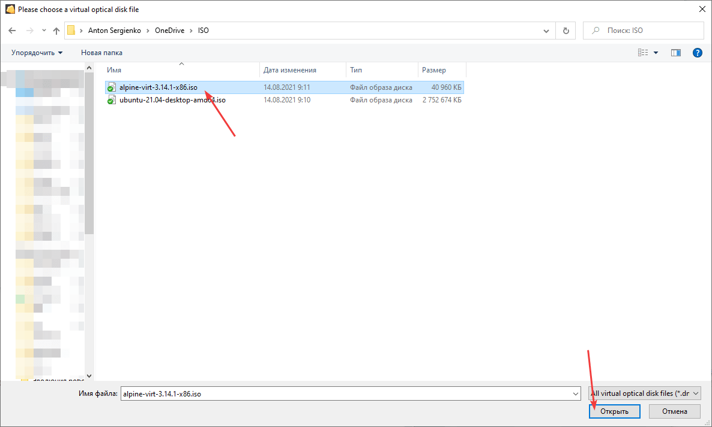

_Рисунок 32 — Выбор файла образа ОС_

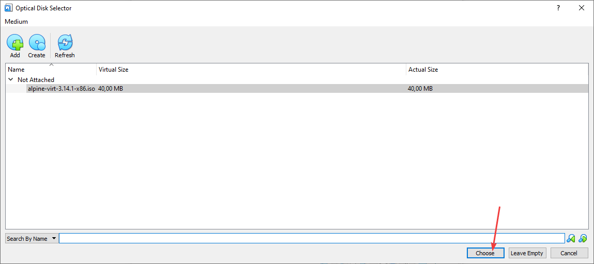

_Рисунок 33 — Добавленный файл образа ОС_

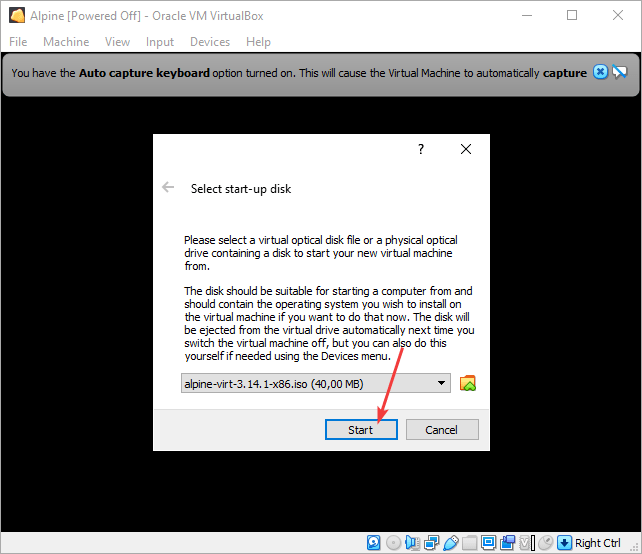

_Рисунок 34 — Запуск образа ОС_

Если всё сделали всё правильно, то запустится Linux, где предложено ввести логин и пароль:

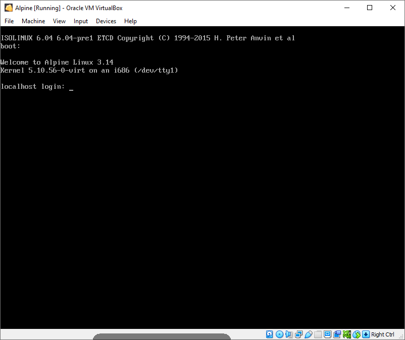

_Рисунок 35 — Запущенная ОС_

Стандартный логин **root**, пароль отсутствует. То есть введите `root` и нажмите `Enter`:

```shell
root
```

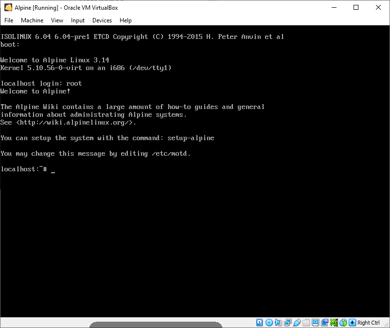

_Рисунок 36 — Вход через root_

Если хотите настроить систему и даже установить графический режим, то можете воспользоваться статьей [Установка Alpine Linux](https://losst.ru/ustanovka-alpine-linux) с шага 4.

А мы пока просто проверим работоспособность системы через две команды, где посмотрим содержимое каталога `/bin`:

```shell
cd /bin
ls -a
```

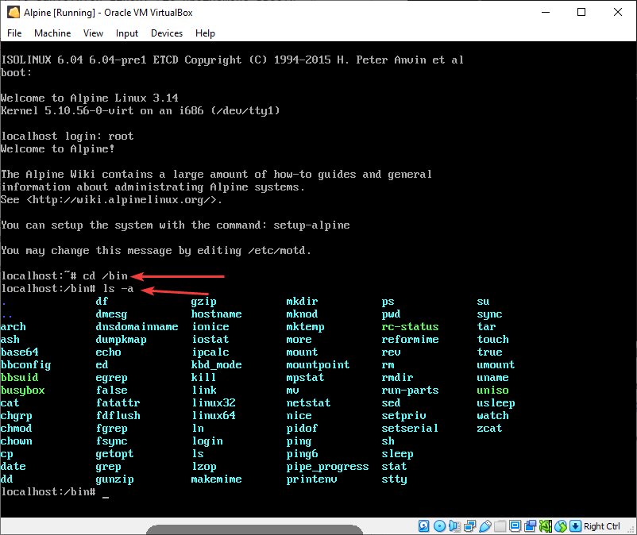

_Рисунок 37 — Содержимое каталога bin_

## Создание виртуальной машины Ubuntu

Если вам нужно установить Ubuntu, то процесс создания её виртуальной машине такой же, как и описанный выше.

На сайте <https://ubuntu.com/> скачивайте образ системы, а потом в VirtualBox создаете новую систему:

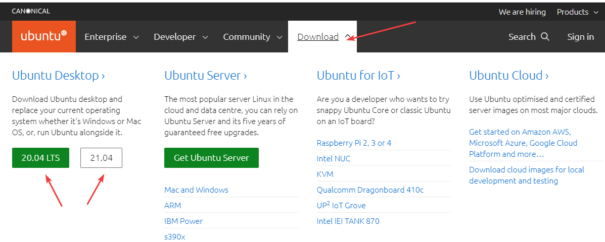

_Рисунок 38 — Скачивание образа Ubuntu_

Учтите, что скачается 64-битная система, поэтому при создании виртуальной машины укажите, что это 64-битная система:

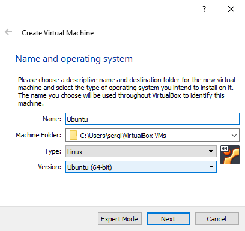

_Рисунок 39 — Скачивание образа Ubuntu_

После установки Ubuntu (то же самое касается виртуальных машин Windows) установите `Guest Additions`, который позволит взаимодействовать виртуальной машине с основной операционной машиной. Например, при изменении окна с запущенной виртуальной машиной она будет подстраиваться под размер окна:

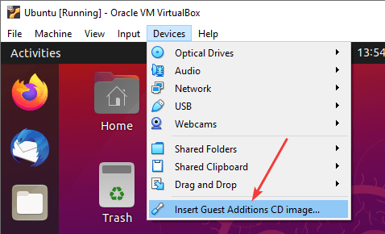

_Рисунок 40 — Запущенная и настроенная Ubuntu_

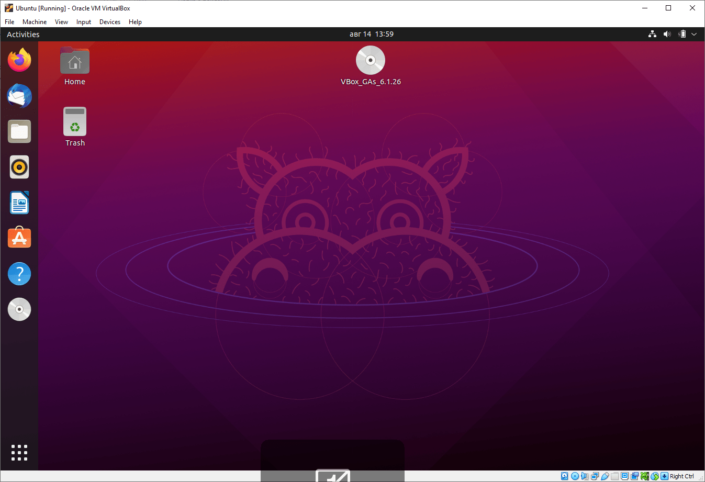

_Рисунок 41 — Запущенная и настроенная Ubuntu_

## Открытие виртуальных машин

На соревнованиях часто дают файл уже готовой виртуальной машины в формате, например, `.ova`. В этом случае можно просто двойным кликом по файлу открыть его в VirtualBox и импортировать виртуальную машину:

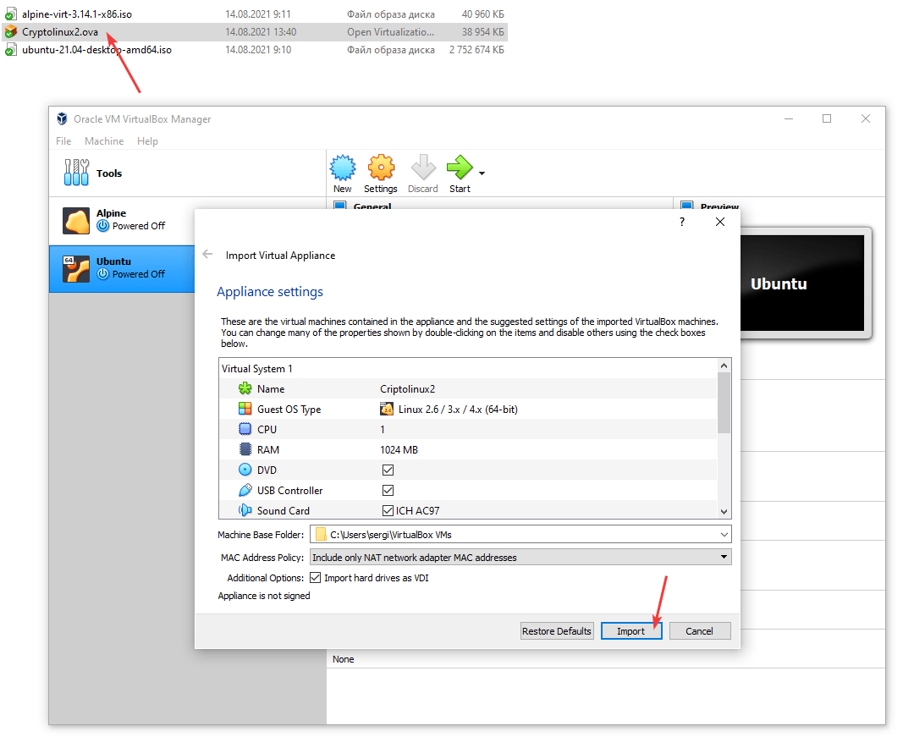

_Рисунок 42 — Открытие файла виртуальной машины_

Потом в списке виртуальных машин двойным кликом открываем виртуальную машину:

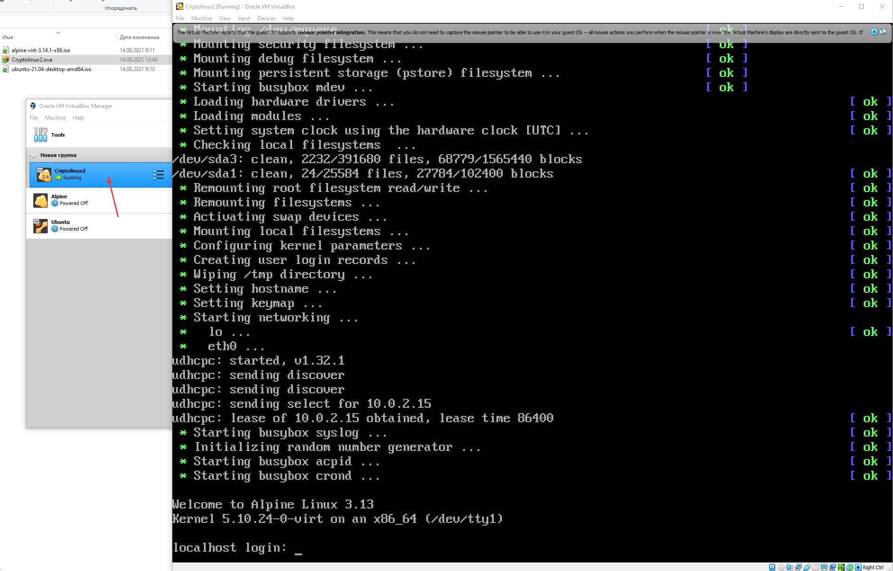

_Рисунок 43 — Открытая импортированная виртуальная машина_
