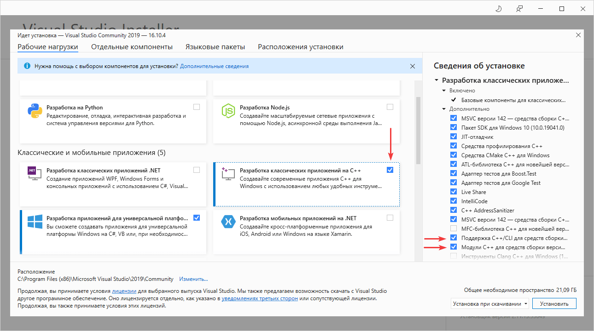

# Установка Visual Studio 2019 Community

В статье приведена инструкция по установке бесплатной версии Visual Studio 2019 Community на Windows 10 для программирования на C++.

На сайте <https://visualstudio.microsoft.com/ru/> скачиваем установщик:

_Рисунок 1 — Скачивание установщика_

Запускаем скаченный файл:

_Рисунок 2 — Начальное окно установщика_

_Рисунок 3 — Подзагрузка нужных файлов_

После этого откроется окно с большим количеством пакетов для скачивания и установки в `Visual Studio`. Там и средства для программирования для мобильных устройств и под Node.js и так далее. Причем каждый пункт имеет справа список загружаемых файлов.

Нас интересует программирование на C++ под обычный Windows.

Если вы хотите программировать так называемые универсальные приложения (это те, что с Metro стилем и могут распространяться с магазином), то выберите первый блок и такие подпункты справа (обратите внимание, что пакет `Windows 10 SDK` лучше выбирать последний версии, который будет показываться у вас):

_Рисунок 4 — Пакеты для UWP приложений_

Для классических приложений выберите эти пакеты:

_Рисунок 5 — Пакеты для классических приложений_

Для программирования на C# это выбираем:

_Рисунок 6 — Пакеты для классических приложений под .NET_

Лично я еще удаляю пакет русского языка и устанавливаю только английский язык. Но это исключительно на ваш выбор:

_Рисунок 7 — Выбор языковых пакетов_

После выбора пакетов нужно запустить долгую-долгую установку:

_Рисунок 8 — Процесс установки_

После установки всех пакетов запустите Visual Studio:

_Рисунок 9 — Первое окно при запуске Visual Studio_

Настоятельно рекомендую войти под учетной записью Visual Studio, чтобы через месяц программа не перестала работать:

_Рисунок 10 — Вход в учетку_

_Рисунок 11 — Вход в учетку_

После этого откроется готовая к работе `Visual Studio 2019 Community`:

_Рисунок 12 — Открытая Visual Studio_

## Дополнительно

Если вы хотите разрабатывать универсальные UWP приложения, то не забудьте включить режим `Режим разработчика` в параметрах Windows 10:

_Рисунок 13 — Раздел «Обновление и безопасность»_

_Рисунок 14 — Вкладка «Для разработчиков»_
