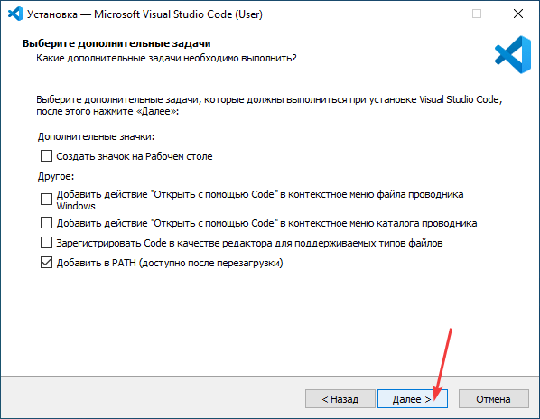

# Установка Visual Studio Code (простая) и открытие Markdown

Это упрощенная статья про простую установку VSCode без каких-либо настроек программы.

Полный вариант статьи с подробным описанием возможностей можно посмотреть в другой статье [Установка и настройка Visual Studio Code](/blog/2022/install-vscode/).

## Скачивание и установка

Перейдите на сайт <https://code.visualstudio.com> и скачайте установщик программы:

Установка происходит по принципу «далее, далее». Скриншоты, если нужно, есть под спойлером:

---

**Процесс установки** <!-- !details -->

---

## Открытие Markdown файла

Открыть Markdown файл можно стандартным путем через `File` → `Open File…`:

Программа может спросить, доверяете ли вы авторам данного файла. Соглашаемся:

Файл открылся. Markdown файл — это, по сути, текстовой файл. Нажмите на иконку сверху справа:

После этого справа отобразится Markdown файл в отрендеренном виде:

